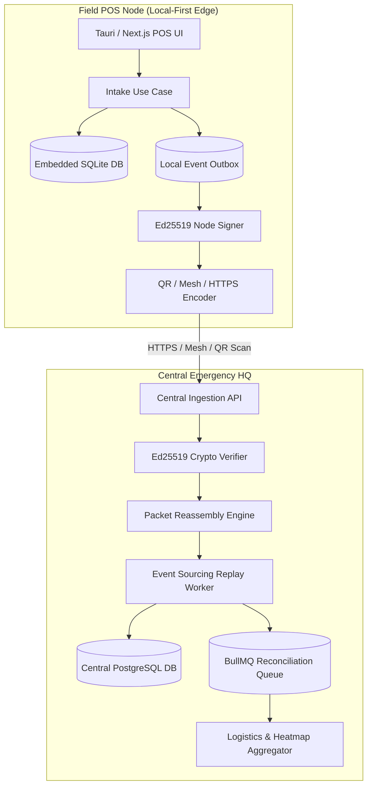
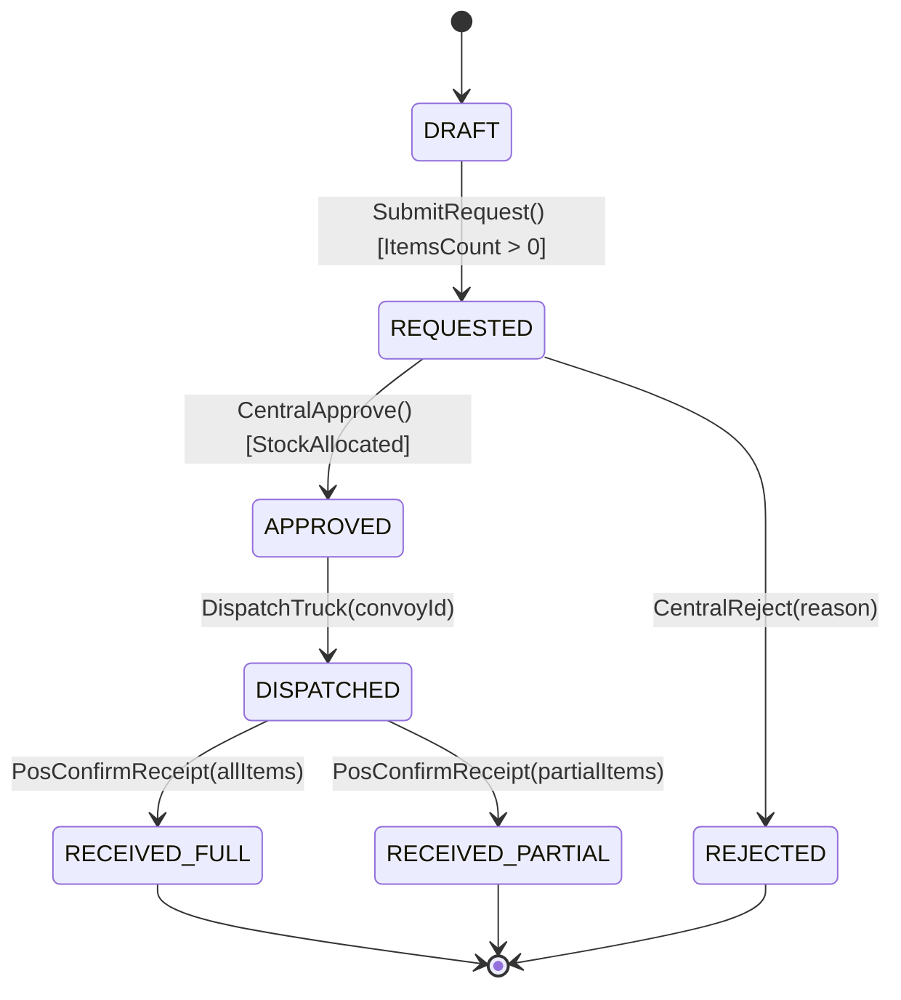

# Backend Architecture Plan: Disaster Response Local-First Engine (Sanidya Architecture)

**Document Metadata**:
- **System**: Sanidya Disaster Command & Local POS Engine
- **Target Stack**: TypeScript, Node.js, Next.js App Router, SQLite (Field Edge), PostgreSQL (Central HQ), Redis, BullMQ
- **Architectural Style**: Hexagonal Architecture + Local-First Event Sourcing

---

## 1. Executive Summary & System Topology

Sanidya operates across two operational environments:
1. **Disconnected Field POS Nodes (Edge)**: Local desktop/mobile apps running embedded SQLite in zero-internet disaster zones. Operations (evacuee registration, triage, aid distribution) are recorded locally, digitally signed via **Ed25519**, and queued into an event outbox.
2. **Central Emergency HQ (Cloud)**: Central PostgreSQL cluster consolidating multi-POS logistics, evacuee registries, and analytics.

Ingestion from Field to Central supports multiple transport modes: Standard HTTPS, P2P Wi-Fi Direct Mesh, and **Optical Animated QR Frames** with Reed-Solomon parity for completely air-gapped zones.

### System Architecture Diagram


---

## 2. Domain Models & Invariants

```typescript
// src/domain/evacuee/evacuee.aggregate.ts
export interface EvacueeProps {
  id: string; // UUIDv7
  posId: string;
  fullName: string;
  nationalId?: string;
  triageStatus: 'GREEN' | 'YELLOW' | 'RED' | 'BLACK';
  state: 'INTAKE' | 'SHELTERED' | 'TRANSFERRED' | 'REUNITED' | 'DECEASED';
  registeredAt: Date;
  version: number;
}

export class EvacueeAggregate {
  private constructor(private props: EvacueeProps) {}

  static register(params: Omit<EvacueeProps, 'state' | 'registeredAt' | 'version'>): EvacueeAggregate {
    return new EvacueeAggregate({
      ...params,
      state: 'INTAKE',
      registeredAt: new Date(),
      version: 1,
    });
  }

  updateTriage(newStatus: EvacueeProps['triageStatus'], reason: string): void {
    if (this.props.state === 'DECEASED' || this.props.state === 'REUNITED') {
      throw new DomainInvariantViolationError(`Cannot alter triage for evacuee in state ${this.props.state}`);
    }
    this.props.triageStatus = newStatus;
    this.props.version += 1;
  }
}
```

### Business Invariants Matrix
| Entity | Invariant Rule | Enforcement Layer | Violation Error |
| :--- | :--- | :--- | :--- |
| `AidDistribution` | Cannot distribute items exceeding available POS stock | Domain Aggregate | `InsufficientAidStockError` |
| `Evacuee` | Duplicate active registrations across POS nodes trigger reconciliation | Ingestion Replay Worker | `DuplicateEvacueeAlert` |
| `SyncPacket` | Packet must contain valid Ed25519 signature from authorized POS key | Crypto Gateway | `InvalidPacketSignatureError` |

---

## 3. Finite State Machine (Aid Logistics)



---

## 4. API & Ingestion Contracts

### A. HTTP Ingestion Endpoint
- `POST /api/v1/sync/ingest-packet`
- Headers: `X-Node-ID: uuid`, `X-Packet-Signature: hex64`

```typescript
export const IngestPacketRequestSchema = z.object({
  packetId: z.string().uuid(),
  originPosId: z.string().uuid(),
  chunkIndex: z.number().int().min(0),
  totalChunks: z.number().int().min(1),
  payloadBase64: z.string().min(1),
  signatureHex: z.string().length(128),
  timestamp: z.string().datetime(),
});

export type IngestPacketRequest = z.infer<typeof IngestPacketRequestSchema>;
```

### B. GraphQL Disaster Analytics Query
```graphql
type Query {
  posLogisticsSummary(posId: UUID!): PosLogisticsReport!
  evacueeRoster(posId: UUID!, triage: TriageStatus): [Evacuee!]!
}

type PosLogisticsReport {
  posId: UUID!
  totalEvacuees: Int!
  criticalMedicalCount: Int!
  foodRationDaysRemaining: Float!
  waterLitersRemaining: Float!
  lastSyncTimestamp: DateTime
}
```

---

## 5. Security & Cryptography Specification

1. **POS Node Key Pairs**: Each field POS is provisioned with an **Ed25519** private key stored in secure local storage / OS Keyring, and its public key is registered at HQ.
2. **Packet Verification**: The Central Ingestion API reads `originPosId`, retrieves the POS public key, and verifies `ed25519.verify(signature, payloadBytes, publicKey)`.
3. **Tamper Proofing**: Any alteration during QR transmission or mesh relay results in immediate verification rejection (`401 Unauthorized`).

---

## 6. Local-First Event Outbox Pipeline

```
1. Operator performs action in POS App (e.g. Register Evacuee).
2. Local SQLite transaction inserts into `evacuees` and `events_outbox`.
3. Background Daemon reads `events_outbox WHERE status = 'PENDING'`.
4. Serializes batch, signs with Ed25519 private key.
5. If animated QR is chosen: Splits into 512-byte chunks + Reed-Solomon parity and renders animated canvas.
6. If internet / mesh is active: Posts directly to `/api/v1/sync/ingest-packet`.
7. Once confirmed, marks SQLite outbox row as `SYNCED`.
```
