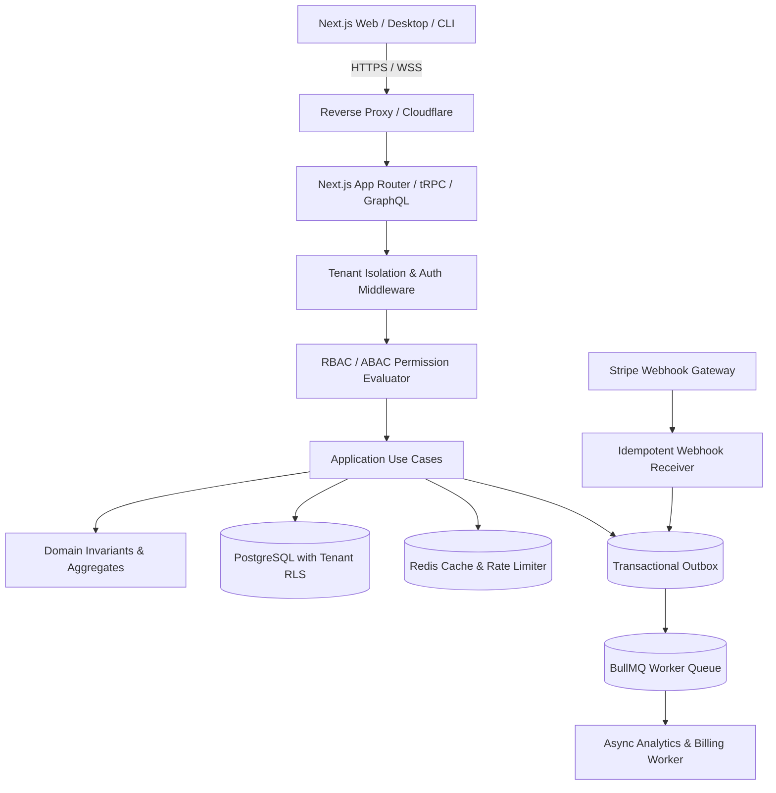
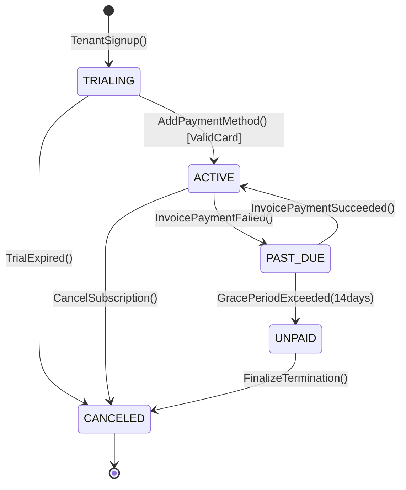

# Backend Architecture Plan: Enterprise Multi-Tenant SaaS Platform

**Document Metadata**:
- **System**: CloudOps Enterprise B2B SaaS
- **Target Stack**: TypeScript, Node.js, Next.js App Router, PostgreSQL (with RLS), Redis, BullMQ, Stripe SDK
- **Architectural Style**: Modular Monolith with Clean Architecture & Domain-Driven Design (DDD)

---

## 1. Executive Summary & System Topology

CloudOps is a high-scale multi-tenant B2B SaaS platform providing cloud infrastructure cost analytics, automated governance policies, and team billing.

### System Architecture Diagram


---

## 2. Domain Models & Invariants

```typescript
// src/domain/billing/subscription.aggregate.ts
export interface SubscriptionProps {
  id: string; // UUIDv7
  tenantId: string;
  planId: 'FREE' | 'STARTER' | 'ENTERPRISE';
  status: 'TRIALING' | 'ACTIVE' | 'PAST_DUE' | 'CANCELED' | 'UNPAID';
  seatLimit: number;
  currentSeatsUsed: number;
  currentPeriodEnd: Date;
  stripeSubscriptionId?: string;
  version: number;
}

export class SubscriptionAggregate {
  private constructor(private props: SubscriptionProps) {}

  addSeats(additionalSeats: number): void {
  if (this.props.status !== 'ACTIVE' && this.props.status !== 'TRIALING') {
  throw new DomainInvariantViolationError('Cannot modify seats on an inactive subscription.');
  }
  if (additionalSeats <= 0) {
  throw new DomainInvariantViolationError('Additional seats must be positive.');
  }
  this.props.seatLimit += additionalSeats;
  this.props.version += 1;
  }

  assignSeat(): void {
  if (this.props.currentSeatsUsed >= this.props.seatLimit) {
  throw new SeatQuotaExceededError(
  `Tenant has reached seat quota of ${this.props.seatLimit} seats. Please upgrade plan.`
  );
  }
  this.props.currentSeatsUsed += 1;
  this.props.version += 1;
  }
}
```

---

## 3. Finite State Machine (Subscription Lifecycle)



---

## 4. API Contracts: tRPC, GraphQL & Webhooks

### A. tRPC Procedure for Adding Team Members
```typescript
export const teamRouter = router({
  inviteMember: protectedProcedure
  .input(
  z.object({
  email: z.string().email(),
  role: z.enum(['MEMBER', 'ADMIN', 'BILLING_MANAGER']),
  })
  )
  .mutation(async ({ ctx, input }) => {
  const useCase = ctx.container.resolve(InviteTeamMemberUseCase);
  return await useCase.execute({
  tenantId: ctx.session.tenantId,
  actorId: ctx.session.userId,
  ...input,
  });
  }),
});
```

### B. GraphQL Schema for Analytics & DataLoader
```graphql
type Query {
  tenantCostBreakdown(from: DateTime!, to: DateTime!): CostReport!
}

type CostReport {
  totalSpend: Float!
  forecastSpend: Float!
  services: [ServiceCostEdge!]!
}
```

### C. Stripe Webhook Idempotency Pipeline
```typescript
export async function handleStripeWebhook(req: Request): Promise<Response> {
  const signature = req.headers.get('stripe-signature')!;
  const rawBody = await req.text();
  const event = stripe.webhooks.constructEvent(rawBody, signature, env.STRIPE_WEBHOOK_SECRET);

  // Check Redis Idempotency Key
  const isDuplicate = await redis.set(`stripe:event:${event.id}`, 'PROCESSED', 'NX', 'EX', 86400);
  if (!isDuplicate) {
  return new Response(JSON.stringify({ received: true, note: 'duplicate_ignored' }), { status: 200 });
  }

  // Enqueue to Transactional Outbox / BullMQ for async processing
  await outboxQueue.add('stripe-event-process', { event });
  return new Response(JSON.stringify({ received: true }), { status: 200 });
}
```

---

## 5. Security & Multi-Tenant Isolation

1. **Row-Level Security (Postgres RLS)**:
  Every tenant query automatically executes with `SET LOCAL app.current_tenant_id = '<tenant_id>'`.
2. **RBAC Permissions Matrix**:
  - `BILLING_MANAGER`: `billing:read`, `billing:update`, `invoices:export`.
  - `ADMIN`: `team:invite`, `team:remove`, `policy:create`, `billing:*`.
  - `MEMBER`: `resources:read`, `resources:deploy`.

---

## 6. Background Jobs & Worker Architecture

| Queue Name | Concurrency | Retry / Backoff | Description |
| :--- | :--- | :--- | :--- |
| `billing-sync` | 5 | 5 attempts (Exponential with Jitter) | Processes Stripe invoices, updates seat counts |
| `cost-analytics`| 10 | 3 attempts | Aggregates hourly AWS/GCP cost telemetry |
| `email-dispatch`| 20 | 5 attempts | Sends invitation & billing alert emails |
