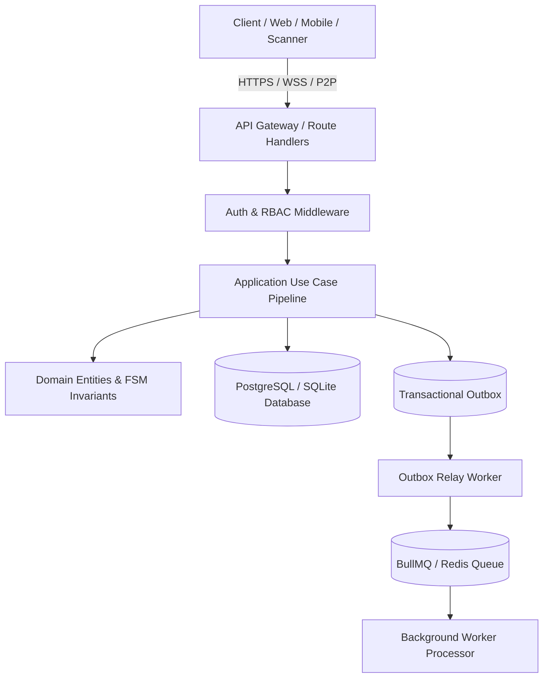
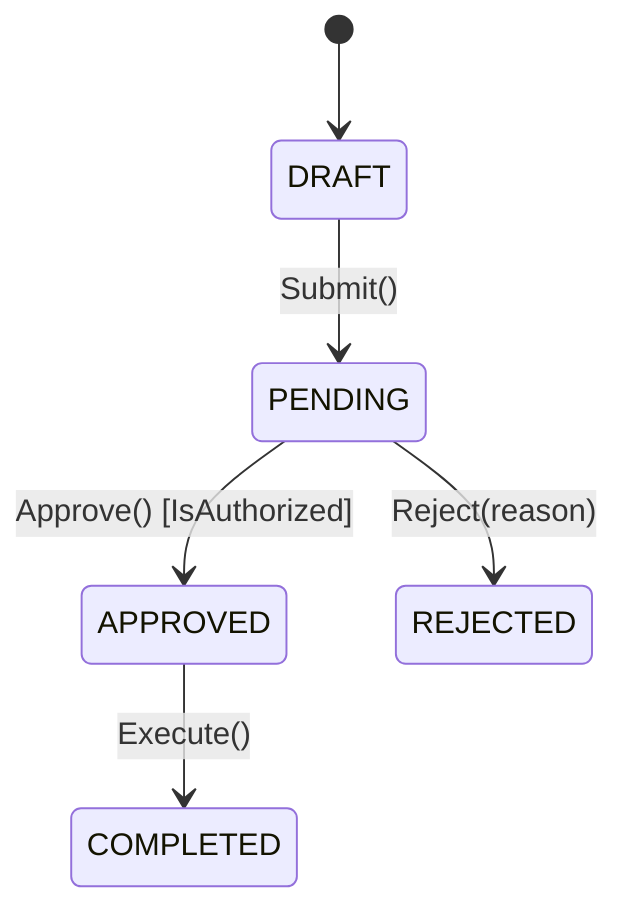

# Backend Architecture & Business Logic Plan Template

Use this template to generate standardized, industrial-grade backend plans.

---

```markdown
# Backend Architecture & Business Logic Plan: <Feature / System Name>

**Document Metadata**:
- **Author / Architect**: Antigravity Backend Architect
- **Status**: DRAFT / PROPOSED / APPROVED
- **Target Stack**: Node.js / Next.js / TypeScript / PostgreSQL / SQLite / Redis / BullMQ
- **Architectural Style**: Clean Architecture / Hexagonal / Modular Monolith

---

## 1. Executive Summary & System Topology

Briefly describe the business goals, system context, and high-level architectural paradigm.

### System Boundary & Architecture Diagram


---

## 2. Domain Models, Aggregates & Invariants

Define pure domain entities, value objects, and non-negotiable business rules.

### Aggregates & Entities
```typescript
// Define TypeScript domain models, props, and value objects
```

### Business Invariants Matrix
| Entity / Aggregate | Invariant Rule | Enforcement Layer | Violation Error |
| :--- | :--- | :--- | :--- |
| `InventoryStock` | Available balance cannot be negative | Domain Entity + DB `CHECK` | `InsufficientStockError` |
| `Evacuee` | Cannot check into Pos B while active in Pos A | Application Use Case | `ActiveRegistrationExistsError`|

---

## 3. Finite State Machine (FSM) & Entity Lifecycles

### Visual State Transition Diagram


### Transition & Guard Table
| Current State | Action / Trigger | Next State | Guard Conditions | Emitted Domain Event |
| :--- | :--- | :--- | :--- | :--- |
| `...` | `...` | `...` | `...` | `...` |

---

## 4. API Contracts & Interface Definitions

### A. Delivery Protocols (REST / tRPC / GraphQL / Server Actions)

#### REST Endpoints Matrix
| Method | Endpoint | Description | Status Code | Auth & RBAC Scope |
| :--- | :--- | :--- | :--- | :--- |
| `POST` | `/api/v1/...` | ... | `201 Created` | `role:action` |

#### GraphQL Schema & Resolvers (If Applicable)
```graphql
type Query { ... }
type Mutation { ... }
```

### B. Zod Request / Response Contracts
```typescript
export const RequestSchema = z.object({ ... });
export type RequestDto = z.infer<typeof RequestSchema>;
```

### C. Error Taxonomy (RFC 7807) & Idempotency
- Define custom error codes mapped to HTTP status codes.
- Idempotency key requirement for mutation routes.

---

## 5. Use Case Execution Pipelines & Transaction Boundaries

Detailed step-by-step pipeline for critical Commands (Writes) and Queries (Reads):

```
1. [Security] Verify JWT / Session & validate RBAC permission.
2. [Validation] Parse & sanitize payload with Zod schema.
3. [Transaction Begin] Start PostgreSQL / SQLite ACID transaction.
4. [Locking] Fetch aggregate root with Optimistic version check or SELECT FOR UPDATE.
5. [Domain Execution] Execute domain method, validate invariants & state machine guards.
6. [Persistence] Update entity table(s) within the transaction.
7. [Outbox] Insert domain event to `transactional_outbox` table.
8. [Transaction Commit] Commit database transaction.
9. [Async Relay] Enqueue outbox job to BullMQ for asynchronous dispatch.
10. [Response] Return clean DTO response to client.
```

---

## 6. Event-Driven Workflows & Background Workers

### Worker Queue Topology
| Queue Name | Job Name | Concurrency | Retry / Backoff | DLQ Routing |
| :--- | :--- | :--- | :--- | :--- |
| `outbox-relay` | `dispatch-event` | 10 | 5 attempts (Exp. Jitter) | `dlq-failed-events` |

### Outbox & Consumer Logic
```typescript
// Job handler and worker definitions
```

---

## 7. Security, Authentication & Cryptography Matrix

### RBAC / ABAC Permission Table
| Role | Allowed Actions | Resource Constraints |
| :--- | :--- | :--- |
| `...` | `...` | `...` |

### Cryptographic Protections
- Digital Signatures: Ed25519 signing specifications.
- Password Hashing: Argon2id parameters.
- Data Encryption: AES-256-GCM for sensitive fields.
- Rate Limiting: Redis sliding window limits per IP/User.

---

## 8. Data Access, Caching & Distributed Sync

- ORM Integration: Drizzle ORM / Prisma queries with explicit index utilization.
- Caching Strategy: Redis key namespaces, TTLs, and cache invalidation hooks.
- Local-First / Sync Protocol (If Applicable): Event Sourcing replay, LWW conflict resolution, animated QR / mesh packet chunking.

---

## 9. Phased Implementation Roadmap & Verification Checklist

- [ ] **Phase 1: Domain Core & Invariants**: Unit tests for entities, value objects, and state machines.
- [ ] **Phase 2: Database Schema & Outbox**: DDL migrations, indexes, and outbox tables.
- [ ] **Phase 3: Application Use Cases & Ports**: Command handlers with transaction boundaries.
- [ ] **Phase 4: API Routes & Zod Validation**: Route handlers, tRPC procedures, GraphQL resolvers, and RFC 7807 error middleware.
- [ ] **Phase 5: Background Workers & Queues**: BullMQ worker setup, retry backoff, and DLQ alerting.
- [ ] **Phase 6: Integration & Concurrency Testing**: Race condition stress tests and end-to-end API verification.
```
