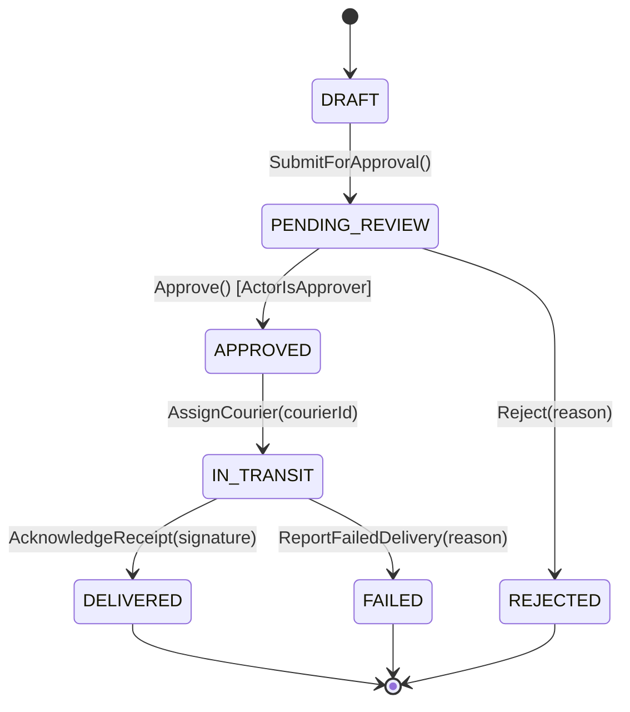

# Business Logic, State Machines & Concurrency Control

This guide defines how to implement bulletproof business logic, enforce domain invariants, manage entity lifecycles using Finite State Machines (FSM), and prevent race conditions with modern concurrency control patterns.

---

##  1. Finite State Machines (FSM) for Domain Entities

Never manage multi-step entity lifecycles with loose boolean flags (e.g. `isApproved`, `isSent`, `isArchived`). Always use an explicit Finite State Machine with strictly defined:
1. **Allowed States** (Enum).
2. **Legal Transitions** (From state $\to$ To state).
3. **Guard Conditions** (Invariants that must be true for transition to succeed).
4. **Transition Side Effects** (Domain events emitted upon transition).

### State Machine Transition Matrix Example (Aid Dispatch)

| Current State | Event / Trigger | Target State | Guard Conditions | Side Effects Emitted |
| :--- | :--- | :--- | :--- | :--- |
| `DRAFT` | `SubmitForApproval()` | `PENDING_REVIEW` | Total items > 0, Origin Pos valid | `DispatchSubmittedEvent` |
| `PENDING_REVIEW`| `Approve()` | `APPROVED` | Actor has `Approver` role | `DispatchApprovedEvent` |
| `PENDING_REVIEW`| `Reject(reason)` | `REJECTED` | Reason is not blank | `DispatchRejectedEvent` |
| `APPROVED` | `AssignCourier(courierId)`| `IN_TRANSIT` | Courier status is `AVAILABLE` | `DispatchCourierAssignedEvent` |
| `IN_TRANSIT` | `AcknowledgeReceipt(sig)` | `DELIVERED` | Valid digital signature received | `DispatchDeliveredEvent` |
| `IN_TRANSIT` | `ReportFailedDelivery()`| `FAILED` | Failure reason logged | `DispatchFailedEvent` |

### Visual State Diagram (Mermaid)


### Type-Safe FSM Implementation (TypeScript)
```typescript
export type DispatchState = 'DRAFT' | 'PENDING_REVIEW' | 'APPROVED' | 'IN_TRANSIT' | 'DELIVERED' | 'REJECTED' | 'FAILED';

export const ALLOWED_DISPATCH_TRANSITIONS: Record<DispatchState, readonly DispatchState[]> = {
  DRAFT: ['PENDING_REVIEW'],
  PENDING_REVIEW: ['APPROVED', 'REJECTED'],
  APPROVED: ['IN_TRANSIT'],
  IN_TRANSIT: ['DELIVERED', 'FAILED'],
  DELIVERED: [],
  REJECTED: [],
  FAILED: [],
} as const;

export class AidDispatchAggregate {
  private state: DispatchState = 'DRAFT';

  transitionTo(nextState: DispatchState, guard?: () => boolean): void {
  const allowed = ALLOWED_DISPATCH_TRANSITIONS[this.state];
  if (!allowed.includes(nextState)) {
  throw new DomainInvariantViolationError(
  `Illegal state transition from '${this.state}' to '${nextState}'`
  );
  }

  if (guard && !guard()) {
  throw new DomainInvariantViolationError(
  `Guard check failed for transition '${this.state}' -> '${nextState}'`
  );
  }

  this.state = nextState;
  }
}
```

---

##  2. Concurrency Control: Optimistic vs Pessimistic Locking

In multi-user, distributed, or high-throughput environments, concurrent writes can cause lost updates or overselling inventory.

### A. Optimistic Concurrency Control (OCC)
Use OCC when write collisions are relatively rare (e.g. updating profile records, evacuee records).

1. Add a `version INTEGER NOT NULL DEFAULT 1` column to the table.
2. Read the record and its `version`.
3. Perform update with condition: `WHERE id = $id AND version = $currentVersion`.
4. If row count is `0`, throw `ConcurrencyConflictError` (HTTP `409 Conflict`), prompting client to refresh and retry.

```sql
UPDATE evacuees 
SET full_name = 'Budi Santoso', version = version + 1, updated_at = now()
WHERE id = '0192e23b-5511-739c-b391-447a46fa7431' AND version = 2;
```

### B. Pessimistic Locking (`SELECT FOR UPDATE`)
Use Pessimistic Locking for critical inventory, balance deductions, or ticket claims where concurrent collisions are frequent:

```typescript
// Drizzle / Postgres Pessimistic Lock example
await db.transaction(async (tx) => {
  // Lock the stock item row during the transaction
  const [stockItem] = await tx
  .select()
  .from(inventoryStock)
  .where(eq(inventoryStock.id, itemId))
  .for('update'); // SELECT ... FOR UPDATE

  if (!stockItem || stockItem.quantity < requestedQty) {
  throw new InsufficientStockError();
  }

  await tx
  .update(inventoryStock)
  .set({ quantity: stockItem.quantity - requestedQty })
  .where(eq(inventoryStock.id, itemId));
});
```

---

##  3. Value Objects for Enforcing Domain Rules

Never pass raw primitive types (`string`, `number`) across domain boundaries if they have business rules. Wrap them in **Value Objects**:

```typescript
// src/domain/value-objects/national-id.vo.ts
export class NationalId {
  private readonly value: string;

  constructor(raw: string) {
  const cleaned = raw.trim();
  if (!/^\d{16}$/.test(cleaned)) {
  throw new InvalidNationalIdError('National ID must be exactly 16 numeric digits.');
  }
  this.value = cleaned;
  }

  getValue(): string {
  return this.value;
  }

  equals(other: NationalId): boolean {
  return this.value === other.value;
  }
}
```
