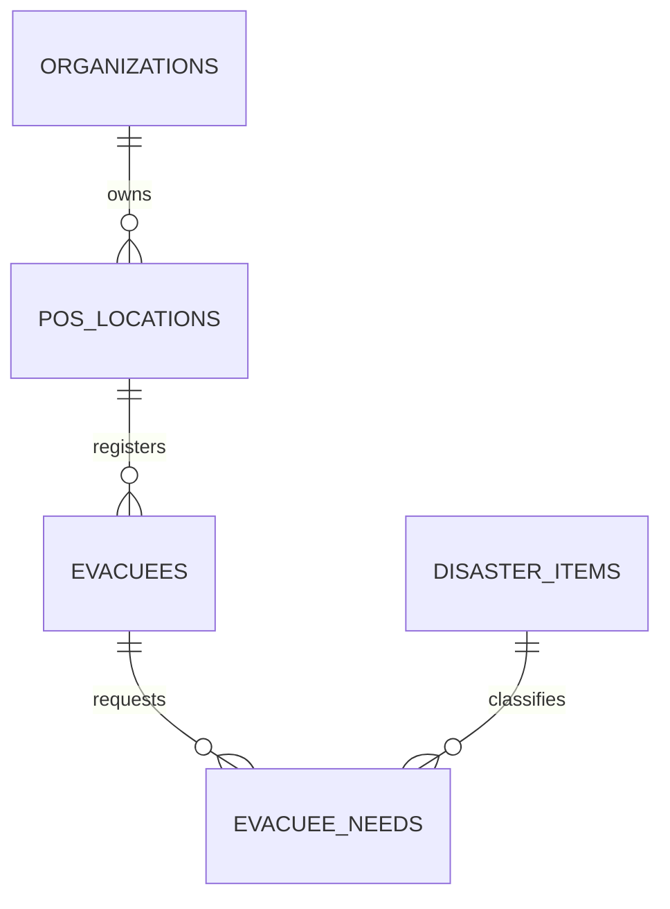

# Database Architect Skill

This skill equips the agent to transform raw or complex application ideas into **industrial-grade, enterprise-ready database schemas**. It ensures schemas meet high standards of data integrity, query performance, security, multi-tenancy, and distributed/offline synchronization.

---

##  Core Engineering Principles

Every database schema produced by this skill adheres to these standards:

1. **Deterministic & Collision-Free Primary Keys**:
  - Default to **UUIDv7** (time-ordered, index-friendly, client-generatable offline) or **ULID**.
  - Use **BigSerial / Identity** only for strictly internal, monolithic OLTP systems without offline needs.
2. **Strict Referential & Domain Integrity**:
  - Explicit Foreign Key constraints with defined `ON DELETE` / `ON UPDATE` actions (`CASCADE`, `RESTRICT`, `SET NULL`).
  - Domain validation using database-level `CHECK` constraints (e.g. non-negative balances, regex checks, valid ranges).
  - Standardized status fields using Postgres `ENUM` or typed lookup tables.
3. **Auditability & Safe Soft-Deletes**:
  - Universal timestamp columns: `created_at TIMESTAMPTZ NOT NULL DEFAULT now()`, `updated_at TIMESTAMPTZ NOT NULL DEFAULT now()`.
  - Audit user tracking: `created_by UUID REFERENCES users(id)`, `updated_by UUID REFERENCES users(id)`.
  - Soft-delete with **Partial Unique Indexes** (`WHERE deleted_at IS NULL`) to avoid duplicate key conflicts on deleted records.
4. **Optimized Indexing Strategy**:
  - Apply the **ESR Rule** (*Equality, Sort, Range*) for composite B-tree indexes.
  - Utilize specialized index types: **GIN** for JSONB/Full-text, **GiST** for PostGIS geospatial coordinates, and **BRIN** for massive time-ordered logs.
5. **Multi-Tenancy & Security (RLS)**:
  - Tenant isolation using Row-Level Security (`ENABLE ROW LEVEL SECURITY`) with `tenant_id` columns and security barrier policies.
  - PII data isolation and encryption tagging.
6. **Local-First & Distributed Sync Capability**:
  - Support for embedded SQLite schemas, Transactional Outbox pattern (`events_outbox`), and Event Sourcing mutation logs for decentralized or offline applications.

---

##  Step-by-Step Architecture Workflow

```
┌─────────────────────────────────────────────────────────────┐
│ 1. DOMAIN & ENTITY EXTRACTION                               │
│ Identify aggregates, entities, cardinality & tenant scopes │
└──────────────────────────────┬──────────────────────────────┘
  │
┌──────────────────────────────▼──────────────────────────────┐
│ 2. PARADIGM & ENGINE SELECTION                              │
│ PostgreSQL (Cloud/RLS) vs SQLite (Local/Offline) vs Hybrid  │
└──────────────────────────────┬──────────────────────────────┘
  │
┌──────────────────────────────▼──────────────────────────────┐
│ 3. VISUAL ER MODELING (Mermaid `erDiagram`)                 │
│ Map tables, PK/FK/UK, attributes, and relationships         │
└──────────────────────────────┬──────────────────────────────┘
  │
┌──────────────────────────────▼──────────────────────────────┐
│ 4. PHYSICAL DDL & CONSTRAINTS FORMULATION                   │
│ Data types, UUIDv7, CHECK constraints, FK cascades          │
└──────────────────────────────┬──────────────────────────────┘
  │
┌──────────────────────────────▼──────────────────────────────┐
│ 5. INDEXING & ACCESS PATTERN OPTIMIZATION                   │
│ Composite B-Tree (ESR), GIN/GiST, Partial & Unique indexes  │
└──────────────────────────────┬──────────────────────────────┘
  │
┌──────────────────────────────▼──────────────────────────────┐
│ 6. SECURITY, RLS & AUDIT LAYER                              │
│ Row-Level Security policies, updated_at triggers            │
└──────────────────────────────┬──────────────────────────────┘
  │
┌──────────────────────────────▼──────────────────────────────┐
│ 7. ORM & MIGRATION DELIVERY                                 │
│ Export Drizzle ORM (TS) / Prisma Schema / Raw SQL DDL       │
└─────────────────────────────────────────────────────────────┘
```

---

##  Detailed Phase Breakdown

### Phase 1: Domain & Entity Extraction
- Extract core aggregate roots, parent-child relationships, and lookup reference tables.
- Determine relationship cardinalities:
  - `1:1` (One-to-One: embedded or foreign key with unique constraint).
  - `1:N` (One-to-Many: foreign key on child).
  - `N:M` (Many-to-Many: junction/join table with composite PK or surrogate PK + unique constraint).

### Phase 2: Paradigm & Engine Selection
- **Centralized Cloud OLTP**: PostgreSQL 16+ with Row-Level Security, JSONB, and PostGIS.
- **Embedded / Local-First / Mobile**: SQLite with WAL mode, bitpacked binary storage, and transactional outbox.
- **Hybrid Event-Sourcing**: SQLite outbox at the edge $\leftrightarrow$ PostgreSQL consolidated event store at HQ.

> Consult [Offline & Event Sourcing Guide](./references/offline-and-eventsourcing.md) for sync architectures.

### Phase 3: Visual Entity-Relationship Diagram
Generate clean, compliant Mermaid ER diagrams following [Mermaid ER Guide](./references/mermaid-er-guide.md):


### Phase 4: Physical DDL & Constraints
- Write production DDL with:
  - Exact column types (`UUID`, `TIMESTAMPTZ`, `VARCHAR(n)`, `NUMERIC(p,s)`, `JSONB`, `BOOLEAN`).
  - `NOT NULL` on all mandatory fields.
  - `CHECK` constraints on numerical thresholds, enums, or string formats.
  - Automatic `updated_at` trigger functions.

### Phase 5: Indexing Strategy
- Define explicit indexes based on query access patterns:
  - Foreign key columns (prevent full table scans on joins and deletes).
  - Composite indexes ordered by `(Equality, Sort, Range)`.
  - Partial indexes for soft deletes: `CREATE INDEX idx_... ON table(col) WHERE deleted_at IS NULL;`.

> Consult [Indexing & Performance Guide](./references/indexing-and-performance.md).

### Phase 6: Multi-Tenant Security & Policies
- If multi-tenant, add `tenant_id UUID NOT NULL REFERENCES tenants(id)`.
- Enable and define Postgres Row-Level Security:
  ```sql
  ALTER TABLE evacuees ENABLE ROW LEVEL SECURITY;
  CREATE POLICY evacuees_tenant_isolation ON evacuees
  FOR ALL
  USING (tenant_id = NULLIF(current_setting('app.current_tenant_id', true), '')::uuid);
  ```

### Phase 7: ORM & Output Formatting
Format the final schema package using the [DDL & Delivery Template](./references/ddl-template.md) with:
1. Architecture & Entity-Relationship Summary
2. Mermaid ER Diagram
3. Production PostgreSQL / SQLite SQL DDL
4. Drizzle ORM (TypeScript) or Prisma Schema representation
5. Query Pattern & Indexing Matrix

---

##  Reference Documentation & Examples

- **[Data Modeling Methodology](./references/modeling-methodology.md)**: Normalization, PK strategies (UUIDv7 vs BigSerial), soft-deletes, and RLS.
- **[Indexing & Performance Guide](./references/indexing-and-performance.md)**: ESR rule, B-Tree, GIN, GiST, BRIN, and query path optimization.
- **[Offline & Event Sourcing Guide](./references/offline-and-eventsourcing.md)**: Edge SQLite schemas, outbox patterns, vector clocks, and CRDT/sync tables.
- **[Mermaid ER Diagram Guide](./references/mermaid-er-guide.md)**: Syntax, relationships, keys, and formatting.
- **[Standard Output Template](./references/ddl-template.md)**: Standard markdown structure for delivering database specs.
- **[Example 1: Disaster Response Local-First Schema](./examples/disaster-localfirst-schema.md)**: Dual SQLite (Field) + Postgres (Central) event-sourced schema.
- **[Example 2: Enterprise Multi-Tenant SaaS Schema](./examples/saas-multitenant-schema.md)**: B2B SaaS schema with RLS, RBAC, billing, and immutable audit logs.
