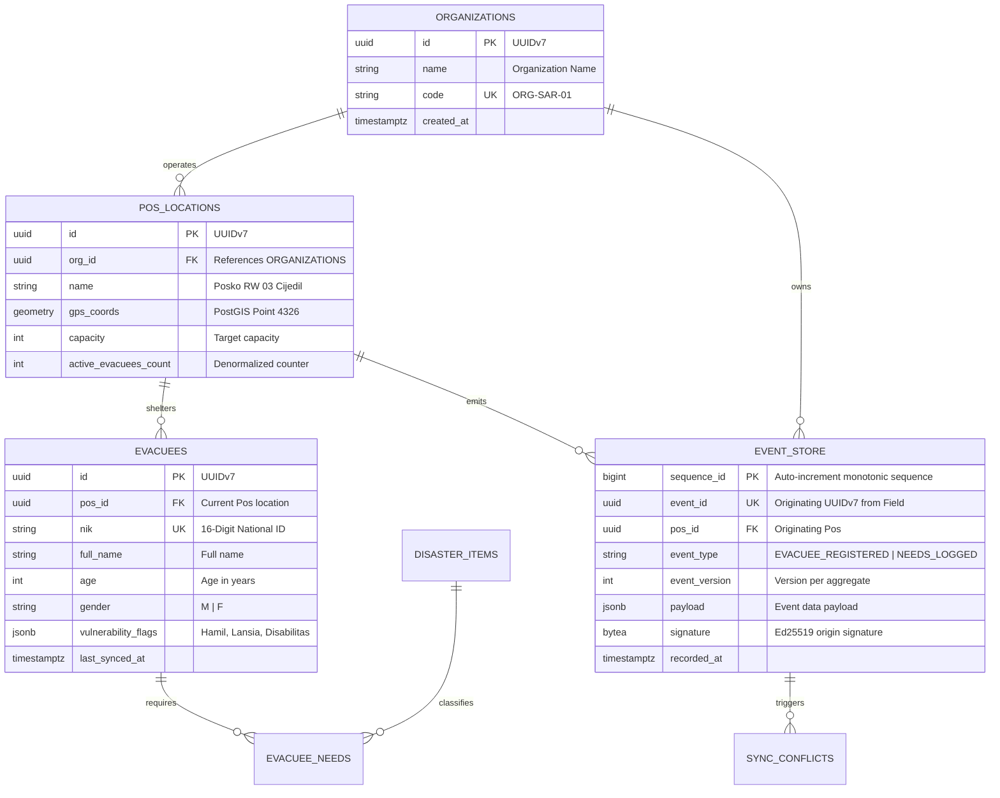

# Reference Example: Disaster Response Local-First Schema (Sandya Architecture)

> **Status**: Production Reference Specification  
> **Engines**: Embedded SQLite (Field Device) + PostgreSQL 16 (Central HQ Cloud)  
> **Key Paradigms**: Event Sourcing, Transactional Outbox, Bit-Packed Binary Buffers, PostGIS, RLS Multi-Tenancy  

---

## 1. Domain Architecture Overview

In the Sandya architecture, field pos devices operate in completely disconnected disaster zones. All intake mutations are recorded in a local SQLite event store. When connected or via optical QR export, events are synchronized upstream to the Central PostgreSQL cluster.

```
┌──────────────────────────────────────────────────────────────┐
│                    EDGE POS TIER (SQLite)                    │
│ • local_evacuees (Materialized fast read view)               │
│ • events_outbox (Transactional queue for QR export / sync)   │
│ • sync_history (Audit of incoming/outgoing scans)            │
└──────────────────────────────┬───────────────────────────────┘
  │
  Optical QR / 4G Uplink Sync
  │
┌──────────────────────────────▼───────────────────────────────┐
│                 CENTRAL CLOUD (PostgreSQL 16)                │
│ • event_store (Append-only immutable multi-tenant ledger)    │
│ • pos_locations (PostGIS GPS coordinates & capacity)         │
│ • evacuees (Aggregated global queryable projection)          │
│ • sync_conflicts (Staged multi-pos reconciliation view)      │
└──────────────────────────────────────────────────────────────┘
```

---

## 2. Mermaid Entity-Relationship Diagram



---

## 3. SQLite Edge Schema (Field Device DDL)

```sql
-- SQLite Connection Init:
PRAGMA journal_mode = WAL;
PRAGMA synchronous = NORMAL;
PRAGMA foreign_keys = ON;

-- 1. Materialized Local Evacuee Read Table
CREATE TABLE local_evacuees (
  id TEXT PRIMARY KEY,                       -- UUIDv7
  pos_id TEXT NOT NULL,
  nik TEXT,
  full_name TEXT NOT NULL,
  age INTEGER CHECK (age >= 0 AND age <= 130),
  gender TEXT CHECK (gender IN ('M', 'F')),
  vulnerabilities INTEGER NOT NULL DEFAULT 0, -- 16-bit bitmask
  notes TEXT,
  created_at INTEGER NOT NULL,               -- Epoch ms
  updated_at INTEGER NOT NULL
);

CREATE INDEX idx_evacuees_pos ON local_evacuees (pos_id, created_at DESC);
CREATE INDEX idx_evacuees_nik ON local_evacuees (nik) WHERE nik IS NOT NULL;

-- 2. Transactional Outbox for QR Export & Cloud Sync
CREATE TABLE events_outbox (
  event_id TEXT PRIMARY KEY,
  aggregate_type TEXT NOT NULL,
  aggregate_id TEXT NOT NULL,
  event_type TEXT NOT NULL,
  event_version INTEGER NOT NULL,
  payload_bin BLOB NOT NULL,                 -- Bit-packed binary payload
  created_at INTEGER NOT NULL,
  sync_status TEXT NOT NULL DEFAULT 'PENDING' 
  CHECK (sync_status IN ('PENDING', 'EXPORTED_QR', 'SYNCED_CLOUD'))
);

CREATE INDEX idx_outbox_pending ON events_outbox (sync_status, created_at ASC)
WHERE sync_status = 'PENDING';
```

---

## 4. PostgreSQL Production Central Cloud DDL

```sql
CREATE EXTENSION IF NOT EXISTS "uuid-ossp";
CREATE EXTENSION IF NOT EXISTS "postgis";

-- 1. Organizations (Tenants)
CREATE TABLE organizations (
  id UUID PRIMARY KEY DEFAULT uuid_generate_v7(),
  name VARCHAR(255) NOT NULL,
  code VARCHAR(32) NOT NULL,
  created_at TIMESTAMPTZ NOT NULL DEFAULT now(),
  updated_at TIMESTAMPTZ NOT NULL DEFAULT now(),
  deleted_at TIMESTAMPTZ
);
CREATE UNIQUE INDEX uq_orgs_code_active ON organizations (LOWER(code)) WHERE deleted_at IS NULL;

-- 2. Disaster Pos Locations with PostGIS
CREATE TABLE pos_locations (
  id UUID PRIMARY KEY DEFAULT uuid_generate_v7(),
  org_id UUID NOT NULL REFERENCES organizations(id) ON DELETE RESTRICT,
  name VARCHAR(255) NOT NULL,
  geom geometry(Point, 4326) NOT NULL,
  capacity INT NOT NULL DEFAULT 100 CHECK (capacity > 0),
  active_evacuees INT NOT NULL DEFAULT 0 CHECK (active_evacuees >= 0),
  created_at TIMESTAMPTZ NOT NULL DEFAULT now(),
  updated_at TIMESTAMPTZ NOT NULL DEFAULT now(),
  deleted_at TIMESTAMPTZ
);

CREATE INDEX idx_pos_org_active ON pos_locations (org_id, created_at DESC) WHERE deleted_at IS NULL;
CREATE INDEX idx_pos_geom ON pos_locations USING GIST (geom);

-- 3. Central Immutable Event Store
CREATE TABLE event_store (
  sequence_id BIGINT GENERATED ALWAYS AS IDENTITY PRIMARY KEY,
  event_id UUID UNIQUE NOT NULL,
  org_id UUID NOT NULL REFERENCES organizations(id),
  pos_id UUID NOT NULL REFERENCES pos_locations(id),
  aggregate_type VARCHAR(64) NOT NULL,
  aggregate_id UUID NOT NULL,
  event_type VARCHAR(64) NOT NULL,
  event_version INT NOT NULL,
  payload JSONB NOT NULL,
  signature BYTEA NOT NULL,
  recorded_at TIMESTAMPTZ NOT NULL DEFAULT now(),
  CONSTRAINT uq_event_version UNIQUE (org_id, aggregate_type, aggregate_id, event_version)
);

CREATE INDEX idx_event_store_stream ON event_store (org_id, aggregate_type, aggregate_id, sequence_id);
CREATE INDEX idx_event_store_pos ON event_store (pos_id, sequence_id);

-- 4. Materialized Global Evacuee Read Projection
CREATE TABLE evacuees (
  id UUID PRIMARY KEY,                       -- Originating UUIDv7
  org_id UUID NOT NULL REFERENCES organizations(id),
  current_pos_id UUID NOT NULL REFERENCES pos_locations(id),
  nik VARCHAR(16),
  full_name VARCHAR(255) NOT NULL,
  age SMALLINT CHECK (age >= 0 AND age <= 130),
  gender CHAR(1) CHECK (gender IN ('M', 'F')),
  vulnerability_flags JSONB NOT NULL DEFAULT '[]'::jsonb,
  last_event_sequence BIGINT NOT NULL REFERENCES event_store(sequence_id),
  created_at TIMESTAMPTZ NOT NULL,
  updated_at TIMESTAMPTZ NOT NULL,
  deleted_at TIMESTAMPTZ
);

CREATE UNIQUE INDEX uq_evacuees_nik_org ON evacuees (org_id, nik) WHERE deleted_at IS NULL AND nik IS NOT NULL;
CREATE INDEX idx_evacuees_pos_active ON evacuees (current_pos_id, created_at DESC) WHERE deleted_at IS NULL;
CREATE INDEX idx_evacuees_vuln_gin ON evacuees USING GIN (vulnerability_flags);
```

---

## 5. Query Pattern & Performance Matrix

| Query Pattern | Dialect | Target SLA | Index Utilized | Scan Type |
|---|---|---|---|---|
| **Find Nearest Pos within 5km** | PostgreSQL | $< 5\text{ms}$ | `idx_pos_geom` (GiST) | Bitmap Index Scan via `ST_DWithin` |
| **Lookup Evacuee by NIK in Org** | PostgreSQL | $< 1\text{ms}$ | `uq_evacuees_nik_org` (B-Tree) | Unique Index Scan |
| **Fetch Unsynced Offline Outbox** | SQLite | $< 0.5\text{ms}$ | `idx_outbox_pending` (B-Tree) | Index-Only Scan |
| **Replay Events for Pos Projection**| PostgreSQL | $< 10\text{ms}$ | `idx_event_store_pos` (B-Tree) | Index Scan with Heap Fetch |
