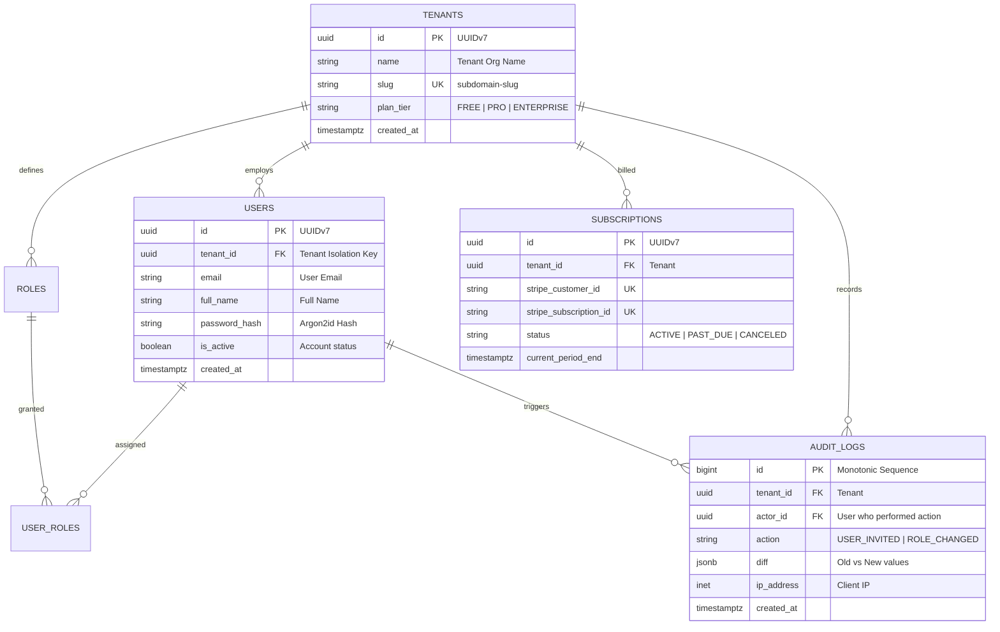

# Reference Example: Enterprise Multi-Tenant SaaS Database Schema

> **Status**: Production Reference Specification  
> **Engine**: PostgreSQL 16+  
> **Key Paradigms**: Row-Level Security (RLS), RBAC Permissions, Stripe Subscriptions, Immutable Audit Log Triggers, Soft-Delete Partial Indexes  

---

## 1. Domain Architecture Overview

This architecture models a multi-tenant B2B SaaS platform where multiple organizations (tenants) share a single database cluster with strict cryptographic and query-level isolation enforced via PostgreSQL **Row-Level Security (RLS)**.



---

## 2. Production PostgreSQL DDL with Row-Level Security

```sql
CREATE EXTENSION IF NOT EXISTS "uuid-ossp";

-- 1. Helper function for updated_at
CREATE OR REPLACE FUNCTION trigger_set_timestamp()
RETURNS TRIGGER AS $$
BEGIN
  NEW.updated_at = NOW();
  RETURN NEW;
END;
$$ LANGUAGE plpgsql;

-- 2. Tenants (Master Partition Root)
CREATE TABLE tenants (
    id UUID PRIMARY KEY DEFAULT uuid_generate_v7(),
    name VARCHAR(255) NOT NULL,
    slug VARCHAR(64) NOT NULL,
    plan_tier VARCHAR(32) NOT NULL DEFAULT 'FREE' CHECK (plan_tier IN ('FREE', 'PRO', 'ENTERPRISE')),
    created_at TIMESTAMPTZ NOT NULL DEFAULT now(),
    updated_at TIMESTAMPTZ NOT NULL DEFAULT now(),
    deleted_at TIMESTAMPTZ
);

CREATE UNIQUE INDEX uq_tenants_slug ON tenants (LOWER(slug)) WHERE deleted_at IS NULL;

-- 3. Users Table (Tenant-Scoped with RLS)
CREATE TABLE users (
    id UUID PRIMARY KEY DEFAULT uuid_generate_v7(),
    tenant_id UUID NOT NULL REFERENCES tenants(id) ON DELETE CASCADE,
    email VARCHAR(255) NOT NULL,
    full_name VARCHAR(255) NOT NULL,
    password_hash VARCHAR(255) NOT NULL,
    is_active BOOLEAN NOT NULL DEFAULT true,
    created_at TIMESTAMPTZ NOT NULL DEFAULT now(),
    updated_at TIMESTAMPTZ NOT NULL DEFAULT now(),
    deleted_at TIMESTAMPTZ
);

CREATE UNIQUE INDEX uq_users_email_tenant ON users (tenant_id, LOWER(email)) WHERE deleted_at IS NULL;
CREATE INDEX idx_users_tenant_active ON users (tenant_id, created_at DESC) WHERE deleted_at IS NULL;

-- Enable Row-Level Security on Users
ALTER TABLE users ENABLE ROW LEVEL SECURITY;
ALTER TABLE users FORCE ROW LEVEL SECURITY;

CREATE POLICY users_tenant_isolation ON users
    FOR ALL
    USING (tenant_id = NULLIF(current_setting('app.current_tenant_id', true), '')::uuid)
    WITH CHECK (tenant_id = NULLIF(current_setting('app.current_tenant_id', true), '')::uuid);

-- 4. Subscriptions (Billing)
CREATE TABLE subscriptions (
    id UUID PRIMARY KEY DEFAULT uuid_generate_v7(),
    tenant_id UUID NOT NULL REFERENCES tenants(id) ON DELETE CASCADE,
    stripe_customer_id VARCHAR(128) UNIQUE NOT NULL,
    stripe_subscription_id VARCHAR(128) UNIQUE,
    status VARCHAR(32) NOT NULL DEFAULT 'ACTIVE' 
        CHECK (status IN ('TRIALING', 'ACTIVE', 'PAST_DUE', 'CANCELED', 'UNPAID')),
    current_period_end TIMESTAMPTZ NOT NULL,
    cancel_at_period_end BOOLEAN NOT NULL DEFAULT false,
    created_at TIMESTAMPTZ NOT NULL DEFAULT now(),
    updated_at TIMESTAMPTZ NOT NULL DEFAULT now()
);

CREATE INDEX idx_subscriptions_tenant ON subscriptions (tenant_id);

-- 5. Immutable Audit Logs Table (Append-Only)
CREATE TABLE audit_logs (
    id BIGINT GENERATED ALWAYS AS IDENTITY PRIMARY KEY,
    tenant_id UUID NOT NULL REFERENCES tenants(id) ON DELETE CASCADE,
    actor_id UUID REFERENCES users(id) ON DELETE SET NULL,
    action VARCHAR(128) NOT NULL,
    resource_type VARCHAR(64) NOT NULL,
    resource_id UUID NOT NULL,
    diff JSONB NOT NULL DEFAULT '{}'::jsonb,
    ip_address INET,
    user_agent TEXT,
    created_at TIMESTAMPTZ NOT NULL DEFAULT now()
);

-- BRIN index for hyper-efficient time-ordered log scanning:
CREATE INDEX idx_audit_logs_timestamp_brin ON audit_logs USING BRIN (created_at);
CREATE INDEX idx_audit_logs_tenant_action ON audit_logs (tenant_id, action, created_at DESC);
CREATE INDEX idx_audit_logs_diff_gin ON audit_logs USING GIN (diff jsonb_path_ops);
```

---

## 3. Drizzle ORM TypeScript Definitions

```typescript
import { pgTable, uuid, varchar, timestamp, text, boolean, uniqueIndex, index } from 'drizzle-orm/pg-core';

export const tenants = pgTable('tenants', {
  id: uuid('id').primaryKey().defaultRandom(),
  name: varchar('name', { length: 255 }).notNull(),
  slug: varchar('slug', { length: 64 }).notNull(),
  planTier: varchar('plan_tier', { length: 32 }).default('FREE').notNull(),
  createdAt: timestamp('created_at', { withTimezone: true }).defaultNow().notNull(),
  updatedAt: timestamp('updated_at', { withTimezone: true }).defaultNow().notNull(),
  deletedAt: timestamp('deleted_at', { withTimezone: true }),
}, (table) => [
  uniqueIndex('uq_tenants_slug').on(table.slug).where(table.deletedAt.isNull()),
]);

export const users = pgTable('users', {
  id: uuid('id').primaryKey().defaultRandom(),
  tenantId: uuid('tenant_id').references(() => tenants.id, { onDelete: 'cascade' }).notNull(),
  email: varchar('email', { length: 255 }).notNull(),
  fullName: varchar('full_name', { length: 255 }).notNull(),
  passwordHash: varchar('password_hash', { length: 255 }).notNull(),
  isActive: boolean('is_active').default(true).notNull(),
  createdAt: timestamp('created_at', { withTimezone: true }).defaultNow().notNull(),
  updatedAt: timestamp('updated_at', { withTimezone: true }).defaultNow().notNull(),
  deletedAt: timestamp('deleted_at', { withTimezone: true }),
}, (table) => [
  uniqueIndex('uq_users_email_tenant').on(table.tenantId, table.email).where(table.deletedAt.isNull()),
  index('idx_users_tenant_active').on(table.tenantId, table.createdAt).where(table.deletedAt.isNull()),
]);
```
