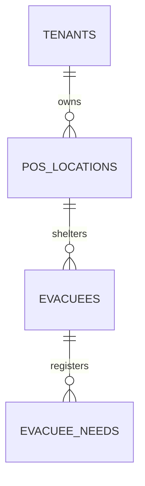

# Industrial-Grade Database Schema Delivery Template

Use this template when producing database architecture specifications in `docs/database/` or planning artifacts.

---

```markdown
# Database Schema Specification: [System / Domain Name]

> **Target Engine(s)**: [e.g., PostgreSQL 16+ (Central Cloud) & SQLite 3.45+ (Local-First Edge)]  
> **Primary Key Strategy**: [e.g., UUIDv7 (RFC 9562)]  
> **Multi-Tenancy Model**: [e.g., Row-Level Security (RLS) via `tenant_id` / Single-tenant]  
> **Audit & Soft-Delete**: [Universal `created_at`, `updated_at`, `deleted_at` with Partial Unique Indexes]  

---

## 1. Domain Architecture & Entity Summary

| Table Name | Primary Purpose | Row Volume Expectation | Mutability |
|---|---|---|---|
| `tenants` | Root organization / workspace partition | Low (< 10k) | Read-heavy |
| `pos_locations` | Operational field camps | Medium (< 100k) | Balanced |
| `evacuees` | Demographic & medical profiles | High (> 1M) | Write-heavy |
| `events_outbox` | Offline mutation sync queue | High (Transient) | Ephemeral / Append |

---

## 2. Mermaid Entity-Relationship Diagram



---

## 3. Production PostgreSQL DDL (Central Cloud Tier)

```sql
-- Extensions
CREATE EXTENSION IF NOT EXISTS "pgcrypto";
CREATE EXTENSION IF NOT EXISTS "postgis";

-- 1. Helper Trigger: Automatic updated_at
CREATE OR REPLACE FUNCTION set_updated_at()
RETURNS TRIGGER AS $$
BEGIN
  NEW.updated_at = now();
  RETURN NEW;
END;
$$ LANGUAGE plpgsql;

-- 2. Master Tables
CREATE TABLE tenants (
  id UUID PRIMARY KEY DEFAULT gen_random_uuid(), -- or uuid_generate_v7()
  name VARCHAR(255) NOT NULL,
  slug VARCHAR(64) NOT NULL,
  created_at TIMESTAMPTZ NOT NULL DEFAULT now(),
  updated_at TIMESTAMPTZ NOT NULL DEFAULT now(),
  deleted_at TIMESTAMPTZ
);

CREATE UNIQUE INDEX uq_tenants_slug_active 
ON tenants (slug) 
WHERE deleted_at IS NULL;
```

---

## 4. Local-First SQLite DDL (Edge / Mobile Tier)

```sql
-- SQLite Schema (WAL Mode Enabled)
CREATE TABLE local_evacuees (
  id TEXT PRIMARY KEY,                       -- UUIDv7
  pos_id TEXT NOT NULL,
  nik TEXT,
  full_name TEXT NOT NULL,
  age INTEGER CHECK (age >= 0 AND age <= 130),
  gender TEXT CHECK (gender IN ('M', 'F')),
  sync_status TEXT NOT NULL DEFAULT 'PENDING' CHECK (sync_status IN ('PENDING', 'SYNCED')),
  created_at INTEGER NOT NULL,               -- Epoch ms
  updated_at INTEGER NOT NULL
);

CREATE INDEX idx_local_evacuees_sync 
ON local_evacuees (sync_status) 
WHERE sync_status = 'PENDING';
```

---

## 5. Drizzle ORM / TypeScript Schema Definitions

```typescript
import { pgTable, uuid, varchar, timestamp, text, integer, uniqueIndex } from 'drizzle-orm/pg-core';

export const tenants = pgTable('tenants', {
  id: uuid('id').defaultRandom().primaryKey(),
  name: varchar('name', { length: 255 }).notNull(),
  slug: varchar('slug', { length: 64 }).notNull(),
  createdAt: timestamp('created_at', { withTimezone: true }).defaultNow().notNull(),
  updatedAt: timestamp('updated_at', { withTimezone: true }).defaultNow().notNull(),
  deletedAt: timestamp('deleted_at', { withTimezone: true }),
}, (table) => [
  uniqueIndex('uq_tenants_slug_active').on(table.slug).where(table.deletedAt.isNull()),
]);
```

---

## 6. Query Access Pattern & Indexing Matrix

| Query Description | Filter Clauses | Sort Order | Index Definition | Expected Type |
|---|---|---|---|---|
| **Active evacuees by Pos** | `pos_id = ? AND deleted_at IS NULL` | `created_at DESC` | `(pos_id, created_at DESC) WHERE deleted_at IS NULL` | Index Scan |
| **Search by NIK** | `nik = ? AND deleted_at IS NULL` | None | `(nik) WHERE deleted_at IS NULL` | Unique Index Scan |
| **Pending sync records** | `sync_status = 'PENDING'` | `created_at ASC` | `(sync_status, created_at ASC) WHERE sync_status = 'PENDING'` | Index-Only Scan |

---

## 7. Migration, Seeding & RLS Security Notes

- **RLS Configuration**: Detailed RLS policy scripts.
- **Rollback Strategy**: Clean reverse migration script (`DROP TABLE ... CASCADE`).
- **Initial Seed Data**: Baseline enum tokens, roles, and disaster dictionary rows.
```
