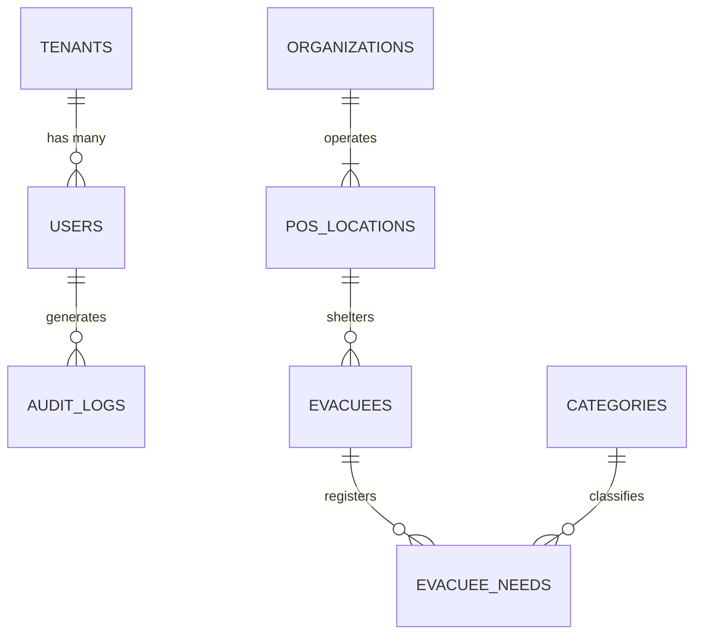
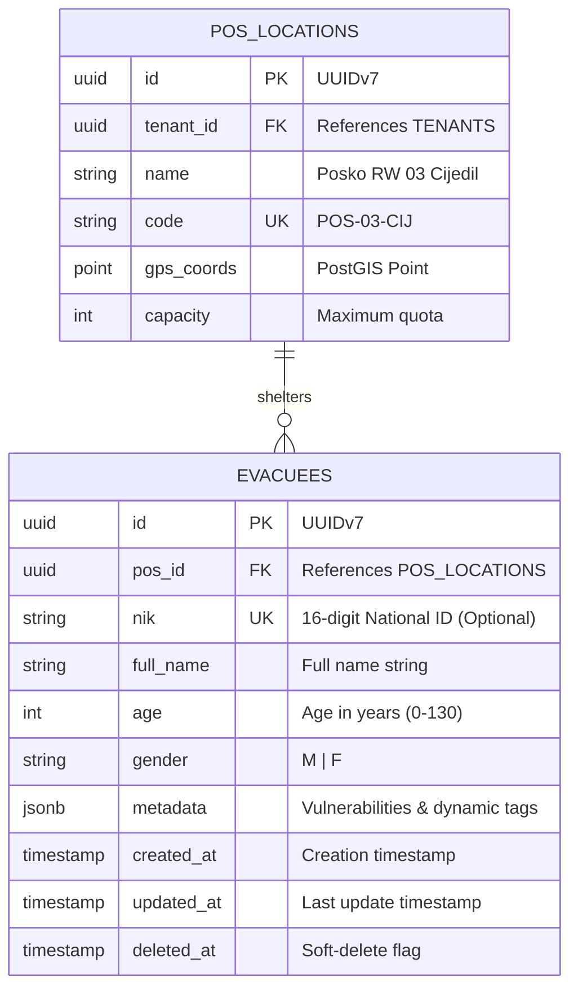

# Mermaid Entity-Relationship (ER) Diagram Modeling Guide

This guide establishes standards for creating clean, parse-safe, and visually clear Mermaid ER diagrams for database specifications.

---

## 1. Syntax Fundamentals & Cardinality Operators



### Cardinality Notation Reference

| Syntax | Left Cardinality | Right Cardinality | Description |
|---|---|---|---|
| `||--||` | Exactly 1 | Exactly 1 | One-to-One Mandatory |
| `|o--||` | 0 or 1 | Exactly 1 | One-to-One Optional Parent |
| `||--|{` | Exactly 1 | 1 or More | One-to-Many (At least one child required) |
| `||--o{` | Exactly 1 | 0 or More | One-to-Many (Standard parent-child) |
| `|o--o{` | 0 or 1 | 0 or More | Optional Parent to Optional Many |
| `}|--|{` | 1 or More | 1 or More | Many-to-Many (Should be resolved to Join Table) |

---

## 2. Table Attribute Syntax & Constraint Keys

Mermaid supports explicit constraint tagging:
- `PK` : Primary Key
- `FK` : Foreign Key
- `UK` : Unique Key



---

## 3. Strict Rules to Prevent Mermaid Syntax Failures

1. **No Spaces in Data Types**:
   - `timestamp` or `timestamptz` (✅ CORRECT)
   - `timestamp with time zone` (❌ BROKEN - Spaces in type will crash the parser)
   - `varchar_255` (✅ CORRECT) vs `varchar(255)` (❌ BROKEN - Parentheses in type crash parser). Put length in the comment column instead: `string full_name "VARCHAR(255)"`.

2. **Always Enclose Relationship Labels in Quotes**:
   - `USERS ||--o{ ORDERS : "places"` (✅ CORRECT)
   - `USERS ||--o{ ORDERS : places` (❌ BROKEN on older parsers)

3. **Resolve N:M Relationships with Junction Entities**:
   Always model many-to-many relationships with an explicit junction table in the ER diagram:
   ```mermaid
   erDiagram
       EVACUEES ||--o{ EVACUEE_SUPPLIES : "receives"
       RELIEF_ITEMS ||--o{ EVACUEE_SUPPLIES : "allocated to"
       
       EVACUEE_SUPPLIES {
           uuid id PK
           uuid evacuee_id FK
           uuid item_id FK
           int quantity
           timestamp distributed_at
       }
   ```
