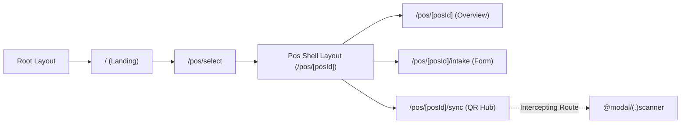
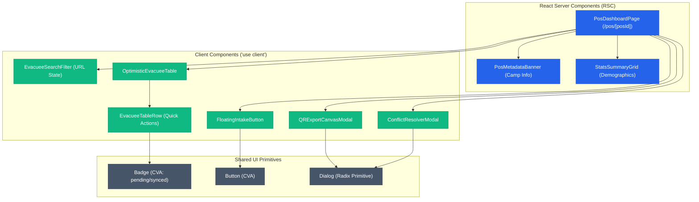
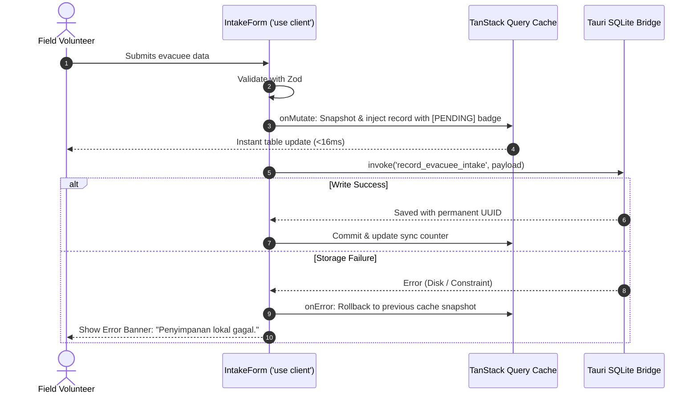

# Reference Example: Disaster Pos Management & QR Scanner Frontend Plan (Sandya Architecture)

> **Status**: Production Reference Architecture  
> **Stack**: Next.js 16 (App Router, React 19 RSC), Tauri v2 Native Bridge, Tailwind CSS v4, TanStack Query v5, Zustand, React Hook Form + Zod  
> **Key Paradigms**: Offline-First Local Storage, Optimistic UI with Rollback, Native Barcode Camera Scanner, Universal 6-State UI Matrix  

---

## 1. Route Inventory & Layout Architecture

| Route Path | Rendering Model | Layout Hierarchy | Route Guard | Purpose |
|---|---|---|---|---|
| `/` | Server Component | `RootLayout` | Auto-redirect to `/pos/select` | Landing / Entry |
| `/pos/select` | Client Component | `RootLayout` | None | Pick active Pos from local storage |
| `/pos/[posId]` | Server Component | `PosShellLayout` | `ActivePosGuard` | Pos dashboard & statistics overview |
| `/pos/[posId]/intake` | Client Component | `PosShellLayout` | `ActivePosGuard` | Rapid offline evacuee registration |
| `/pos/[posId]/sync` | Client Component | `PosShellLayout` | `ActivePosGuard` | QR Code export & import manager |
| `@modal/(.)scanner` | Client Modal | Intercepted Modal | Camera Permission | Native camera QR scanner view |

### Route Navigation Graph


---

## 2. Server vs Client Component Hierarchy Tree



---

## 3. State Management & Data Fetching Architecture

### A. State Classification
- **Server Cache (`@tanstack/react-query`)**: Evacuee lists, pos details, query key factory: `evacueeKeys.list(posId)`.
- **Global UI Store (`zustand`)**: `useActivePosStore` (persisted in `localStorage` for offline session).
- **Offline Storage (`Tauri SQLite IPC`)**: Native Tauri commands (`invoke('save_evacuee')`, `invoke('get_unsynced_events')`).

### B. Optimistic Mutation Sequence


---

## 4. Universal 6-State UI Matrix

| Component / View | 1. Skeleton Loading | 2. Empty State | 3. Success / Populated | 4. Error State | 5. Offline Badge | 6. Conflict Resolver |
|---|---|---|---|---|---|---|
| **Pos Dashboard Header** | Shimmer block for camp name & badges | "Pilih / Buat Posko Baru" banner | Camp name, RW, and active quota | Error banner with reload | "Mode Lapangan (Offline)" tag | N/A |
| **Evacuee Table** | 5-row pulse bars matching column widths | Illustration + "+ Daftarkan Pengungsi Pertama" CTA | Full sortable table with age/needs tags | Toast error + inline "Muat Ulang" | Yellow "Pending Sync" pill per row | Amber "Konflik Data" badge |
| **QR Export Modal** | Loading spinner on canvas generation | "Tidak ada data baru untuk diekspor" | Chunky QR canvas (Versi 15) with pagination | "Gagal encode QR" alert | Export works 100% offline | N/A |
| **Camera Scanner Modal** | Video stream placeholder spinner | N/A | Target reticle + optical alignment frame | "Akses kamera ditolak" + input PIN fallback | Buffer queue pill counter | Auto-triggers Diff Modal |

---

## 5. Form Schemas & Zod Contracts

```typescript
// src/features/evacuees/schemas/evacuee-schema.ts
import { z } from 'zod';

export const evacueeIntakeSchema = z.object({
  fullName: z.string().trim().min(3, 'Nama wajib diisi minimal 3 karakter'),
  nik: z.string().trim().regex(/^[0-9]{16}$/, 'NIK harus 16 digit').optional().or(z.literal('')),
  age: z.coerce.number().int().min(0).max(130),
  gender: z.enum(['M', 'F']),
  vulnerabilities: z.array(z.string()).default([]),
  urgentNeeds: z.array(z.string()).min(1, 'Pilih minimal 1 kebutuhan mendesak'),
  notes: z.string().max(500).optional(),
});

export type EvacueeIntakeValues = z.infer<typeof evacueeIntakeSchema>;
```

---

## 6. Phased Implementation Roadmap

- [ ] **Phase 1: Foundation & Shared UI Tokens** (Tailwind v4 theme setup, CVA Button, Badge, Modal primitives).
- [ ] **Phase 2: Offline SQLite IPC Integration** (Tauri Rust invoke bindings, Local event outbox bridge).
- [ ] **Phase 3: Evacuee Intake Flow & Optimistic Cache** (Zod form validation, TanStack Query optimistic mutation with rollback).
- [ ] **Phase 4: QR Export & Optical Scanner Modal** (Dynamic QR canvas generation, Tauri barcode scanner plugin integration).
- [ ] **Phase 5: Conflict Resolver UI & Accessibility Polish** (Side-by-side diff viewer, keyboard a11y, zero-CLS skeleton loading).
