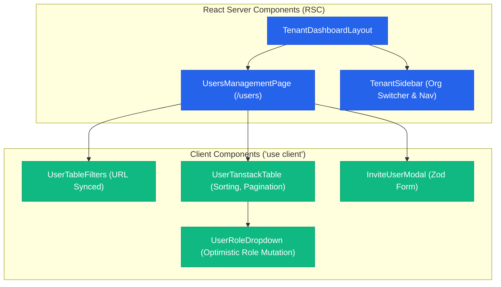

# Reference Example: Enterprise Multi-Tenant SaaS Dashboard Frontend Plan

> **Status**: Production Reference Architecture  
> **Stack**: Next.js 16 (App Router, React 19 RSC), Tailwind CSS v4, TanStack Query v5, TanStack Table v8, Zod  
> **Key Paradigms**: Server-Driven Rendering with Client Interactivity Islands, RBAC Route Protection, URL-Synchronized Filters, Zero-CLS Skeletons  

---

## 1. Route Inventory & Layout Architecture

| Route Path | Rendering Model | Layout Hierarchy | Route Guard | Purpose |
|---|---|---|---|---|
| `/(auth)/login` | Client Component | `AuthLayout` | Guest-only Guard | Organization credentials / SSO login |
| `/(dashboard)/[orgSlug]` | Server Component | `TenantDashboardLayout` | `TenantMemberGuard` | Overview analytics & active KPI counters |
| `/(dashboard)/[orgSlug]/users` | Server Component | `TenantDashboardLayout` | `AdminRoleGuard` | Paginated user management table |
| `/(dashboard)/[orgSlug]/settings` | Client Component | `TenantDashboardLayout` | `OwnerRoleGuard` | Tenant profile & Stripe billing portal |

---

## 2. Server vs Client Component Hierarchy Tree

---

## 3. Universal 6-State UI Matrix

| Component | 1. Skeleton Loading | 2. Empty State | 3. Success / Populated | 4. Error State | 5. Offline Badge | 6. Conflict Resolver |
|---|---|---|---|---|---|---|
| **Tenant Sidebar** | Nav link shimmer bars | N/A | Organization logo & switch list | "Gagal memuat org" | Gray badge | N/A |
| **User Data Table** | 10-row skeleton matching headers | "Belum ada anggota tim" + Invite button | Sortable table with role badges | Error banner + Retry button | Cached read-only banner | N/A |
| **Billing Card** | Card placeholder skeleton | "Belum ada langganan aktif" CTA | Plan badge, renewal date, card last4 | Payment error warning | Offline banner | N/A |

---

## 4. Phased Implementation Roadmap

- [ ] **Phase 1: Multi-Tenant Layout & Navigation** (Sidebar, Org switcher, Breadcrumbs, Tenant Auth Guard).
- [ ] **Phase 2: Server-Rendered Analytics & KPIs** (RSC data fetching with Suspense boundaries).
- [ ] **Phase 3: TanStack Table & URL State Sync** (`nuqs` search params, sortable column headers, pagination).
- [ ] **Phase 4: Role-Based Access Control & Mutations** (Invite user modal, role toggle dropdown, Server Actions).
- [ ] **Phase 5: Performance & Accessibility Polish** (Keyboard focus trapping, ARIA roles, Lighthouse score > 95).
