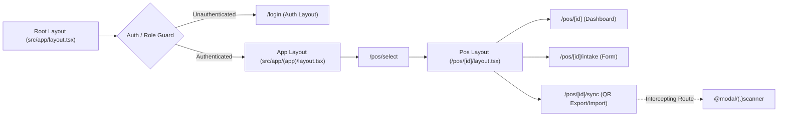
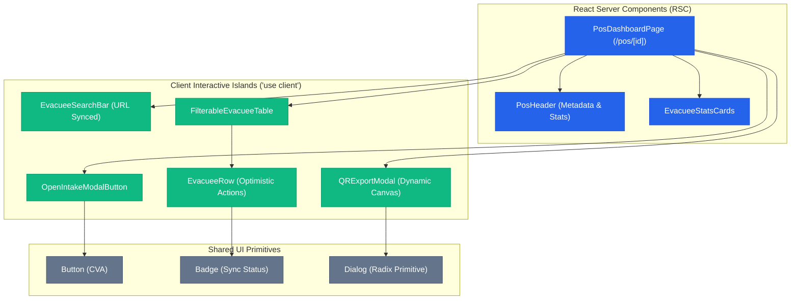
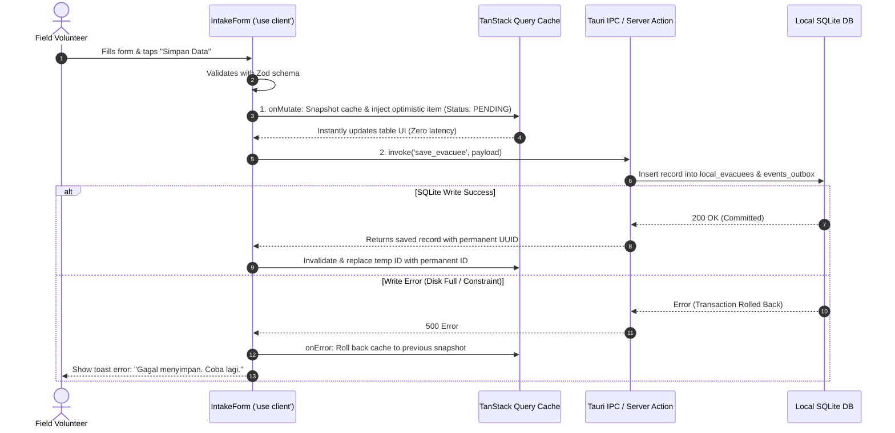

# Mermaid Diagrams Guide for Frontend Architecture

This guide defines standard Mermaid patterns for visualizing route structures, Server/Client component trees, and UI data-flow sequences.

---

## 1. Route Navigation & Layout Graph

Use `flowchart LR` to map URL routes, middleware guards, and nested layouts.

---

## 2. Server vs Client Component Hierarchy Tree

Use `graph TD` with clear visual demarcation between **Server Components (RSC)** and **Client Components ('use client')**.

---

## 3. UI Data-Flow & Optimistic Mutation Sequence Diagram

Use `sequenceDiagram` to show UI actions, optimistic cache updates, IPC calls, and rollback logic.

