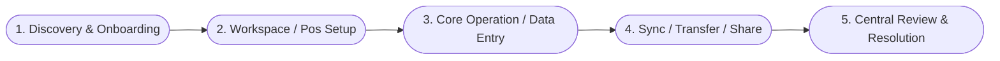

# User Flow Designer Skill

This skill guides the agent in transforming high-level, unstructured, or domain-specific application ideas into rigorous, actionable, and visually clear **User Flows** with standard **Mermaid Diagrams**, screen hierarchies, edge-case handling, and technical implications.

---

## 🎯 Core Objectives

When designing a user flow from an app idea:
1. **Deconstruct the Concept**: Extract actors, core value props, jobs-to-be-done (JTBD), and environmental constraints (e.g., offline-first, latency, role permissions).
2. **Clarify Ambiguities & Edge Cases**: Identify hidden assumptions (e.g., data conflict resolution, auth timeouts, empty states) before finalizing the flow.
3. **Map Macro & Micro Journeys**:
   - **Macro Flow**: High-level end-to-end journey spanning milestones from onboarding to goal completion.
   - **Micro Flow**: Granular step-by-step paths with branching logic (Happy Path, Alternative Paths, Failure/Error Paths).
4. **Render Visual Mermaid Diagrams**: Produce compliant, syntax-clean Mermaid charts (`flowchart TD`, `sequenceDiagram`, `stateDiagram-v2`).
5. **Deliver Standardized Documentation**: Generate a clean, reproducible Markdown artifact or project documentation file based on the [Flow Template](./references/flow-template.md).

---

## 🧭 Step-by-Step Workflow

### Step 1: Concept Deconstruction & Entity Identification
Read the provided application idea carefully and extract the following foundational elements:
- **Actors / Personas**: Who interacts with the system? (e.g., Field Volunteer, Pos Coordinator, HQ Admin, Unauthenticated Guest).
- **Primary Goal (JTBD)**: What core objective is each actor trying to achieve?
- **Domain Entities & States**: What data entities are created, updated, or transferred? (e.g., `EvacueeRecord`, `PosProfile`, `SyncPackage`).
- **Environment & Constraints**: Offline capability, peer-to-peer sharing (QR/Bluetooth/Local network), network latency, permission boundaries.

> Refer to [User Flow Framework Guide](./references/framework.md) for detailed analysis matrices.

### Step 2: Interactive Clarification (When Needed)
If critical architectural or UX decisions are missing from the raw idea, briefly present concise clarification questions (or use sensible defaults with explicit notes) regarding:
- Authentication & Onboarding mechanism.
- Offline behavior (local-first storage, sync triggers, conflict resolution rules).
- Data sharing & security constraints across different roles or organizations.

### Step 3: Macro User Journey Formulation
Draft the high-level roadmap showing the lifecycle of the user interaction:

### Step 4: Micro Flow Formulation & Logic Branching
For each milestone/module, write the detailed interaction flow:
- **Preconditions**: What must be true before this step starts?
- **Step-by-Step Actions**:
  - **User Action**: What does the user tap, click, scan, or input?
  - **System Reaction**: What does the system calculate, store locally, or render?
- **Decision Points & Branches**:
  - `[Happy Path]`: Standard successful execution.
  - `[Alternative Path]`: Secondary valid path (e.g., manual ID input instead of camera scan).
  - `[Exception / Error Path]`: Network offline, permission denied, validation failure, conflicting records.
- **Postconditions & Outputs**: Final state of the system and user screen.

### Step 5: Visual Diagram Generation
Generate clean, self-contained Mermaid diagrams following [Mermaid Modeling Guide](./references/mermaid-guide.md):
- Use `flowchart TD` or `flowchart LR` for user screen transitions and decision trees.
- Use `sequenceDiagram` for multi-actor interactions, client-server sync, or peer-to-peer data transfers.
- Use `stateDiagram-v2` for lifecycle states of core domain objects.

### Step 6: Produce Output Document
Format the final user flow specification using [Flow Template](./references/flow-template.md) and save it either:
1. In the project documentation directory (e.g., `docs/userflows/<flow-name>.md`), or
2. As a structured artifact if presented during planning/design sessions.

---

## 📚 Reference Documentation & Examples

- **[User Flow Analysis Framework](./references/framework.md)**: Deep dive on JTBD, Actor-Action-System matrix, error handling taxonomy, and offline-first UX.
- **[Mermaid Modeling Guide](./references/mermaid-guide.md)**: Syntax rules, node naming conventions, and diagram templates.
- **[Standard Output Template](./references/flow-template.md)**: Markdown structure for delivering user flows.
- **[Example 1: Offline-First P2P Sync Flow](./examples/offline-first-p2p-sync.md)**: Complete production example for disaster pos data collection and QR code sync.
- **[Example 2: Multi-Role Onboarding Flow](./examples/multi-role-onboarding.md)**: Organization setup, member invitation, role permission delegation, and pos management.

---

## 💡 Quality Checklist

Before finalizing any user flow:
- [ ] Are all user roles clearly delineated with distinct entry and exit points?
- [ ] Are offline, empty, loading, error, and conflict states explicitly handled?
- [ ] Do all decision diamonds in Mermaid diagrams have labeled outgoing branches (e.g., `-->|Yes|`, `-->|No|`)?
- [ ] Is every screen or modal mapped to a clear route or UI component name?
- [ ] Are technical dependencies (local database, encryption, export format, sync protocol) clearly annotated?
