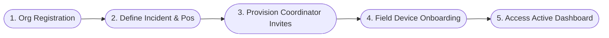
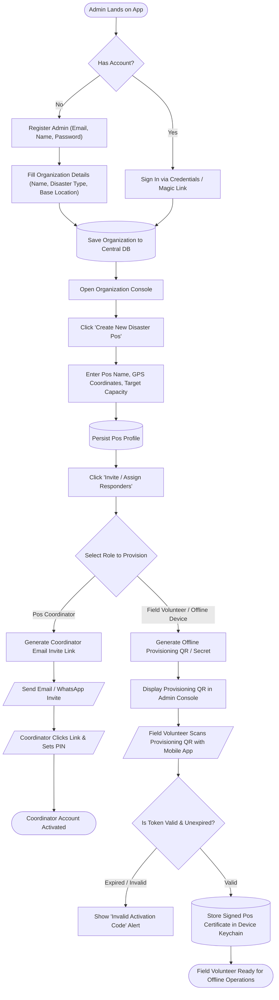

# Reference Example: Multi-Role Organization Setup & Pos Delegation

> **Status**: Approved Specification  
> **Target Personas**: Organization Administrator, Pos Coordinator, Field Responder  
> **Core Objective (JTBD)**: Allow disaster response organizations to register their organization, invite coordinators, delegate pos-level permissions, and provision offline keys for field volunteers.  
> **Context & Environment**: Web Admin Dashboard (Online) & Mobile Field Clients (Hybrid Online/Offline).

---

## 1. Flow Overview & Scope

### In Scope
- Organization creation and admin profile registration.
- Role-Based Access Control (RBAC): Super Admin, Pos Coordinator, Field Responder, Read-Only Auditor.
- Generation of single-use or token-based invite links / QR codes for field staff.
- Offline device authorization token provisioning.

### Out of Scope
- Financial donor billing and invoicing.

---

## 2. Macro Journey Map

---

## 3. Detailed Micro Flow & Logic Branching

---

## 4. Step-by-Step Interaction Table

| Step # | Screen / Route | Actor Action | System Response | Validations & Notes |
|---|---|---|---|---|
| **1.0** | `/auth/register` | Admin inputs org name, contact info, and admin password | Creates new Org tenant & assigns SuperAdmin role | Enforces strong password rules |
| **1.1** | `/org/dashboard` | Admin selects "Pos Management" -> "Add Pos" | Opens Pos creation modal | Pre-populates location via browser geolocation if granted |
| **1.2** | `/org/pos/[id]/staff` | Admin selects "Generate Field Pass QR" | Creates signed device token with 7-day expiration | Encrypted with org public key |
| **1.3** | `/onboarding/scan-pass` | Volunteer scans Field Pass QR using mobile app | Decodes token, binds device ID to Pos, switches app to offline-ready state | Stores JWT/certificate locally |

---

## 5. Edge Cases & Exception Matrix

| Trigger / Condition | Failure Mode | UX Behavior / Recovery Path |
|---|---|---|
| **Stolen / Compromised Field Device** | Unauthorized person holds field phone | Admin can click "Revoke Device Key" in Org console; subsequent syncs from that device ID are rejected at server gateway. |
| **Field Pass QR Scanned Twice** | Multi-use attempt on single-use token | System rejects second scan with message "This activation code was already used on another device." |
| **Role Downgrade while Offline** | User role demoted from Coordinator to Read-Only | Device retains local permissions until next successful online sync or peer sync verification. |
