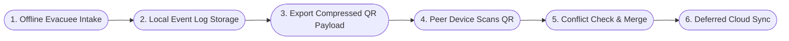
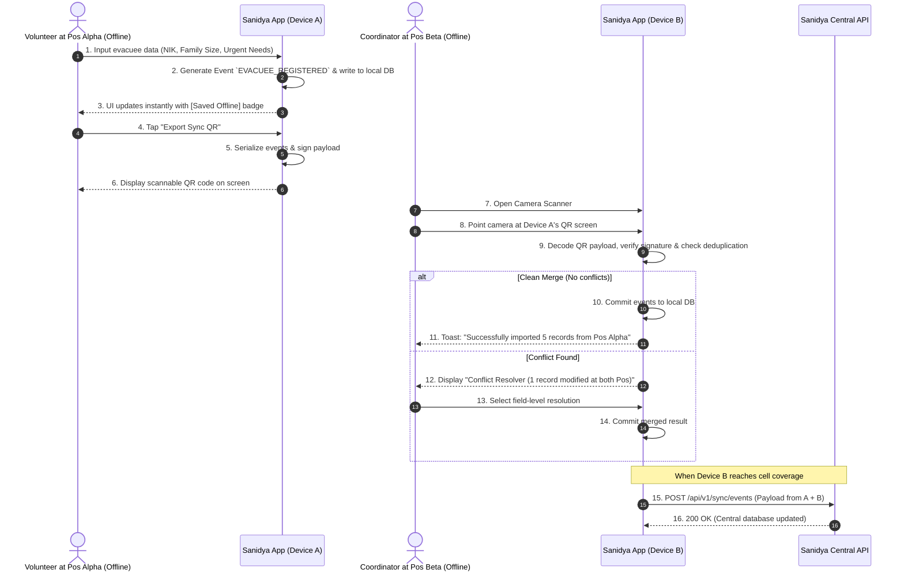

# Reference Example: Offline Disaster Intake & Peer-to-Peer QR Sync

> **Status**: Approved Specification  
> **Target Personas**: Pos Field Volunteer (Device A), Pos Coordinator (Device B), HQ Admin  
> **Core Objective (JTBD)**: Enable field volunteers to log evacuee intake and supply status completely offline, then export and sync data to another device or pos coordinator using optical QR transfer without requiring internet.  
> **Context & Environment**: Disaster zone with zero cellular connectivity, mobile/desktop client with camera scanner.

---

## 1. Flow Overview & Scope

### In Scope
- Offline registration of evacuee profiles and urgent supply needs.
- Generation of compressed, signed QR codes representing local mutation events.
- Optical scanning of QR codes by peer devices (same or different organization).
- Conflict detection and merging of peer data into local offline storage.
- Background cloud synchronization once internet is restored.

### Out of Scope
- Direct NFC / Bluetooth mesh networking (deferred to future milestone).
- External donor payment gateway processing.

### Preconditions
- User has opened the app on their device and selected or created an active Pos.
- Device has camera permission enabled for scanning.

### Postconditions
- All evacuee intake records are stored locally with event-sourced mutation logs.
- Scanned peer data is integrated without duplicating existing records.

---

## 2. Macro Journey Map (High-Level)

---

## 3. Detailed Micro Flow & Logic Branching

```mermaid
flowchart TD
    Start([Field Volunteer Opens App]) --> CheckPos{"Is Active Pos Configured?"}
    
    CheckPos -->|No| CreatePos["Create Pos Profile (Name, Location, Camp ID)"]
    CreatePos --> SavePosLoc[(Save Pos to Local SQLite)]
    SavePosLoc --> IntakeView["Open Pos Intake Screen"]
    
    CheckPos -->|Yes| IntakeView
    
    IntakeView --> InputData["Fill Evacuee Demographic & Needs Data"]
    InputData --> TapSave["Tap 'Save Record'"]
    
    TapSave --> SaveLocal[(Append Event to Local Event Store)]
    SaveLocal --> UpdateUI["Show Success Toast & Increment Unsynced Counter"]
    
    UpdateUI --> NextAction{"Action Chosen by Volunteer"}
    NextAction -->|Add More| IntakeView
    NextAction -->|Export to Peer| GenQR["Tap 'Export Sync QR'"]
    
    GenQR --> CompressData["Compress Event Logs (Gzip/CBOR) & Sign with Device Key"]
    CompressData --> PayloadSize{"Payload > 2KB?"}
    
    PayloadSize -->|No| ShowSingleQR["Render High-Density QR Code"]
    PayloadSize -->|Yes| ShowPaginatedQR["Render Paginated / Animated QR Stream"]
    
    ShowSingleQR --> PeerScan[/Peer Device Opens Scanner & Reads QR/]
    ShowPaginatedQR --> PeerScan
    
    PeerScan --> VerifyPayload{"Verify Signature & Schema?"}
    VerifyPayload -->|Invalid / Corrupt| ShowScanError["Show 'Corrupted QR' Alert & Prompt Rescan"]
    
    VerifyPayload -->|Valid| CheckDuplicates{"Check for ID / Conflict in Peer DB?"}
    CheckDuplicates -->|New Records Only| FastMerge["Insert New Records into Peer DB"]
    
    CheckDuplicates -->|Conflicting Updates| ConflictModal["Open Conflict Resolution UI (Diff View)"]
    ConflictModal --> ResolveChoice{"User Merge Decision"}
    ResolveChoice -->|Use Newer Timestamp| AutoLWW["Apply Last-Write-Wins Rule"]
    ResolveChoice -->|Manual Field Pick| ManualCommit["Save Custom Merged Version"]
    
    AutoLWW --> CommitPeer[(Commit to Peer Local DB)]
    ManualCommit --> CommitPeer
    FastMerge --> CommitPeer
    
    CommitPeer --> PeerSuccess["Show 'Synced X Records from Pos' Banner"]
    
    PeerSuccess --> NetCheck{"Internet Connection Restored?"}
    NetCheck -->|No| StayOffline([Remain in Offline Queue])
    NetCheck -->|Yes| PushCloud["Push Cumulative Event Logs to Central Server"]
    PushCloud --> Done([Sync Complete])
```

---

## 4. Multi-Actor Sequence Diagram

---

## 5. Step-by-Step Interaction Table

| Step # | Screen / Route | Actor Action | System Response | Validations & Notes |
|---|---|---|---|---|
| **1.0** | `/pos/[id]/dashboard` | Taps "Tambah Pengungsi" | Navigates to `/pos/[id]/intake` | Form initializes with local UUID |
| **1.1** | `/pos/[id]/intake` | Enters Name, NIK, Age, Health Conditions, Logistics needs | Validates input format; activates "Simpan" button | NIK format check (16 digits) |
| **1.2** | `/pos/[id]/intake` | Taps "Simpan Data" | Writes record to local IndexedDB/SQLite with status `PENDING_SYNC` | Instant optimistic response |
| **1.3** | `/pos/[id]/dashboard` | Taps "Bagikan via QR" | Opens QR Export modal with compressed event batch | Shows QR version & timestamp |
| **1.4** | `/scanner` (Peer) | Opens camera scanner and points to QR | Scans image, decodes JSON, checks digital signature | Runs background deduplication |
| **1.5** | `/pos/[id]/sync-review` | Reviews imported records & approves merge | Commits records to peer database with origin metadata | Displays pos origin tag |

---

## 6. Edge Cases & Exception Matrix

| Trigger / Condition | Failure Mode | System Reaction & Recovery Path |
|---|---|---|
| **Same person registered at two pos** | Duplicate NIK detected during QR scan | System flags duplicate NIK, displays both pos entry timestamps, allows coordinator to merge notes or mark relocation. |
| **Damaged / glare on phone screen** | QR scanner fails to lock focus | App allows switching between high-density and low-density QR chunks, or adjusting brightness slider. |
| **Different Organization QR scan** | Data origin signed by Org X, scanned by Org Y | Data is imported with `External_Org` tag and read-only attributes, avoiding overwrite of internal taxonomy. |
| **App closed during QR generation** | Interrupted export | State is stateless; reopening "Export QR" regenerates code from persisted unexported event log. |
