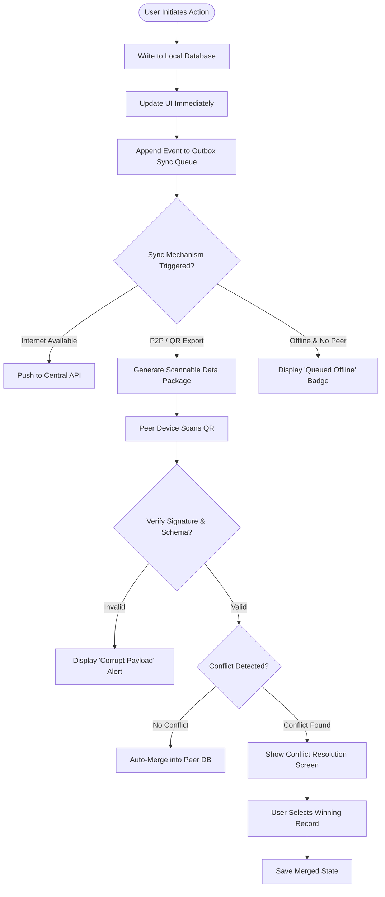

# User Flow Analysis & Formulation Framework

This framework defines a systematic approach to breaking down product ideas and feature requests into rigorous, end-to-end user flows.

---

## 1. Concept Deconstruction: The 4-Pillar Model

When analyzing an application idea, deconstruct it across four essential pillars:

```
┌────────────────────────────────────────────────────────┐
│                   APPLICATION IDEA                     │
└───────────────────────────┬────────────────────────────┘
                            │
       ┌────────────────────┼───────────────────┐
       ▼                    ▼                   ▼
 1. PERSONAS &        2. JOBS-TO-BE-DONE  3. ENTITIES &      4. ENVIRONMENT &
    ROLES                (JTBD)              LIFECYCLES         CONSTRAINTS
 • Field Operator     • Register intake   • Evacuee Profile  • Offline / P2P
 • Pos Coordinator    • Generate QR sync  • Relief Inventory • Low battery
 • Org Admin          • Merge records     • Sync Package     • No cloud link
```

### Pillar 1: Personas & Roles
- Define each user type, their authority, and their primary device/context (e.g., Mobile in low-connectivity disaster zone vs. Desktop in command center).
- Map permission boundaries (e.g., Read-only, Local Pos Admin, Multi-Pos Coordinator).

### Pillar 2: Jobs-To-Be-Done (JTBD)
- Frame user goals using the standard format:
  > *"When [situation / trigger], I want to [action / capability], so that [outcome / value]."*
- Group JTBD into Primary (must-have for the flow to succeed) and Secondary (supporting operations like filtering, exporting, auditing).

### Pillar 3: Entities & Lifecycles
- Identify core data objects created or modified during the flow.
- Define object states (e.g., `Draft` → `Saved Locally` → `Pending Sync` → `Synced` → `Archived`).

### Pillar 4: Environment & Constraints
- Device constraints (screen size, camera scanner availability, storage quotas).
- Network conditions (offline-only, intermittent 2G/3G, local Wi-Fi, mesh network).
- Security & compliance (local encryption, PII data handling, role-based export verification).

---

## 2. The Actor-Action-System Matrix

For every step in a micro user flow, maintain a 3-way mapping:

| Step # | Actor Action | System Reaction (Client / UI) | Backend / Local Engine Reaction |
|---|---|---|---|
| 1.0 | User taps "New Evacuee Entry" | Navigates to `/intake/form`, autofocuses National ID field | Generates local UUID & timestamp |
| 1.1 | Enters demographic data & taps Save | Shows optimistic success banner, redirects to pos list | Appends event to local SQLite/IndexedDB, increments unsynced counter |
| 1.2 | Taps "Export Sync QR" | Renders high-density QR modal with chunk pagination if payload > 2KB | Signs compressed JSON payload with local private key |

---

## 3. Taxonomy of Flow Paths

Every user flow must account for three path categories:

### A. The Happy Path (Primary Flow)
- The frictionless, error-free path to achieving the user's goal.
- Clear forward momentum with minimal cognitive overhead.

### B. The Alternative Paths (Secondary Flows)
- Intentional branches chosen by the user:
  - Choosing manual data entry instead of scanning a barcode/QR.
  - Selecting "Batch Import" instead of individual entry.
  - Filter / Search / Sorting variations.

### C. Exception & Recovery Paths (Edge Cases & Failures)
Every step must evaluate potential failure modes:
1. **Validation Failures**: Missing required fields, invalid format, duplicate entries.
2. **Hardware / Sensor Issues**: Camera permission denied, unreadable QR code, damaged barcode.
3. **Network & Sync Disruptions**: Cloud unreachable, timeout, partial sync failure, token expiration.
4. **Data Conflicts**:
   - Record modified on two disconnected devices simultaneously.
   - Same evacuee registered in Pos A and Pos B.
   - Pos inventory depleted while offline.
5. **System & Storage Limits**: Local storage quota exceeded, database corruption, app crash recovery.

---

## 4. Offline-First & Local-First User Flow Patterns

When designing flows for apps that must function without internet (like disaster response dashboards):



### Key Offline UX Principles:
1. **Never Block on Network**: Every write operation succeeds locally immediately.
2. **Transparent Sync Status**: Always display clear indicators (`Saved Locally`, `Pending Sync (3 items)`, `Synced just now`).
3. **Explicit Conflict Resolution**: When automatic merge (e.g. CRDT / Last-Write-Wins) is ambiguous, present a side-by-side comparison UI.
4. **Chunked QR Transfer for Large Payloads**: If data exceeds QR capacity (~2KB), provide multi-frame animated QR codes or paginated QR scanning.
