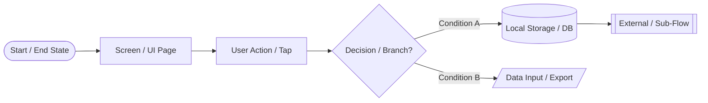
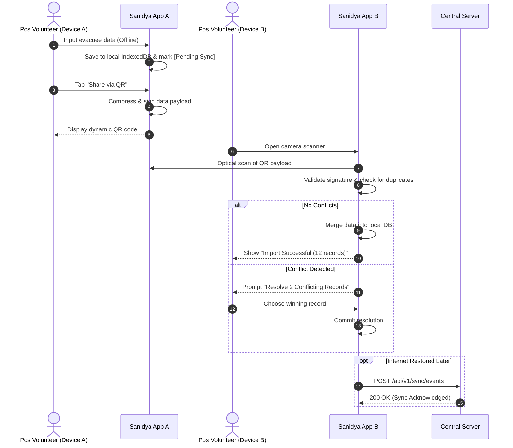
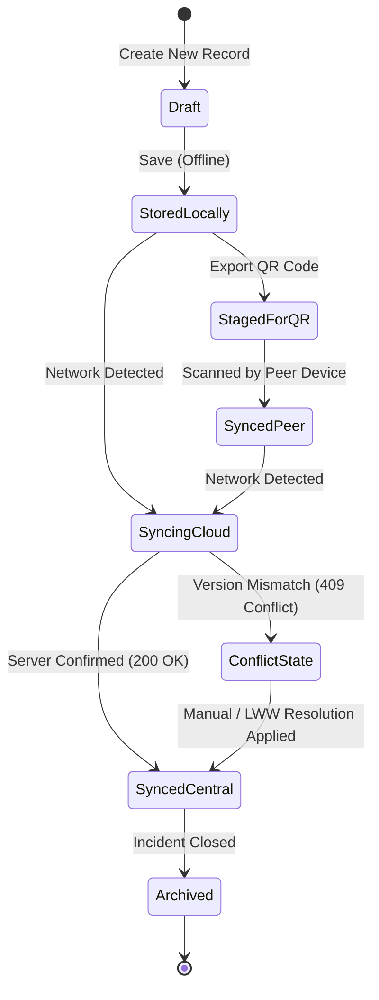

# Mermaid Modeling & Syntax Guide for User Flows

This guide outlines standards and syntax rules for creating resilient, unambiguous, and readable Mermaid diagrams for user flows.

---

## 1. Diagram Types & Usage Rules

| Diagram Type | Primary Use Case | Key Strengths |
|---|---|---|
| **Flowchart (`flowchart TD` or `LR`)** | Screen navigation, conditional logic, user decision trees, error paths. | Best for general user flows, routing, and UI state branching. |
| **Sequence Diagram (`sequenceDiagram`)** | Peer-to-peer data sync, QR exchange, client-server APIs, multi-device handshakes. | Best for showing chronological message passing between actors & systems. |
| **State Diagram (`stateDiagram-v2`)** | Entity lifecycle (e.g., Record sync state, Disaster event status). | Best for tracking state transitions and valid trigger events. |

---

## 2. Flowchart Standards & Node Conventions

### Recommended Shapes & Meaning



- `([Stadium])` : Entry points, exits, terminal states (`([Start Flow])`, `([Flow Completed])`).
- `[Rectangle]` : UI Views, Screens, or standard user actions (`[Open Pos Dashboard]`).
- `{"Diamond"}` : Decision points, condition evaluations, validation checks (`{"Is Camera Allowed?"}`).
- `[(Cylinder)]` : Databases, local storage, indexedDB, cache (`[(Local SQLite DB)]`).
- `[/Parallelogram/]` : I/O operations, QR code generation, camera scan (`[/Scan QR Code/]`).
- `[[Subroutine]]` : Reusable modular sub-flows (`[[Authentication Flow]]`).

---

## 3. Critical Syntax Guardrails to Prevent Rendering Errors

1. **Always Quote Labels with Punctuation**:
   ```mermaid
   %% CORRECT
   nodeA["View Details (Read-Only)"]
   nodeB{"Has Camera Permission?"}
   nodeC["Route: /dashboard/pos-1"]

   %% INCORRECT - Will break parser
   %% nodeA[View Details (Read-Only)]
   %% nodeB{Has Camera Permission?}
   ```

2. **Explicitly Label All Decision Branches**:
   Every decision diamond MUST have at least two outgoing edges with descriptive labels:
   ```mermaid
   flowchart TD
       CheckNet{"Network Online?"}
       CheckNet -->|Yes| SyncCloud["Push to API"]
       CheckNet -->|No| QueueLocal["Save to Local Outbox"]
   ```

3. **Use Subgraphs for Actors, Devices, or Screen Boundaries**:
   ```mermaid
   flowchart TD
       subgraph Device_A["Device A (Field Pos)"]
           A1["Input Evacuee Data"] --> A2["Generate QR Export"]
       end

       subgraph Device_B["Device B (Relief Camp)"]
           B1["Scan QR with Camera"] --> B2["Merge into Local DB"]
       end

       A2 -.->|Optical QR Transfer| B1
   ```

---

## 4. Sequence Diagram Standards

Use sequence diagrams when multiple actors, devices, or services interact over time.



---

## 5. State Diagram Standards

Use `stateDiagram-v2` to model entity lifecycles.


