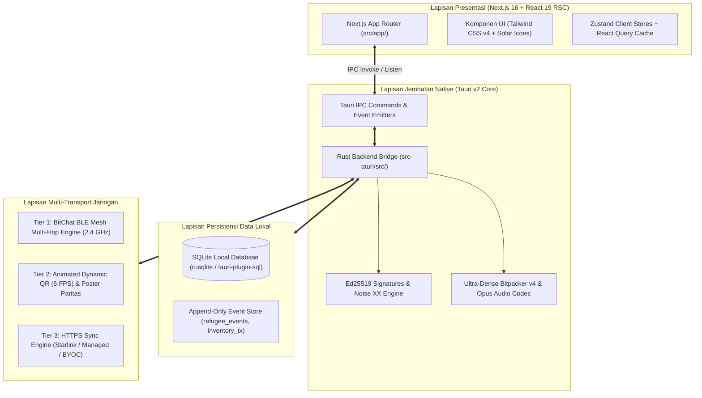

# Arsitektur Sistem Sandya (`docs/design/architecture`)

> **Status**: Approved (Katalog & Blueprint Arsitektur Sistem)  
> **Klasifikasi**: Spesifikasi Arsitektur Sistem Terdistribusi  
> **Dokumen Terkait**: [Indeks Utama Desain](../README.md) | [Analisis Arsitektur](../../analisis-arsitektur.md)

Folder ini merangkum rancangan arsitektur sistem, modularitas antarkomponen, protokol komunikasi nirkabel, dan mekanisme persistensi data lokal tanpa ketergantungan internet pada aplikasi **Sandya**.

---

## 1. Diagram Arsitektur Berlapis (Layered Architecture)

---

## 2. Dokumen Spesifikasi Arsitektur Terkait

Dokumen arsitektur sistem Sandya dijabarkan secara rinci dalam spesifikasi berikut:

1. **[Analisis Kritis & Blueprint Arsitektur](../../analisis-arsitektur.md)**:
   - Evaluasi kelayakan arsitektur *offline-first*.
   - Mitigasi *race condition* stok fisik melalui prinsip *Single-Writer Ledger*.
   - Penanganan benturan identitas (*identity collision*) dan integritas data.
2. **[Spesifikasi Protokol Bluetooth LE Mesh & Intercom Taktis](../../spesifikasi-mesh-dan-intercom.md)**:
   - *Sandya Mesh Protocol (SMP v1)* berbasis *framing* BitChat v2.
   - Mekanisme *Zero-Touch Background Gossip Sync* dan *Vector Clock anti-entropy*.
   - 4 saluran radio lapangan dan Push-to-Talk (PTT) suara terkompresi Opus 3.2 kbps.
3. **[Spesifikasi Protokol Transfer Animated QR & Poster Paritas](../../spesifikasi-transfer-animated-dan-poster.md)**:
   - *Animated Dynamic Multipart QR* untuk transfer asinkron *out-of-order* layar HP.
   - Poster multi-QR fisik dengan redundansi paritas XOR (kebal kehilangan 1 kotak QR).
4. **[Kamus Bencana & Serialisasi Biner Ultra-Dense v4](../../metode-transfer-dan-kamus-bencana.md)**:
   - Katalog 256 kebutuhan bencana bawaan (`uint8` token).
   - Format biner *Ultra-Dense v4* (~5-6 bytes/jiwa terkompresi).
5. **[Tokenisasi Nama Indonesia & Poster Multi-QR](../../tokenisasi-nama-dan-paritas-qr.md)**:
   - Tokenisasi nama deterministik berbasis frekuensi nama nusantara tanpa model AI.
   - Evaluasi ketahanan sobekan kertas poster di tiang tenda darurat.
6. **[Tata Kelola Organisasi, Hierarki 3-Tingkat, & Kriptografi](../../tata-kelola-organisasi-dan-kriptografi.md)**:
   - Hierarki: Organisasi -> Misi Bencana -> Posko Lapangan.
   - Matriks 4-peran RBAC fungsional dan otentikasi kunci asimetris Ed25519.
7. **[Evaluasi Eksperimen JabCode](../../archive/evaluasi-jabcode-dan-perbandingan.md)**:
   - Catatan riset pengujian barcode 2D warna dan dasar pembatalannya untuk situasi lapangan.
