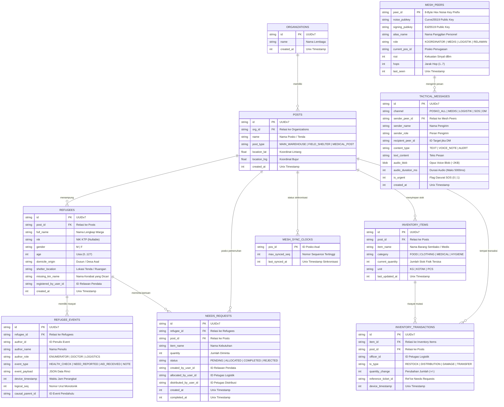

# Desain Basis Data & Skema Persistensi (`docs/design/database`)

> **Status**: Approved (Spesifikasi Model Data & Skema Database)  
> **Klasifikasi**: Skema Relasional SQLite & Arsitektur Event Sourcing  
> **Dokumen Terkait**: [Event Sourcing & Hierarki](../../event-sourcing-dan-hierarki.md) | [Indeks Desain](../README.md)

Folder ini mendokumentasikan spesifikasi skema data relasional lokal, diagram relasi entitas (*Entity-Relationship Diagram*), model *Event Sourcing*, dan strategi pengindeksan basis data SQLite pada aplikasi **Sandya**.

---

## 1. Diagram Relasi Entitas (Mermaid ERD)



---

## 2. Strategi Pengindeksan Database (Indexing Strategy)

Untuk memastikan performa kueri tetap instan pada smartphone dengan spesifikasi rendah saat mengelola ribuan data pengungsi:

```sql
-- Indeks Pencarian Cepat Pengungsi & Temu Keluarga
CREATE INDEX idx_refugees_post_id ON refugees(post_id);
CREATE INDEX idx_refugees_full_name ON refugees(full_name COLLATE NOCASE);
CREATE INDEX idx_refugees_domicile ON refugees(domicile_origin COLLATE NOCASE);
CREATE INDEX idx_refugees_missing_kin ON refugees(missing_kin_name COLLATE NOCASE) WHERE missing_kin_name IS NOT NULL;

-- Indeks Event Sourcing & Rekonsiliasi Vector Clock
CREATE INDEX idx_refugee_events_refugee_id ON refugee_events(refugee_id);
CREATE INDEX idx_refugee_events_sync ON refugee_events(logical_seq, device_timestamp);

-- Indeks Logistik & Distribusi
CREATE INDEX idx_inventory_post_cat ON inventory_items(post_id, category);
CREATE INDEX idx_needs_status ON needs_requests(post_id, status);

-- Indeks Komunikasi Radio & Radar Mesh
CREATE INDEX idx_tactical_channel ON tactical_messages(channel, created_at DESC);
CREATE INDEX idx_mesh_peers_last_seen ON mesh_peers(last_seen DESC);
```

---

## 3. Dokumen Spesifikasi Terkait
Detail arsitektur event sourcing, mitigasi pergeseran jam (*clock drift*), dan alur transaksi *Single-Writer* dijelaskan secara lengkap di:
[Arsitektur Event Sourcing, Hierarki Organisasi, & Universal Data Mule](../../event-sourcing-dan-hierarki.md).
