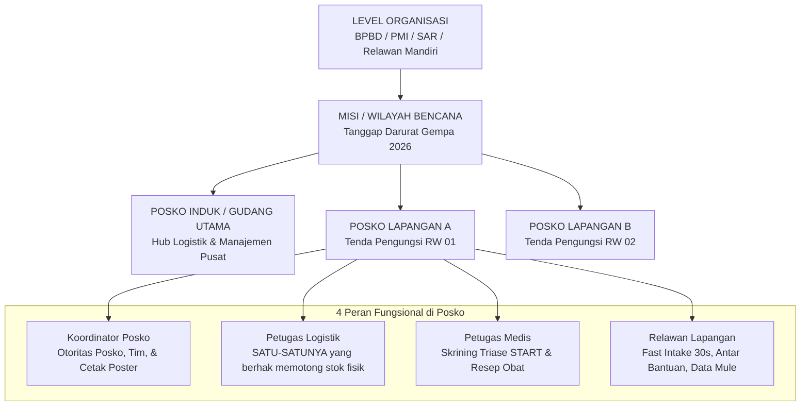
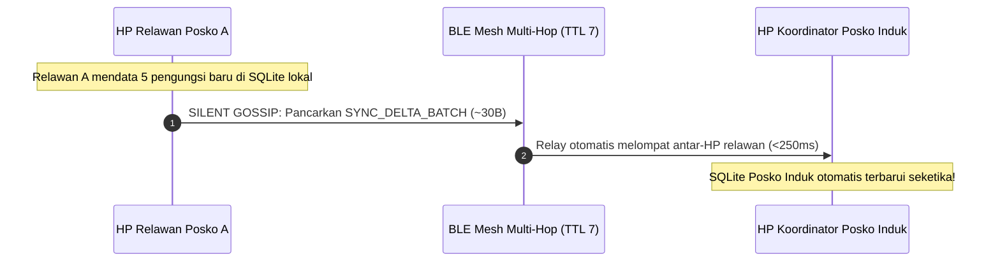
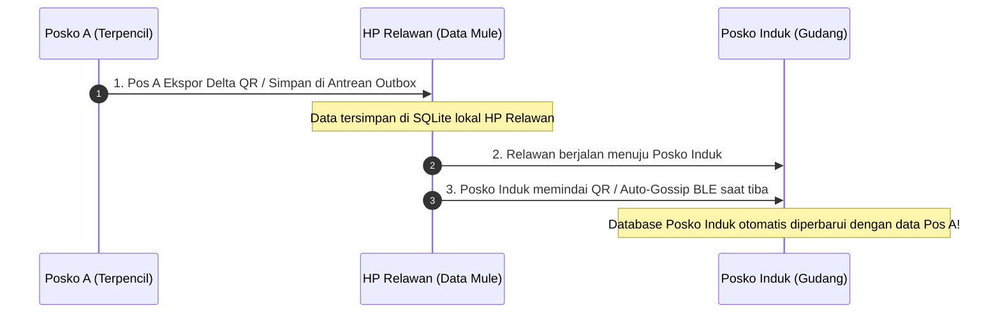
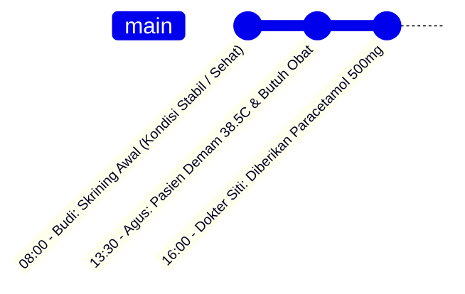
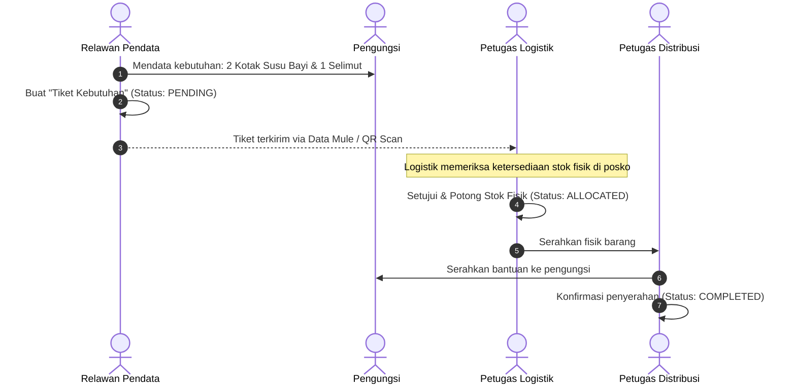

# Arsitektur Event Sourcing, Hierarki Organisasi, & Universal Data Mule: Sandya

Dokumen ini merupakan spesifikasi arsitektur lanjutan untuk sistem **Sandya (Offline-First Disaster Management)**, yang merinci model **Event Sourcing** pada pendataan manusia, hierarki posko, prinsip **Universal Data Mule**, dan mitigasi *clock drift*.

---

## 1. Pemisahan Wewenang (*Separation of Duties*)

Dalam lingkungan bencana, terdapat perbedaan mendasar antara karakteristik data manusia dan data logistik:

```
┌──────────────────────────────────────────────────────────┐
│                     DATA MANUSIA                         │
│               (Additive / Enriching Data)                │
├──────────────────────────────────────────────────────────┤
│ Sifat: Menambah orang, memperbarui kondisi kesehatan,    │
│ mencatat keluhan/kebutuhan baru.                         │
│ Resolusi Konflik: Append-Only Event Log (Bebas Konflik). │
│ Hak Akses: DEMOKRATIS (Bisa dilakukan semua relawan)     │
└──────────────────────────────────────────────────────────┘

  VS

┌──────────────────────────────────────────────────────────┐
│                     DATA STOK LOGISTIK                   │
│               (Zero-Sum / Finite Resources)              │
├──────────────────────────────────────────────────────────┤
│ Sifat: Barang fisik berkurang saat didistribusikan.      │
│ Resolusi Konflik: Rawan Race Condition / Phantom Stock.  │
│ Hak Akses: KETAT (Hanya 1 Petugas Logistik per Posko)    │
└──────────────────────────────────────────────────────────┘
```

---

## 2. Struktur Hierarki Organisasi & Posko



### Matriks Peran (*Streamlined 4-Role RBAC*)

| Role / Peran | Manajemen Pengungsi | Triase Medis START | Mutasi Stok Fisik | Cetak Poster Serah Terima | Transfer Layar (Data Mule) |
| :--- | :---: | :---: | :---: | :---: | :---: |
| **1.  KOORDINATOR** | [PASS] Penuh | [PASS] Audit |  Audit Agregat | [PASS] **Otorisasi Utama (Ed25519)** | [PASS] Bebas |
| **2.  MEDIS** | [PASS] Catat Kondisi | [PASS] **Input Triase & Resep Obat** | [FAIL] (Hanya ajukan tiket obat) | [FAIL] Dilarang | [PASS] Bebas |
| **3.  LOGISTIK** |  Lihat Data | [FAIL] | [PASS] **Mutasi & Potong Stok** | [FAIL] Dilarang | [PASS] Bebas |
| **4.  RELAWAN** | [PASS] **Fast Intake 30s & Tiket Butuh** | [FAIL] | [FAIL] (Hanya konfirmasi penyerahan) | [FAIL] Dilarang | [PASS] **Bebas Scan & Ekspor** |
| **[  WARGA / TAMU ]** |  Cari Kerabat Sendiri | [FAIL] | [FAIL] | [FAIL] |  Pindai Poster (Read-Only) |


---

## 3. Konsep "Zero-Touch BLE Mesh & Universal Data Mule"

### A. Jalur Utama: Zero-Touch BLE Mesh Gossip
Di lokasi bencana, perangkat relawan secara otomatis membentuk jaringan jaring (*ad-hoc multi-hop BLE mesh* hingga 7 hop). Sinkronisasi event delta berjalan otomatis di latar belakang saat relawan mendekati posko lain:



### B. Mekanisme Rekonsiliasi Smart Delta (Vector Clock Anti-Entropy)
Untuk mencegah pengiriman ulang seluruh tabel database (*zero redundancy*):
1. **Probe Handshake**: Node A menyiarkan `SYNC_VECTOR_PROBE` berisi nomor sequence tertinggi lokal per posko: `{ posko_id: max_seq }`.
2. **Kalkulasi Selisih Delta**: Node B membandingkan sequence lokalnya. Jika Node B memiliki `seq = 40` dan Node A mengklaim `seq = 45`, Node B hanya meminta selisih:
  $$\text{Delta Request} = \text{Sequence Range }[41 \dots 45]$$
3. **Pengiriman Data Padat**: Node A mengeksekusi `SELECT * FROM refugee_events WHERE post_id = ? AND logical_seq > 40`, memadatkannya dengan *Ultra-Dense Bitpacking v4* (~5-6B/jiwa), dan mengirimkannya dalam 1 paket BLE MTU (~30 Bytes).
4. **Nol Transfer Saat Sinkron**: Jika kedua node memiliki sequence yang sama (`seq_A == seq_B`), transfer data = **0 Bytes**!

### C. Jalur Cadangan: Universal Data Mule (Air-Gapped Sneakernet)
Jika sinyal radio dimatikan (*radio silence*) atau baterai sekarat, relawan yang berjalan fisik membawa HP bertindak sebagai kurir data (*Data Mule*):



* **Setiap perangkat anggota adalah simpul relai (*relay node*)**: Siapa pun yang berpapasan secara otomatis bertukar paket data terbaru (*Epidemic Gossip Protocol*).
* Tidak ada ketergantungan pada satu orang koordinator untuk memindahkan data lapangan ke posko utama.

---

## 4. Event Sourcing & Timeline Berbasis Waktu

### A. Membedah Masalah: "Agus Mendata A Sakit vs Budi Mendata A Sehat"

Jika menggunakan model pembaruan baris tunggal (*in-place update*):
```json
// Database lama tertimpa:
{ "id": "pengungsi_1", "nama": "A", "status_kesehatan": "SAKIT" }
// Jika Budi mengimpor data "SEHAT", salah satu data akan hilang dan membingungkan.
```

### B. Solusi: Append-Only Event Timeline (Rekam Medis Kronologis)

Setiap perubahan kondisi dicatat sebagai *event* baru yang berurutan dalam waktu:



1. **Tidak Ada Data yang Dihapus**: Catatan Agus dan catatan Budi tetap tersimpan berdampingan di basis data.
2. **Konteks Kronologis Utuh**: Petugas medis dapat membaca kronologi: *"Pagi hari sehat, siang hari demam, sore hari sudah tertangani"*.
3. **Status Terkini (*Derived State*)**: Aplikasi cukup menampilkan proyeksi dari baris event paling mutakhir.

---

## 5. Mitigasi "Jebakan Waktu" (*Clock Drift / Clock Skew*)

###  Masalah: Jam HP Tidak Akurat
Pada kondisi bencana, baterai HP yang habis total atau jam yang tidak tervalidasi internet dapat membuat timestamp mundur (misal: ke tahun 2020 atau selisih jam).

###  Solusi: Hybrid Timestamp + Lamport Sequence Counter
Setiap catatan event menyertakan:
1. `device_timestamp`: Waktu fisik jam HP saat input.
2. `logical_seq`: Nomor urut monotonik (`seq = seq + 1`) pada perangkat tersebut.
3. `causal_parent_id`: ID event terakhir yang diketahui sebelum catatan ini dibuat.

Saat menggabungkan data antar-perangkat:
* Jika selisih waktu wajar $\rightarrow$ Urutkan berdasarkan `device_timestamp`.
* Jika timestamp meragukan $\rightarrow$ Gunakan `logical_seq` dan rantai `causal_parent_id` untuk merekonstruksi urutan sebab-akibat.

---

## 6. Alur Kerja Permintaan Logistik Bebas *Race Condition*



---

## 7. Skema Database Lengkap SQLite

```sql
-- 1. Organisasi & Posko
CREATE TABLE organizations (
  id TEXT PRIMARY KEY,               -- UUIDv7
  name TEXT NOT NULL,
  created_at INTEGER NOT NULL
);

CREATE TABLE posts (
  id TEXT PRIMARY KEY,               -- UUIDv7
  org_id TEXT NOT NULL,
  name TEXT NOT NULL,                -- e.g. "Posko Tenda RW 03"
  post_type TEXT NOT NULL,           -- 'MAIN_WAREHOUSE', 'FIELD_SHELTER', 'MEDICAL_POST'
  location_lat REAL,
  location_lng REAL,
  created_at INTEGER NOT NULL,
  FOREIGN KEY(org_id) REFERENCES organizations(id)
);

-- 2. Data Induk Pengungsi
CREATE TABLE refugees (
  id TEXT PRIMARY KEY,               -- UUIDv7
  post_id TEXT NOT NULL,
  full_name TEXT NOT NULL,
  nik TEXT,                          -- Nullable jika dokumen hilang/lupa (0 Byte)
  gender TEXT CHECK(gender IN ('M', 'F')),
  age INTEGER,                       -- 0..127 Tahun
  domicile_origin TEXT,              -- Dusun / Desa asal (Kunci pencarian keluarga)
  shelter_location TEXT,             -- Lokasi spesifik ("Kelas 2B", "Tenda 04", dll)
  missing_kin_name TEXT,             -- Nama kerabat yang dicari (Family Reunion)
  registered_by_user_id TEXT NOT NULL,
  created_at INTEGER NOT NULL,
  FOREIGN KEY(post_id) REFERENCES posts(id)
);

-- 3. Event Sourcing Timeline Pengungsi (Append-Only)
CREATE TABLE refugee_events (
  id TEXT PRIMARY KEY,               -- UUIDv7
  refugee_id TEXT NOT NULL,
  author_id TEXT NOT NULL,
  author_name TEXT NOT NULL,
  author_role TEXT NOT NULL,         -- 'ENUMERATOR', 'DOCTOR', 'LOGISTICS'
  event_type TEXT NOT NULL,          -- 'HEALTH_CHECK', 'NEED_REPORTED', 'AID_RECEIVED', 'NOTE'
  event_payload TEXT NOT NULL,       -- JSON Detail (suhu, tensi, keluhan, jenis kebutuhan)
  device_timestamp INTEGER NOT NULL, -- Waktu lokal jam HP
  logical_seq INTEGER NOT NULL,      -- Sequence counter lokal anti clock-drift
  causal_parent_id TEXT,             -- ID event pendahulu
  FOREIGN KEY(refugee_id) REFERENCES refugees(id)
);

-- 4. Stok Logistik (Hanya dimutasi oleh Petugas Logistik)
CREATE TABLE inventory_items (
  id TEXT PRIMARY KEY,               -- UUIDv7
  post_id TEXT NOT NULL,
  item_name TEXT NOT NULL,           -- 'Beras 5kg', 'Selimut', 'Susu Bayi'
  category TEXT NOT NULL,            -- 'FOOD', 'CLOTHING', 'MEDICAL', 'HYGIENE'
  current_quantity INTEGER NOT NULL DEFAULT 0,
  unit TEXT NOT NULL,                -- 'KG', 'KOTAK', 'PCS'
  last_updated_at INTEGER NOT NULL,
  FOREIGN KEY(post_id) REFERENCES posts(id)
);

-- 5. Buku Kas Transaksi Stok Logistik (Append-Only Ledger)
CREATE TABLE inventory_transactions (
  id TEXT PRIMARY KEY,               -- UUIDv7
  item_id TEXT NOT NULL,
  post_id TEXT NOT NULL,
  officer_id TEXT NOT NULL,
  tx_type TEXT NOT NULL,             -- 'RESTOCK', 'DISTRIBUTION', 'DAMAGE', 'TRANSFER'
  quantity_change INTEGER NOT NULL,  -- +100 atau -20
  reference_ticket_id TEXT,          -- Terhubung ke needs_requests jika distribusi
  device_timestamp INTEGER NOT NULL,
  FOREIGN KEY(item_id) REFERENCES inventory_items(id),
  FOREIGN KEY(post_id) REFERENCES posts(id)
);

-- 6. Tiket Permintaan Kebutuhan Pengungsi
CREATE TABLE needs_requests (
  id TEXT PRIMARY KEY,               -- UUIDv7
  refugee_id TEXT NOT NULL,
  post_id TEXT NOT NULL,
  item_name TEXT NOT NULL,
  quantity INTEGER NOT NULL,
  status TEXT CHECK(status IN ('PENDING', 'ALLOCATED', 'COMPLETED', 'REJECTED')) DEFAULT 'PENDING',
  created_by_user_id TEXT NOT NULL,  -- Relawan yang mendata
  allocated_by_user_id TEXT,         -- Petugas logistik yang menyetujui
  distributed_by_user_id TEXT,       -- Petugas yang menyerahkan fisik
  created_at INTEGER NOT NULL,
  completed_at INTEGER,
  FOREIGN KEY(refugee_id) REFERENCES refugees(id),
  FOREIGN KEY(post_id) REFERENCES posts(id)
);

-- 7. Direktori Tetangga BLE Mesh (BitChat Peer Table)
CREATE TABLE mesh_peers (
  peer_id TEXT PRIMARY KEY,          -- 8-byte Hex ID (SHA-256 Noise PubKey)
  noise_pubkey TEXT NOT NULL,        -- Full Curve25519 Public Key
  signing_pubkey TEXT NOT NULL,      -- Full Ed25519 Public Key
  alias_name TEXT NOT NULL,          -- e.g. "dr. Siti (Medis)"
  role TEXT NOT NULL,                -- 'KOORDINATOR', 'MEDIS', 'LOGISTIK', 'RELAWAN'
  current_pos_id TEXT,
  rssi INTEGER,                      -- Sinyal Radio dBm (-30 s/d -95)
  hops INTEGER DEFAULT 1,            -- Jarak hop (1 s/d 7)
  last_seen INTEGER NOT NULL
);

-- 8. Pesan Obrolan & Audio PTT Taktis Lapangan
CREATE TABLE tactical_messages (
  id TEXT PRIMARY KEY,               -- UUIDv7
  channel TEXT NOT NULL,             -- 'POSKO_ALL', 'MEDIS', 'LOGISTIK', 'SOS', 'DM'
  sender_peer_id TEXT NOT NULL,
  sender_name TEXT NOT NULL,
  sender_role TEXT NOT NULL,
  recipient_peer_id TEXT,            -- NULL jika broadcast ke channel
  content_type TEXT NOT NULL,        -- 'TEXT', 'VOICE_NOTE', 'ALERT'
  text_content TEXT,                 -- Isi teks jika teks
  audio_blob BLOB,                   -- Opus compressed voice data jika PTT (~2KB)
  audio_duration_ms INTEGER,         -- Durasi audio dalam ms (maks 5.000ms)
  is_urgent INTEGER DEFAULT 0,       -- 1 jika SOS Darurat
  created_at INTEGER NOT NULL,
  FOREIGN KEY(sender_peer_id) REFERENCES mesh_peers(peer_id)
);

-- 9. Vector Clock Sinkronisasi Mesh Otomatis (Zero-Touch Handshake)
CREATE TABLE mesh_sync_clocks (
  pos_id TEXT PRIMARY KEY,           -- ID Posko asal
  max_synced_seq INTEGER NOT NULL,   -- Sequence event tertinggi yang tersimpan
  last_synced_at INTEGER NOT NULL
);
```
