# Spesifikasi Transfer Data Visual: Kamus Bencana & Poster Multi-QR Paritas

Dokumen ini mendefinisikan arsitektur dasar untuk transfer data visual offline pada sistem **Sandya**, menggunakan metode **Pre-Shared Disaster Dictionary (Kamus Bencana Bawaan)**, **Serialisasi Biner Ultra-Dense v4**, dan **Poster Serah Terima Berbasis Paritas XOR**.

---

## 1. Latar Belakang & Filosofi Desain

### Tantangan Fisik di Lapangan Bencana:
1. **Keterbatasan Alat Cetak**: Relawan lapangan umumnya hanya membawa *printer thermal* bluetooth saku monokrom (hanya bisa mencetak hitam-putih resolusi standar) atau kertas HVS A4.
2. **Kondisi Lingkungan Ekstrem**: Minim pencahayaan (malam hari di dalam tenda), kertas poster rawan terlipat, terkena lumpur, atau sobek di tiang tenda.
3. **Kamera HP Kelas Menengah ke Bawah**: Kamera HP murah sulit mengunci fokus jika QR code memiliki kisi piksel mikro yang terlalu rapat (QR versi tinggi di atas Versi 35).

```
┌──────────────────────────────────────────────────────────┐
│                   DILEMA QR TRADISIONAL                  │
├──────────────────────────────────────────────────────────┤
│ Data Banyak (JSON) -> QR Versi Tinggi (Piksel Mikro)     │
│                    -> Kamera HP Murah GAGAL Scan [FAIL]      │
├──────────────────────────────────────────────────────────┤
│                   SOLUSI SANDYA                         │
├──────────────────────────────────────────────────────────┤
│ Kamus Bencana Pre-Shared + Bit-Packing Ultra-Dense       │
│ -> Ukuran Data Menyusut ~90%                             │
│ -> QR Tetap Versi Rendah/Sedang (Modul Tebal & Besar)    │
│ -> Kamera HP Murah INSTAN Scan (Bahkan di Remang-Remang) │
│ -> Paritas XOR: Kebal Sobekan Fisik 1 Kotak QR Utuh [PASS]   │
└──────────────────────────────────────────────────────────┘
```

---

## 2. Katalog 256 Kebutuhan Bencana Bawaan (`uint8` Token)

Aplikasi Sandya di setiap perangkat relawan memiliki tabel katalog kebutuhan standar (*pre-shared catalog*) berukuran **1-Byte (`uint8`)** yang mengadopsi klaster BNPB, PMI, dan SPHERE:

```
Rentang Token 1-Byte (0x01 - 0xFF):
├── 0x01 - 0x20 : Logistik Pangan & Air Minum (Beras, MRE, MPASI, Air Bersih, dll)
├── 0x21 - 0x50 : Medis & Obat-Obatan Rutin (Insulin, Hipertensi, Asma, Paracetamol, Perban)
├── 0x51 - 0x70 : Perlengkapan Bayi & Balita (Susu Formula, Popok, Minyak Telon, Botol)
├── 0x71 - 0x90 : Kebersihan Diri & Sanitasi (Pembalut, Sabun, Sikat Gigi, Popok Dewasa)
├── 0x91 - 0xB0 : Sandang & Logistik Alas (Selimut Hangat, Matras/Tikar, Baju Anak, Terpal)
├── 0xB1 - 0xD0 : Alat Bantu Khusus (Kursi Roda, Tongkat, Kacamata Baca, Alat Dengar)
└── 0xD1 - 0xFF : Peralatan Darurat (Senter LED, Powerbank, Lilin, Peluit Rescue)
```

> Dengan alokasi 1 Byte per kebutuhan, seorang pengungsi yang memerlukan 2–3 jenis bantuan hanya menambahkan **2–3 Bytes** ke dalam payload biner.

---

## 3. Spesifikasi Bit-Packing Biner Ultra-Dense v4

Setiap data pengungsi (`DisasterPerson`) dikemas dalam format biner yang sangat padat dengan fitur *Dynamic Null-Field Bypass*:

```
┌─────────────────────────────────────────────────────────────┐
│       STRUKTUR BINER 1 PENGUNGSI ULTRA-DENSE V4             │
├─────────────────────────────────────────────────────────────┤
│ 1. Header Flags 1 (hasNIK, isSameRegion, hasDom, Shl, Kin)  │ 1 Byte
│ 2. Header Flags 2 (nameWordCount 4b | urgentNeedCount 4b)   │ 1 Byte
│ 3. Gender (1 bit) + Usia (7 bit)                            │ 1 Byte
│ 4. Vulnerabilities Bitmask (8 Kategori Rentan)              │ 1 Byte
│ 5. NIK KTP (0 Byte jika lupa/hilang, 5 Byte jika sewilayah) │ 0 - 5 Bytes
│ 6. Nama Lengkap (Tokenized 2 kata dari Kamus 2.048 kata)    │ 4 Bytes
│ 7. Kebutuhan Mendesak (Array token uint8: 1 Byte / item)    │ 1 - 3 Bytes
│ 8. Domisili Asal / Dusun (Opsional)                         │ Var
│ 9. Lokasi Penampungan / Ruangan (Opsional)                  │ Var
│ 10. Nama Kerabat yang Dicari (Opsional - Family Reunion)    │ Var
├─────────────────────────────────────────────────────────────┤
│ TOTAL UKURAN MENTAH (Kondisi Lapangan Tanpa KTP)            │ ~9 Bytes!
│ TOTAL TERKOMPRESI (Zstandard / Deflate)                     │ ~5 - 6 Bytes!
└─────────────────────────────────────────────────────────────┘
```

---

## 4. Desain Poster Serah Terima Posko Berbasis Paritas (*Handover Poster*)

Poster serah terima dicetak saat posko ditinggalkan atau diserahkan ke tim relawan berikutnya. Alih-alih memaksakan 1 QR raksasa yang rapuh di sudutnya, poster menggunakan **Grid Multi-QR dengan 1 Kotak Paritas XOR**:

```
┌──────────────────────────────────────────────────────────┐
│   SANDYA - POSTER SERAH TERIMA POSKO LAPANGAN         │
│  Posko: RW 03 Kp. Cijedil | Kapasitas: 500 Pengungsi     │
│  Otorisasi: Koordinator Budi Santoso (Ed25519 Signed)    │
├──────────────────────────────────────────────────────────┤
│  RINGKASAN DARURAT (MATA MANUSIA):                       │
│  • Total Pengungsi : 500 Jiwa (Balita: 42, Lansia: 28)   │
│  • Kebutuhan Kritis: Air Bersih, Susu Bayi, Selimut      │
│  • Penampungan     : Tenda Lapangan, Ruang Kelas SDN 1   │
├──────────────────────────────────────────────────────────┤
│  DATA DIGITAL SANDYA (GRID 4 QR DENGAN PARITAS XOR):    │
│                                                          │
│   ┌─────────────┐       ┌─────────────┐                  │
│   │ [ QR Data A]│       │ [ QR Data B]│                  │
│   │  (167 Jiwa) │       │  (167 Jiwa) │                  │
│   └─────────────┘       └─────────────┘                  │
│                                                          │
│   ┌─────────────┐       ┌─────────────┐                  │
│   │ [ QR Data C]│       │ [ QR PARITAS│                  │
│   │  (166 Jiwa) │       │    XOR D ]  │                  │
│   └─────────────┘       └─────────────┘                  │
│                                                          │
│   KEBAL SOBEKAN: Cukup pindai SEMBARANG 3 DARI 4 QR!   │
│  Jika salah satu kotak QR sobek / rusak / terkena lumpur,│
│  aplikasi otomatis merekonstruksi data 100% utuh:        │
│                     B = A ⊕ C ⊕ D                        │
└──────────────────────────────────────────────────────────┘
```

---

## 5. Pipeline Encoding & Decoding

```mermaid
flowchart TD
  subgraph Encoding_Export [Proses Ekspor Poster Resmi di Posko]
  DB[(Database SQLite)] --> Extract[Query Data Pengungsi & Logistik]
  Extract --> Tokenize[Ganti Kata Nama & Kebutuhan dengan Token Kamus]
  Tokenize --> BitPack[Bit-Packing Struct Biner Ultra-Dense v4]
  BitPack --> ZstdComp[Kompresi Lossless Zstandard Lvl 19 / Deflate]
  ZstdComp --> Split[Bagi Payload ke N Chunks + Hitung Paritas XOR]
  Split --> Sign[Tanda Tangan Digital Ed25519 Koordinator]
  Sign --> GenQR[Generate Grid QR Codes Monokrom]
  GenQR --> Print[Cetak ke Kertas A4 / Printer Thermal Saku]
  end

  subgraph Decoding_Import [Proses Impor di HP Relawan Baru]
  Camera[Scan Kamera HP Relawan Baru] --> Capture[Pindai N-1 Kotak QR yang Masih Utuh]
  Capture --> ParityRec[Rekonstruksi Chunk Rusak via Rumus XOR]
  ParityRec --> Verify[Verifikasi Signature Ed25519 Koordinator]
  Verify --> ZstdDecomp[Dekompresi Zstandard / Deflate]
  ZstdDecomp --> Unpack[Unpack Bit Biner v4]
  Unpack --> Detokenize[Terjemahkan Token ke Teks Asli]
  Detokenize --> ReunionCheck[Cek Otomatis Temu Keluarga / Family Reunion]
  ReunionCheck --> InsertDB[(Insert ke SQLite Relawan Baru)]
  end
```


