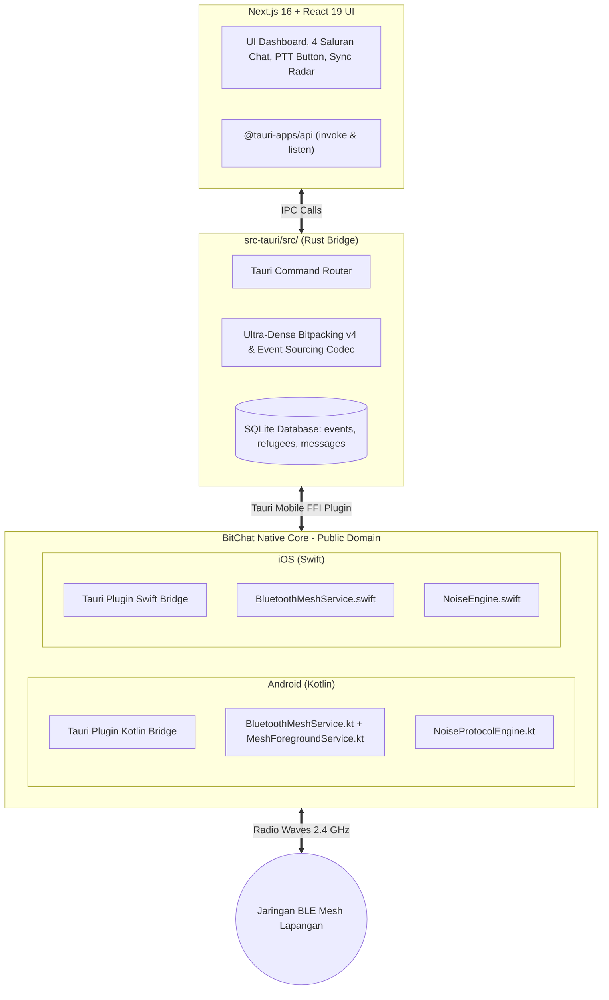
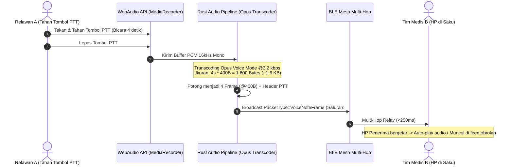

# Spesifikasi Protokol Jaringan: Bluetooth LE Mesh (BitChat), Zero-Touch Gossip Sync, & Tactical Intercom (PTT)

> **Status**: Approved (Standar Spesifikasi Protokol Taktis Sandya)  
> **Lisensi & Dasar Fondasi**: Mengadopsi Arsitektur & Kode Native **BitChat (`permissionlesstech/bitchat` & `permissionlesstech/bitchat-android`)** yang berlisensi **Public Domain (Unlicense / CC0)**.  
> **Cakupan**: Protokol BLE Mesh Multi-Hop, Zero-Touch Background Event Sourcing Sync, 4 Saluran Intercom Lapangan (`#posko-all`, `#medis`, `#logistik`, `#sos`), Push-to-Talk (PTT) Audio Kompresi Opus, dan Analisis Jangkauan Radio.  
> **Dokumen Terkait**: [Analisis Arsitektur](./analisis-arsitektur.md) | [Event Sourcing & Hierarki](./event-sourcing-dan-hierarki.md) | [User Flow Komunikasi Taktis](./userflow/07-komunikasi-taktis-dan-mesh-intercom.md)

---

## 1. Filosofi & Latar Belakang Desain

### A. Mengapa Beralih dari "Scan-Heavy" ke "Zero-Touch BLE Mesh"?
Pada rancangan awal, pertukaran data antar-posko sangat bergantung pada *Sneakernet* berbasis pemindaian QR manual. Di medan bencana nyata yang penuh kepanikan, evakuasi medis, dan distribusi logistik darurat, **kewajiban mendekatkan layar HP dan memindai QR berulang kali (*scan fatigue*) menciptakan hambatan operasional yang fatal**.

Dengan mengadopsi **Bluetooth Low Energy (BLE) Mesh**:
1. **Zero-Touch Background Sync**: Perangkat relawan secara otomatis saling mendeteksi dan menyinkronkan data pengungsi berukuran padat (**Ultra-Dense Bitpacking v4 $\approx 5 - 6\text{ bytes/jiwa}$**) di latar belakang tanpa relawan perlu membuka smartphone atau menekan tombol apa pun.
2. **Tactical Field Intercom**: Memberikan fasilitas radio komunikasi lapangan 4 saluran darurat tanpa pulsa, kuota, sinyal seluler, maupun koneksi internet.
3. **Push-to-Talk (PTT) Suara Mikro**: Memungkinkan instruksi medis dan SAR penting disampaikan lewat suara instan 5 detik dengan kompresi ultra-rendah Opus 3.2 kbps ($\approx 2\text{ KB}$).
4. **Pertahanan Berlapis (*Defense in Depth*)**: BLE Mesh bertindak sebagai jalan tol utama (*Primary Highway*), sementara *Animated Multipart QR* dan *Poster Paritas XOR* tetap siaga 100% sebagai cadangan fisik/udara (*Ultimate Fallback*).

---

## 2. Arsitektur Jembatan Native (Tauri v2 Native Plugin Bridge)

Alih-alih menulis ulang seluruh *Bluetooth Mesh Stack* di Rust dari nol (yang sangat rentan terhadap *bug chipset OEM Android* dan pemutusan *Doze Mode*), Sandya membungkus modul native **BitChat** yang sudah teruji di ribuan perangkat ke dalam **Tauri v2 Mobile Plugin**:



---

## 3. Spesifikasi Paket: Sandya Mesh Protocol (SMP v1)

Paket transmisi biner Sandya dirancang kompatibel dengan *framing* biner BitChat v2:

```text
┌────────────────────────────────────────────────────────────────────────┐
│               STRUKTUR PAKET SANDYA MESH PROTOCOL (SMP v1)            │
├────────────────────────────────────────────────────────────────────────┤
│ 1. Protocol Version (1B)      : 0x02 (BitChat v2 Compatible)           │
│ 2. Packet Type (1B)           : Tipe Paket (Announce, Chat, Sync, dll) │
│ 3. TTL (1B)                   : Time-To-Live (Default: 7, Max Hops)    │
│ 4. Flags (1B)                 : Bitmask [0:Compressed, 1:Encrypted, 2:Sig]
│ 5. Timestamp (4B uint32)      : Unix Timestamp Detik                   │
│ 6. Sender Peer ID (8B)        : 8-Byte SHA-256 Prefix Noise Static Key │
│ 7. Recipient Peer ID (8B)     : 0x00..00 jika Broadcast / Target Node  │
│ 8. Sequence Number (2B uint16): Monotonic Counter Anti-Replay          │
│ 9. Payload Length (2B uint16) : Panjang Isi Payload (Max MTU ~469B)    │
│ 10. Payload Body (Var Bytes)  : Data Terenkripsi / Biner Ultra-Dense   │
│ 11. Ed25519 Signature (64B)   : Tanda Tangan Kriptografi Integritas    │
└────────────────────────────────────────────────────────────────────────┘
```

### Matriks Tipe Paket (`Packet Type`):

| Kode Tipe | Nama Paket | Deskripsi & Isi Payload |
| :--- | :--- | :--- |
| `0x01` | **`MESH_ANNOUNCE`** | *Presence Beacon*: Menyiarkan identitas node, nama alias, role (`KOORDINATOR`, `MEDIS`, `LOGISTIK`, `RELAWAN`), dan Public Key. Dipancarkan berkala (15-30s). |
| `0x02` | **`TACTICAL_BROADCAST`** | *Public Group Chat*: Pesan radio lapangan ke channel `#posko-all`, `#medis`, `#logistik`, `#sos`. |
| `0x03` | **`TACTICAL_DIRECT_MSG`** | *E2EE Private Message*: Komunikasi rahasia antar-2 relawan via Noise Protocol XX. |
| `0x04` | **`VOICE_NOTE_FRAME`** | *Push-to-Talk Frame*: Potongan rekaman suara terkompresi Opus 3.2 kbps (durasi maks 5s). |
| `0x10` | **`SYNC_VECTOR_PROBE`** | *Sync Handshake*: Probe ringkas berisi Vector Clock posko lokal untuk mendeteksi event baru. |
| `0x11` | **`SYNC_DELTA_BATCH`** | *Zero-Touch Event Gossip*: Paket berisi kumpulan *Append-Only Events* pengungsi/logistik format **Ultra-Dense Bitpacking v4 (~5-6 bytes/jiwa)**. |
| `0x12` | **`LOGISTICS_REQUISITION`** | *Logistics Alert*: Tiket permintaan kebutuhan mendesak antar-posko. |
| `0x13` | **`FAMILY_REUNION_BEACON`** | *Lost Person Inquiry*: Permintaan pencarian orang hilang untuk pencocokan otomatis di SQLite lokal. |

---

## 4. Mekanisme Flood Control & Anti-Broadcast Storm

Untuk mencegah tabrakan transmisi (*packet storm / collision*) saat 50-100 relawan berkumpul di satu area tenda:

1. **LRU Seen-Cache Deduplication**:
   - Setiap node memelihara *ring buffer* LRU berisi 1.024 entri hash paket (`BLAKE3(sender_id + seq_num + packet_type)`).
   - Paket duplikat yang sampai dari jalur relay berbeda langsung dibuang ($O(1)$) tanpa diproses ulang.
2. **Split-Horizon Relay**:
   - Paket tidak pernah dipancarkan ulang ke antarmuka atau simpul tetangga asal pengirim.
3. **Randomized Relay Jitter (10-220 ms)**:
   - Sebelum me-relay paket, node menunggu jeda acak 10-220 milidetik (jeda lebih lebar jika graf tetangga padat).
   - Jika paket yang sama sudah lebih dulu di-relay oleh node lain di sekitarnya, antrean relay lokal langsung dibatalkan (*Duplicate Suppression*).
4. **Adaptive TTL Clamping**:
   - Pada jaringan padat ($\ge 6\text{ tetangga langsung}$), TTL paket siaran otomatis dipangkas dari 7 menjadi 5 untuk meredam kebisingan radio.

---

## 5. Zero-Touch Background Event Sourcing Sync (Smart Delta Handshake)

### A. Membedah Masalah BitChat Standar vs Solusi Event-Sourcing Sandya
* **Kelemahan BitChat Standar (*Live Ephemeral Chat*)**:
  Aplikasi mesh biasa hanya memancarkan pesan sekali lewat udara (*live broadcast*). Jika penerima sedang tidur, di luar jangkauan sinyal, atau aplikasinya tertutup saat pesan dipancarkan, **pesan tersebut hilang selamanya**. Di medan bencana, ini fatal karena relawan sering berada di area tanpa sinyal selama berjam-jam.
* **Solusi Sandya (*Store-and-Forward Anti-Entropy*)**:
  Sandya **tidak pernah membuang data**. Setiap warga yang didata, obat yang diresepkan, dan barang yang dimutasi disimpan permanen di basis data **SQLite Lokal sebagai *Append-Only Event Log*** bertanda nomor urut monotonik (`logical_seq = 1, 2, 3...`).

---

### B. Studi Kasus Lapangan: Sinkronisasi Pintar Relawan Terisolasi

> **Skenario Lapangan**:
> 1. **Pukul 08:00 WIB**: Relawan A berjalan mendata 10 pengungsi baru di Tenda 04 (lembah terisolasi tanpa sinyal radio BLE ke Posko Induk).
>    - SQLite HP Relawan A mencatat: Posko RW 03 memiliki `logical_seq` 1 s/d 45.
> 2. **Pukul 14:00 WIB (6 Jam Kemudian)**: Relawan A berjalan kembali ke Posko Induk (masuk radius radio BLE ~50 meter dari HP Koordinator).
>    - SQLite HP Koordinator baru memiliki data Posko RW 03 hingga `logical_seq` 40.
> 3. **Eksekusi Smart Delta Sync (<25 milidetik di Latar Belakang)**:

```mermaid
sequenceDiagram
  autonumber
  participant NodeA as HP Relawan A (Tenda 04)
  participant BLE as Gelombang Radio BLE 2.4 GHz
  participant NodeB as HP Koordinator (Posko Induk)

  Note over NodeA, NodeB: Node A masuk jangkauan radio BLE (~50m dari Node B)
  
  NodeA->>BLE: MESH_ANNOUNCE + SYNC_VECTOR_PROBE (~8 Bytes)<br/>(Klaim Clock Node A: {Posko_RW03: seq 45})
  
  Note over NodeB: SQLite Node B mengecek tabel mesh_sync_clocks:<br/>"Clock lokal saya untuk Posko_RW03 adalah seq 40"<br/>Delta yang hilang = seq 41 s/d 45 (HANYA 5 EVENT BARU!)
  
  NodeB->>NodeA: SYNC_DELTA_REQUEST (Minta: Posko_RW03 seq 41..45)
  
  Note over NodeA: Node A mengkueri SQLite lokal:<br/>SELECT * FROM refugee_events WHERE post_id='RW03' AND logical_seq > 40;<br/>-> Dikompresi Ultra-Dense Bitpacking v4 (~30 Bytes)
  
  NodeA->>NodeB: SYNC_DELTA_BATCH (1 Paket BLE MTU 469B, Payload 30B)
  
  Note over NodeB: SQLite Node B mengeksekusi Transaksi Atomik:<br/>BEGIN TRANSACTION;<br/>INSERT INTO refugee_events...;<br/>UPDATE mesh_sync_clocks SET max_synced_seq = 45;<br/>COMMIT;
  
  NodeB->>NodeB: React Query Invalidate Cache -> Layar Dasbor Terupdate Seketika!
  NodeB-->>NodeA: SYNC_ACK (Konfirmasi Clock: {Posko_RW03: seq 45})
  
  Note over NodeA, NodeB: Kedua HP kini sinkron penuh. Transmisi berikutnya = 0 Byte!
```

---

### C. Mengapa Mekanisme Ini Sangat Efisien & Bebas Redundansi?

1. **Hanya Mengirim Selisih (*Delta Only, No Full Dump*)**:
   Sistem **TIDAK MENGIRIM ULANG** 40 data lama yang sudah ada di HP Koordinator. Hanya 5 data baru yang ditransmisikan.
2. **Kepadatan Maksimal (Ultra-Dense Bitpacking v4)**:
   Ukuran 1 event warga hanya $\approx 5 - 6\text{ Bytes}$. 5 data baru hanya memakan $\approx 30\text{ Bytes}$—muat dalam 1 paket BLE tunggal.
3. **Nol Redundansi Saat Sudah Sinkron (*Zero-Cost Heartbeat*)**:
   Jika kedua perangkat sudah sama-sama memegang `seq 45`, pertukaran vector clock selesai dalam 8 byte dan **0 byte data event yang ditransmisikan**, menghemat baterai hingga 95%.

---

## 6. Saluran Taktis & Push-to-Talk (PTT) Low-Bitrate Voice

### A. Pembagian 4 Saluran Lapangan Resmi:

```text
┌─────────────────────────────────────────────────────────────┐
│   SANDYA MESH RADIO       12 Node Terhubung   [Mesh: Aktif] │
├─────────────────────────────────────────────────────────────┤
│  SALURAN: [ #posko-all ]   [ #medis ]   [ #logistik ] [ SOS ]│
└─────────────────────────────────────────────────────────────┘
```

1. **`#posko-all` (Siaran Umum Lapangan)**:
   - Koordinasi umum, pergantian shift relawan, informasi cuaca, dan pembagian tenda.
2. **`#medis` (Triase & Medis Darurat)**:
   - Skrining pasien darurat, tiket resep obat kritis, permohonan kantong darah, dan tabung oksigen.
3. **`#logistik` (Logistik & Gudang Sembako)**:
   - Permintaan pasokan makanan bayi, selimut, air bersih, serta verifikasi surat jalan (*waybills*).
4. **`#sos` (Peringatan Bahaya & Evakuasi Cepat)**:
   - Saluran prioritas tinggi yang memotong notifikasi lain. Memancarkan peringatan debit banjir, gempa susulan, atau longsor dengan getaran alarm (*haptic siren*).
   - **Protokol Perlindungan Anti-Panik & Akuntabilitas**:
     1. **Autentikasi Kriptografis Wajib**: Hanya node dengan kartu tugas terverifikasi (`KOORDINATOR`, `MEDIS`, `LOGISTIK`, `RELAWAN`) yang bisa memancarkan paket `#sos`. Paket dari *Guest/Publik* otomatis dibuang (*dropped*).
     2. **Akuntabilitas Terbuka (*Full Attributed Identity*)**: Notifikasi alarm menampilkan identitas pemancar secara mencolok: `SOS DIPANCARKAN OLEH: [Nama Personel] ([Peran] - [Posko])`.
     3. **Friction-by-Design UX**: Pemicuan wajib melalui mekanisme **Geser untuk Konfirmasi (*Slide to Confirm*)** atau **Tahan 3 Detik (*Hold for 3s*)** + Pemilihan Kategori Bahaya Resmi BNPB.
     4. **Tombol Pembatalan Koordinator (*Koordinator False-Alarm Override*)**: Koordinator/Komandan memiliki tombol siaran darurat `[Batalkan SOS: Alarm Palsu / Situasi Terkendali]` untuk mematikan sirene di seluruh smartphone dalam hitungan detik.
     5. **Rate-Limiting Keras**: Maksimal 1 paket SOS per node per 60 detik (anti-spam / anti-DoS).

---

### B. Spesifikasi Push-to-Talk (PTT) Audio Kompresi



#### Parameter Teknis Audio PTT:
* **Durasi Maksimum**: 5 detik per transmisi suara.
* **Sample Rate**: 16.000 Hz Mono (Wideband Speech).
* **Audio Codec**: **Opus Voice Mode (Silk) pada bitrate 3.2 kbps** (atau Codec2 pada 2.4 kbps).
* **Ukuran Payload**: $5\text{s} \times 400\text{ bytes} \approx \mathbf{2.000\text{ Bytes}}$ (hanya 2 KB).
* **Fragmentasi**: Dipecah menjadi 4-5 frame BLE (@400B payload).
* **Waktu Transmisi**: $< 250\text{ milidetik}$ melalui jaringan relay.

---

## 7. Analisis Jarak Jangkauan Radio & Topologi Lapangan

Jarak jangkauan BLE Mesh Sandya terbagi dalam 3 tingkatan:

| Tingkatan Transmisi | Kondisi Lingkungan | Jarak Jangkauan Efektif | Karakteristik Operasional |
| :--- | :--- | :---: | :--- |
| **1. Direct Hop (1-Hop)** | **Ruang Terbuka (*Line of Sight*)**<br/>(Lapangan pengungsian, jalan desa) | **$\approx 30 - 80\text{ Meter}$** | Transmisi langsung antar-HP tanpa perantara. |
| | **Banyak Halangan (*Indoor / Puing*)**<br/>(Dalam tenda tebal, reruntuhan gedung) | **$\approx 10 - 25\text{ Meter}$** | Sinyal teratenuasi material fisik. |
| **2. Multi-Hop Mesh (BitChat Relay)** | **Rantai 7-Hop (Kawasan Posko Tenda)** | **$\approx 300\text{ Meter} - 1\text{ Km}$** | **Real-Time Mesh**: Sinyal melompat otomatis melalui HP relawan lain yang tersebar di tenda-tenda (TTL=7). |
| **3. Opportunistic Courier (Data Mule)** | **Pergerakan Relawan / Ambulans / Motor** | **TAK TERBATAS ($\infty$)** | **Store-and-Forward**: Relawan membawa HP bergerak dari Posko A ke Posko B (jarak 5-20 km). Saat tiba di Posko B, data otomatis ter-dump ke mesh Posko B. |

```mermaid
graph LR
  subgraph Posko_Sektor_A ["Sektor Barat (Tenda 1-10)"]
  A1["HP Relawan A1"] ---|40m| A2["HP Relawan A2"]
  end

  subgraph Jalur_Relay ["Jembatan Mesh Antar-Sektor"]
  A2 ---|50m| R1(("HP Dapur Umum"))
  R1 ---|50m| R2(("HP Pos Medis"))
  R2 ---|50m| R3(("HP Logistik"))
  end

  subgraph Posko_Sektor_B ["Sektor Timur (GOR Pengungsian)"]
  R3 ---|40m| B1["HP Koordinator B1"]
  end

  A1 -.->|Total Jangkauan Multi-Hop: ~300m - 1km (Real-Time)| B1
```

---

## 8. Ringkasan Matriks Multi-Transport 3-Tier

| Dimensi | Tier 1: BLE Mesh (BitChat) | Tier 2: Animated QR & Poster Paritas | Tier 3: Cloud / Nostr WAN |
| :--- | :--- | :--- | :--- |
| **Peran** | **Jalur Utama (*Primary Highway*)** | **Cadangan Udara & Fisik (*Ultimate Fallback*)** | **Sinkronisasi Pusat (*Central Uplink*)** |
| **Interaksi Pengguna** | **Zero-Touch** (Otomatis Latar Belakang) | Manual (Kamera HP / Kertas Cetak) | Otomatis (Saat ada sinyal internet/Starlink) |
| **Media Transfer** | Gelombang Radio BLE 2.4 GHz | Optik Layar (6 FPS) / Lembar Kertas A4 | Protokol Internet HTTPS / WSS Nostr |
| **Kecepatan Transfer** | $< 250\text{ ms}$ (Real-Time) | $1 - 3\text{ detik}$ (Layar) / Jepret Foto | Bergantung Latensi ISP Satelit |
| **Kebutuhan Daya** | Rendah (Duty-cycled BLE) | Sangat Rendah (Pasif / Optik) | Normal (Wi-Fi / Seluler) |
| **Kondisi Penggunaan** | Seluruh operasional harian posko | Radio silence / Baterai sekarat / Posko ditinggalkan | Posko Induk dengan Starlink / Markas Pusat |
