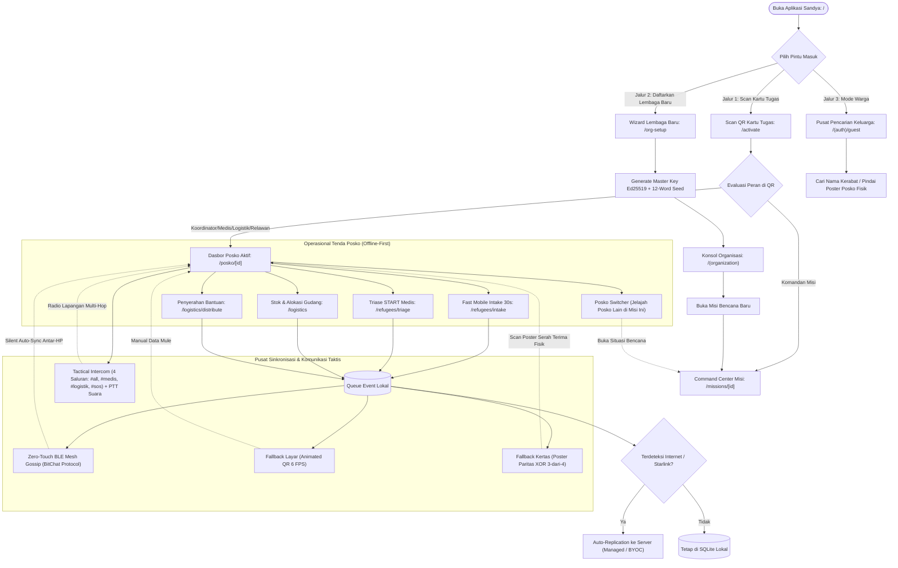

# Peta Induk & Arsitektur User Flow: Sandya

> **Status**: Approved (Harmonisasi Tanpa Celah & Terstruktur)  
> **Ruang Lingkup**: Seluruh Aktor Kemanusiaan, Hierarki 3-Tingkat (Organisasi -> Misi -> Posko), Pusat Situasi Misi Terbuka, Logistik Single-Writer, Triase Medis START, Fast Intake 30s, dan Temu Keluarga.  
> **Standar Rute**: Canonical Next.js 16 App Router (`src/app/...`) + Tauri v2 Desktop/Mobile.  
> **Dokumen Terkait**: [Indeks Dokumentasi](../README.md) | [Tata Kelola Organisasi](../tata-kelola-organisasi-dan-kriptografi.md)

---

## 1. Taksonomi Aktor & Matriks Hak Akses (RBAC)

Sistem Sandya membagi persona pengguna ke dalam 4 peran inti operasional (+ 2 peran pimpinan hierarki & 1 mode publik):

```text
┌──────────────────────────────────────────────────────────────────────────────────┐
│                               TAKSONOMI PERSONA SANDYA                          │
├──────────────────────┬───────────────────────────────────────────────────────────┤
│ 1. Pemimpin          │ Level 1: Pemegang Master Authority Key Ed25519.           │
│    Organisasi        │ Setup Lembaga, Cloud BYOC/Managed, buat Misi Bencana baru.│
├──────────────────────┼───────────────────────────────────────────────────────────┤
│ 2. Komandan Misi     │ Level 2: Komandan Operasi Bencana (Incident Commander).   │
│    (Incident Lead)   │ Dirikan titik-titik posko, kelola gudang sentral misi.   │
├──────────────────────┼───────────────────────────────────────────────────────────┤
│ 3. Koordinator Posko │ Level 3: Otoritas fisik di satu posko lapangan.           │
│    (Posko Lead)      │ Delegasi kartu tugas tim posko, cetak Poster Paritas XOR. │
├──────────────────────┼───────────────────────────────────────────────────────────┤
│ 4. Petugas Medis     │ Level 3: Otoritas klinis. Skrining tanda vital, Kanban    │
│    (Doctor / Nurse)  │ Triase START, resep obat darurat (farmasi).               │
├──────────────────────┼───────────────────────────────────────────────────────────┤
│ 5. Petugas Logistik  │ Level 3: Otoritas fisik gudang (Single-Writer).           │
│    (Warehouse Master)│ Menerima restock masuk, setujui & potong stok fisik barang│
├──────────────────────┼───────────────────────────────────────────────────────────┤
│ 6. Relawan Lapangan  │ Level 3: Frontliner serbaguna. Fast Intake warga 30s,     │
│    (Field Volunteer) │ ajukan tiket kebutuhan, antar bantuan, Data Mule P2P QR.  │
├──────────────────────┼───────────────────────────────────────────────────────────┤
│ 7. Warga / Tamu      │ Mode Publik: Non-login. Melacak keluarga terpisah (Family │
│    (Public Guest)    │ Reunion), pindai poster posko fisik (Read-Only).          │
└──────────────────────┴───────────────────────────────────────────────────────────┘
```

---

## 2. Matriks Wewenang & Visibilitas Situasi Bencana

> [!IMPORTANT]
> **Pusat Situasi Misi Bencana (`/missions/[missionId]`) ADALAH RUANG TERBUKA (Situational Awareness Hub)**.
> Seluruh anggota tim posko (Medis, Logistik, Relawan) **BISA MELIHAT** daftar seluruh posko, peta krisis, dan radar stok/medis posko tetangga di misi yang sama dalam mode *Read-Only*. 
> Hanya *Hak Mutasi Tulis (Write/Control)* yang dikunci per posko (*Single-Writer*)!

| Peran & Jabatan | Ruang Lingkup Kerja | Kelola Level Organisasi | Kelola Level Misi | Kontrol Posko Sendiri | Akses ke Posko Lain di Misi |
| :--- | :--- | :---: | :---: | :---: | :---: |
| **Pemimpin Organisasi** | Markas Besar Lembaga | **Penuh (Master Key)** | **Penuh (Semua Misi)** | **Audit Penuh** | **Audit Penuh** |
| **Komandan Misi** | Command Center Misi | [FAIL] Ditolak | **Penuh (Misi Ini)** | **Setup & Audit Posko** | **Audit Makro Misi** |
| **Koordinator Posko** | 1 Posko Tenda Fisik | [FAIL] Ditolak | Situasi Misi & Minta Bantuan | **Penuh (Posko Ini)** | **Read-Only via Sync** |
| **Petugas Medis** | Pos Medis Tenda Ini | [FAIL] Ditolak | Radar Medis Misi | **Tulis Triase & Resep** | **Read-Only via Sync** |
| **Petugas Logistik** | Gudang Posko Ini | [FAIL] Ditolak | Radar Stok Misi | **Mutasi Stok Fisik** | **Read-Only via Sync** |
| **Relawan Lapangan** | Lapangan Tenda Ini | [FAIL] Ditolak | Direktori Posko Misi | **Intake Warga & Antar** | **Read-Only via Sync** |
| **Warga / Tamu** | Meja Informasi Publik | [FAIL] Ditolak | [FAIL] Ditolak | [FAIL] Ditolak | **Cari Kerabat** |

---

## 3. Makro Peta Perjalanan Pengguna (Global Macro Map)



---

## 4. Indeks Lengkap Dokumen User Flow

Berikut adalah daftar dokumen spesifikasi User Flow lengkap di direktori `docs/userflow/`:

| No | Dokumen Spesifikasi User Flow | Ruang Lingkup & Fitur Kunci |
|:---|:---|:---|
| **00** | [Peta Induk & Arsitektur User Flow](./00-arsitektur-dan-peta-userflow.md) | Peta Induk, Hierarki 3-Tingkat, RBAC, dan Global Flow. |
| **01** | [Onboarding & Tata Kelola Organisasi](./01-onboarding-dan-manajemen-organisasi.md) | Onboarding 3 Pintu, Ed25519 Master Key, Kartu Tugas QR. |
| **02** | [Pendataan Warga & Event Sourcing](./02-pendataan-warga-dan-event-sourcing.md) | Fast Mobile Intake 30s, Append-Only Timeline, NIK Null-Bypass. |
| **03** | [Triase Medis & Rekam Kesehatan](./03-triase-medis-dan-rekam-kesehatan.md) | Papan Kanban Triase START, Resep Obat, Skrining. |
| **04** | [Logistik & Distribusi Single-Writer](./04-logistik-dan-distribusi-single-writer.md) | Buku Kas Mutasi Single-Writer, Tiket Kebutuhan, Surat Jalan. |
| **05** | [Pusat Sinkronisasi Data & Paritas](./05-sinkronisasi-p2p-dan-poster-paritas.md) | Zero-Touch BLE Mesh Gossip, Animated Multipart QR, Poster Paritas XOR. |
| **06** | [Temu Keluarga Offline](./06-temu-keluarga-offline.md) | Rekonsiliasi Graf Temu Keluarga Otomatis Multi-Posko. |
| **07** | [Komunikasi Taktis & Mesh Intercom](./07-komunikasi-taktis-dan-mesh-intercom.md) | Radio Lapangan 4 Saluran, Push-to-Talk (PTT) Suara Opus 3.2 kbps, SOS Alarm. |
