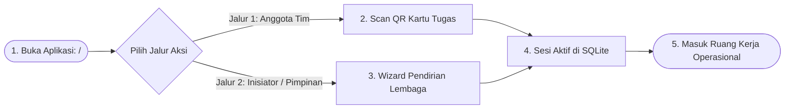
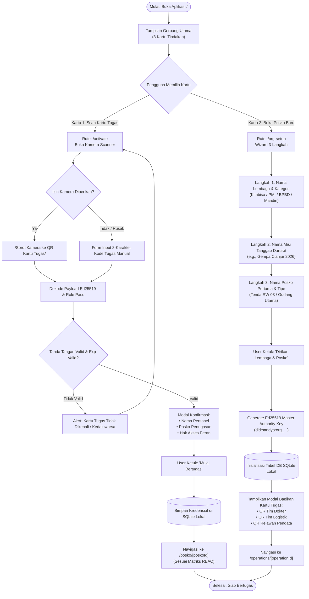

# User Flow: Onboarding, Aktivasi Tim, & Tata Kelola Organisasi

> **Status**: Approved  
> **Target Persona**: Superadmin Lembaga, Koordinator Posko, Dokter/Relawan Tim  
> **Core Objective (JTBD)**: Membuka lembaga/posko baru atau mengaktifkan tugas lapangan instan via scan QR kartu tugas tanpa antre dan tanpa login rumit.  
> **Konteks & Lingkungan**: Offline-first Mobile & Desktop Command Center.

---

## 1. Lingkup Alur & Pra-Kondisi

### Cakupan (In Scope)
- Gerbang masuk 3-kartu di halaman utama (`/`).
- Jalur 1: Aktivasi kartu tugas tim via pemindaian QR / input kode manual (`/activate`).
- Jalur 2: Wizard pendirian organisasi, misi operasi bencana, dan posko pertama (`/org-setup`).
- Konsol manajemen misi & pembagian peran regu (Poster QR Regu & PIN Otorisasi 4-digit) (`/operations/[opId]`, `/members`).
- Konfigurasi penyedia cloud (Sandya Managed vs BYOC) (`/settings`).

### Di Luar Cakupan (Out of Scope)
- Registrasi akun berbasis email/password publik (Sandya murni menggunakan otoritas kriptografi lokal Ed25519).

### Prekondisi
- Aplikasi Sandya terpasang di HP/Laptop (Tauri v2 / Web PWA).

### Postkondisi
- Pasangan kunci Ed25519 tersimpan aman di SQLite lokal.
- Sesi aktif tersimpan dengan role RBAC yang sesuai, langsung diarahkan ke dasbor posko atau konsol organisasi.

---

## 2. Peta Perjalanan Makro (High-Level Journey)

---

## 3. Diagram Alur Mikro Terinci (Detailed Flowchart)

---

## 4. Tabel Interaksi Langkah Demi Langkah

| Langkah # | Rute / Layar | Tindakan Aktor | Respons Sistem / SQLite Lokal | Validasi & Catatan |
|---|---|---|---|---|
| **1.0** | `/` | Membuka aplikasi Sandya | Menampilkan halaman landing dengan 3 kartu pilihan bahasa & aksi | Desain kontras tinggi lapangan |
| **1.1a** | `/activate` | Mengetuk kartu *[1] Scan Kartu Tugas* | Menyalakan kamera pemindai QR aktif | Fallback input kode teks jika kamera mati |
| **1.1b** | `/activate` | Memindai QR tugas dari koordinator | Memverifikasi tanda tangan Ed25519, mengekstrak `role`, `orgId`, `posId` | Instan 1 detik (*Haptic Beep*) |
| **1.1c** | `/activate` | Mengetuk *"Mulai Bertugas"* | Menyimpan sesi pengguna ke SQLite dan me-route ke dashboard posko | Hak akses RBAC terkunci otomatis |
| **1.2a** | `/org-setup` | Mengetuk kartu *[2] Buka Posko Baru* | Membuka wizard input nama organisasi & posko | Mendukung komunitas lokal mandiri |
| **1.2b** | `/org-setup` | Mengisi data posko & klik *Simpan* | Membuat Master Keypair lokal, insert data ke tabel `organizations` & `posts` | Tanpa butuh koneksi internet |
| **1.2c** | `/operations/[id]` | Koordinator membuat kartu tugas regu | Men-generate QR token regu yang dapat di-scan 50 relawan serentak | *Zero-bottleneck distribution* |

---

## 5. Matriks Kasus Khusus & Penanganan Galat (*Edge Cases*)

| Pemicu / Kondisi | Mode Kegagalan | Perilaku UX & Jalur Pemulihan |
|---|---|---|
| **Kamera HP Buram / Malam Hari** | Gagal fokus memindai QR kartu tugas | Sediakan tombol *"Gunakan Kode Manual"*; koordinator menyebutkan kode 8 karakter alfanumerik. |
| **Penaikan Hak Akses Mendadak di Tenda** | Relawan biasa mendadak ditugaskan jadi Petugas Medis | Koordinator membuka menu Posko $\rightarrow$ Ketik PIN 4-digit di HP relawan $\rightarrow$ Hak akses langsung naik seketika. |
| **Pindah Posko Penugasan** | Relawan dimutasi dari Posko A ke Posko B | Cukup scan QR kartu tugas Posko B $\rightarrow$ SQLite lokal mengalihkan *active posko workspace* tanpa menghapus history. |
| **Pergantian Host Cloud (BYOC)** | Lembaga BPBD ingin sinkron ke server internal | Buka `/settings` $\rightarrow$ pilih *"Server Mandiri"* $\rightarrow$ masukkan URL `https://sandya.bpbd.go.id`. |

---

## 6. Inventaris Layar & Rute Terkait

| Nama Layar | Rute / ID Komponen | Komponen Utama | Aksi Kunci |
|---|---|---|---|
| **Gerbang Utama** | `/page.tsx` | Kartu 3 Jalur, Pemilih Bahasa | Masuk Jalur 1/2/3 |
| **Aktivasi Kartu Tugas** | `/(auth)/activate/page.tsx` | Viewfinder Kamera, Tab Input Manual | Pindai QR, Submit Kode |
| **Wizard Setup Lembaga** | `/(auth)/org-setup/page.tsx` | Multi-step Form, Tipe Posko Selector | Buat Master Key, Buka Posko |
| **Konsol Operasi Misi** | `/(organization)/operations/[id]/page.tsx` | Grid Kartu Posko, Status BNPB Badge | Buka Posko, Tambah Tenda |
| **Manajemen Anggota** | `/(organization)/members/page.tsx` | Roster Anggota, QR Generator Kartu Tugas | Cetak QR Regu, Setel PIN |
| **Pengaturan Cloud & Key** | `/(organization)/settings/page.tsx` | Input URL BYOC, Ekspor Master Key | Backup Kunci, Switch Provider |
