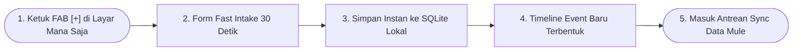

# User Flow: Pendataan Warga (Fast Intake) & Event Sourcing Timeline

> **Status**: Approved  
> **Target Persona**: Seluruh Staf Posko (Koordinator Posko, Petugas Medis, Petugas Logistik, Relawan Lapangan)  
> **Core Objective (JTBD)**: Mendaftarkan pengungsi baru dalam <30 detik dalam kondisi darurat tanpa hambatan KTP, serta mencatat riwayat perkembangan kondisi secara kronologis (*append-only*).  
> **Konteks & Lingkungan**: Offline-first Mobile (di tenda pengungsian), SQLite lokal, outbox queue P2P.

---

## 1. Lingkup Alur & Pra-Kondisi

### Cakupan (In Scope)
- Pemicu Fast Mobile Intake 30 detik dari Tombol FAB Melayang (`/refugees/intake`) yang tersedia di HP seluruh staf posko.
- Penanganan NIK Dinamis (*Dynamic Null-Bypass*): 0 Byte jika dokumen KTP hilang/lupa, 5 Byte jika satu wilayah posko.
- Identifikasi Kelompok Rentan (Balita, Lansia, Ibu Hamil, Disabilitas) & Kebutuhan Mendesak Awal (Katalog Standar Bencana).
- Perekaman Relasi Temu Keluarga (`missing_kin_name` & `domicile_origin`).
- Append-Only Event Timeline: Tambah catatan peristiwa (`HEALTH_CHECK`, `NEED_REPORTED`, `AID_RECEIVED`, `NOTE`).
- Hybrid Timestamp anti-*clock drift* (`device_timestamp`, `logical_seq`, `causal_parent_id`).

### Di Luar Cakupan (Out of Scope)
- Persetujuan & pemotongan stok fisik barang (dialihkan ke User Flow 04: Logistik).

### Prekondisi
- Pengguna memiliki kartu tugas aktif di posko tersebut (Koordinator, Medis, Logistik, atau Relawan).

### Postkondisi
- Record pengungsi baru tersimpan di tabel `refugees` SQLite lokal.
- Event awal tercatat di tabel `refugee_events`.
- Antrean sinkronisasi lokal (*Outbox Queue*) bertambah untuk disebarkan via Data Mule.

---

## 2. Peta Perjalanan Makro (High-Level Journey)

---

## 3. Diagram Alur Mikro Terinci (Detailed Flowchart)

```mermaid
flowchart TD
  Start(["Mulai: Di Dasbor Posko Lapangan"]) --> TapFAB["User Ketuk Tombol FAB [+]<br/>'Pendaftaran Cepat'"]
  
  TapFAB --> FastIntakeModal["Buka Modal / Form Fast Mobile Intake<br/>Rute: /refugees/intake"]
  
  FastIntakeModal --> InputBasic["1. Input Nama Lengkap & Usia / Estimasi<br/>(e.g., 'Muhammad Budi Santoso', 34 th)"]
  
  InputBasic --> CheckNIK{"Warga Membawa KTP / Ingat NIK?"}
  CheckNIK -->|Tidak / Hilang| SetNIKNull["Tandai hasNationalId = 0<br/>(Alokasi 0 Byte di Biner)"]
  CheckNIK -->|Ya / Ada KTP| InputNIK["Input 16 Digit NIK KTP"]
  
  InputNIK --> NIKRegionCheck{"6 Digit Wilayah Sama dengan Posko?"}
  NIKRegionCheck -->|Sama| PrefixOffload["Aktifkan Regional Prefix Offloading<br/>(Simpan 10 Digit Sisa / 5 Bytes)"]
  NIKRegionCheck -->|Beda Wilayah| FullNIK["Simpan NIK Lengkap (8 Bytes)"]
  
  SetNIKNull --> SelectVulnerability
  PrefixOffload --> SelectVulnerability
  FullNIK --> SelectVulnerability["2. Pilih Chip Kelompok Rentan<br/>[Balita] [Ibu Hamil] [Lansia] [Disabilitas]"]
  
  SelectVulnerability --> SelectUrgentNeeds["3. Pilih Kebutuhan Mendesak Awal<br/>[Beras] [Susu Bayi] [Selimut] [Tenda]"]
  
  SelectUrgentNeeds --> KinSearchCheck{"Mencari Keluarga yang Terpisah?"}
  KinSearchCheck -->|Ya| InputKin["Isi: Nama Kerabat Dicari & Dusun Asal<br/>(e.g., 'Siti Rahmawati', 'Dusun Cijedil')"]
  KinSearchCheck -->|Tidak| SkipKin["Lewati Field Temu Keluarga (0 Byte)"]
  
  InputKin --> TapSave["User Ketuk: 'Simpan Warga (30s)'"]
  SkipKin --> TapSave
  
  TapSave --> GenUUIDv7["Generate UUIDv7 Pengungsi<br/>+ Hitung Logical Sequence Counter"]
  GenUUIDv7 --> InsertRefugeeDB[("INSERT INTO refugees (SQLite Lokal)")]
  InsertRefugeeDB --> InsertInitEvent[("INSERT INTO refugee_events (TYPE: INTAKE)")]
  
  InsertInitEvent --> CheckKinMatch{"Apakah Nama Pengungsi Ini<br/>Dicari oleh Posko Lain di Database Lokal?"}
  CheckKinMatch -->|Ya: Cocok!| TriggerReunionAlert["Tampilkan Popup Reuni: 'Keluarga Ditemukan!'"]
  CheckKinMatch -->|Tidak| ShowSuccessToast["Toast: 'Warga Berhasil Didaftarkan'"]
  
  TriggerReunionAlert --> UpdateSyncQueue
  ShowSuccessToast --> UpdateSyncQueue[("Tambah ke Outbox Queue untuk Data Mule")]
  UpdateSyncQueue --> ReturnToRefugeeList["Kembali ke /refugees (Daftar Terupdate)"]
  
  %% SUB-FLOW: MENAMBAH EVENT BARU PADA WARGA LAMA
  ReturnToRefugeeList --> ViewDetail["Buka Detail Warga: /refugees/[id]"]
  ViewDetail --> AddEventTap["User Ketuk: '+ Tambah Rekam Peristiwa'"]
  AddEventTap --> SelectEventType{"Pilih Tipe Peristiwa"}
  
  SelectEventType -->|Kondisi Medis| MedEvent["Catat Suhu, Tensi, Keluhan Baru"]
  SelectEventType -->|Kebutuhan Baru| NeedEvent["Catat Permintaan Selimut/Susu Tambahan"]
  SelectEventType -->|Catatan Khusus| NoteEvent["Catat Catatan Sosial / Lokasi Tenda Baru"]
  
  MedEvent & NeedEvent & NoteEvent --> StampClock["Hitung Hybrid Timestamp:<br/>device_timestamp + logical_seq++ + causal_parent_id"]
  StampClock --> InsertAppendOnlyEvent[("INSERT INTO refugee_events (Append-Only)")]
  InsertAppendOnlyEvent --> RefreshTimeline["Timeline Terupdate Seketika (No Overwrite)"]
  RefreshTimeline --> EndState(["Selesai"])
```

---

## 4. Tabel Interaksi Langkah Demi Langkah

| Langkah # | Rute / Layar | Tindakan Aktor | Respons Sistem / SQLite Lokal | Validasi & Catatan |
|---|---|---|---|---|
| **2.0** | Layar Mana Saja | Mengetuk tombol melayang FAB `[+]` | Membuka sheet modal *Fast Mobile Intake* di atas layar aktif | Desain *thumb-friendly* |
| **2.1** | `/refugees/intake` | Mengetik nama lengkap & usia | Sistem mencocokkan kata dengan Kamus Nama Deterministik (2 Byte/kata) | Bebas AI & bebas salah eja |
| **2.2** | `/refugees/intake` | Mengosongkan NIK (karena KTP tertimbun) | Flag `hasNationalId` disetel ke `0`, tidak memakan byte biner | Tanpa blokir registrasi |
| **2.3** | `/refugees/intake` | Mengetuk chip *Balita* & *Susu Bayi* | Mengaktifkan bitmask kerentanan & menambahkan token `0x51` ke array kebutuhan | Cepat 1-tap per item |
| **2.4** | `/refugees/intake` | Mengisi nama kerabat yang dicari | Mengisi `missing_kin_name` dan `domicile_origin` | Mempersiapkan rekonsiliasi graf |
| **2.5** | `/refugees/intake` | Mengetuk *"Simpan Warga"* | Menyimpan record ke SQLite & membuat baris event `INTAKE` pertama | Waktu eksekusi $< 5\text{ms}$ |
| **2.6** | `/refugees/[id]` | Menambahkan catatan demam siang hari | Menambahkan baris baru ke `refugee_events` tanpa menimpa status pagi | *Full audit trail* terjaga |

---

## 5. Matriks Kasus Khusus & Penanganan Galat (*Edge Cases*)

| Pemicu / Kondisi | Mode Kegagalan | Perilaku UX & Jalur Pemulihan |
|---|---|---|
| **Baterai HP Habis Total (Jam Reset ke 1970)** | Timestamp fisik jam HP tidak akurat (*Clock Drift*) | Sistem otomatis mengandalkan nomor urut monotonik `logical_seq` dan rantai `causal_parent_id` untuk menyusun kronologi riwayat. |
| **Pengungsi Terdaftar Ganda di 2 Tenda** | Warga didata oleh Relawan A di Tenda 01 dan Relawan B di Tenda 02 | Algoritma *Fuzzy Matching Hash* (Nama + Usia + Dusun) menandai duplikasi potensial dengan badge *"Duplikasi Terdeteksi"* untuk diverifikasi manual oleh Koordinator. |
| **Nama Langka di Luar Kamus Bawaan** | Kata nama tidak ditemukan di kamus 2.048 kata | Sistem otomatis mengaktifkan *Bit 15 = 1* (Fallback Literal String UTF-8) atau menyematkannya ke *Dynamic Local Symbol Table* di header payload. |
| **Ruang Penyimpanan HP Penuh** | SQLite mencapai kuota batas memori | Tampilkan peringatan oranye *"Penyimpanan Hampir Penuh"*, sarankan ekspor cadangan `.sandya` ke kartu memori / flashdisk USB OTG. |

---

## 6. Inventaris Layar & Rute Terkait

| Nama Layar | Rute / ID Komponen | Komponen Utama | Aksi Kunci |
|---|---|---|---|
| **Daftar Pengungsi** | `/(posko)/[poskoId]/refugees/page.tsx` | Search Bar, Filter Chip Kelompok Rentan, List Kartu Warga | Cari Warga, Filter Balita, Buka Detail |
| **Fast Mobile Intake** | `/(posko)/[poskoId]/refugees/intake/page.tsx` | Form 30 Detik, Toggle KTP, Multi-Select Kebutuhan | Simpan Cepat, Reset Form |
| **Detail & Timeline Warga** | `/(posko)/[poskoId]/refugees/[refugeeId]/page.tsx` | Profil Warga, Event Sourcing Timeline Git-Graph, Riwayat Medis | Tambah Event, Terbitkan Tiket |
| **Modal Tambah Event** | `#modal-add-refugee-event` | Tipe Event Picker, Input Vital Signs, Selector Obat | Submit Log Event Baru |
