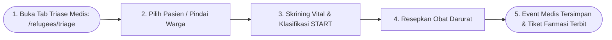
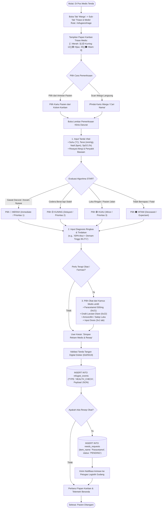

# User Flow: Triase Medis START & Rekam Kesehatan Darurat

> **Status**: Approved  
> **Target Persona**: Petugas Medis / Dokter, Perawat Lapangan, Koordinator Posko  
> **Core Objective (JTBD)**: Melakukan triase cepat START (Simple Triage and Rapid Treatment) terhadap pengungsi sakit, mencatat tanda vital, dan menerbitkan resep/tiket obat darurat secara offline.  
> **Konteks & Lingkungan**: Tenda Pos Medis / RS Darurat Lapangan, SQLite lokal, integrasi tiket logistik farmasi.

---

## 1. Lingkup Alur & Pra-Kondisi

### Cakupan (In Scope)
- Papan Kanban Triase Medis START 4-Warna (🔴 Merah, 🟡 Kuning, 🟢 Hijau, ⚫ Hitam) di rute `/refugees/triage`.
- Skrining Tanda Vital Cepat (Suhu Tubuh, Tekanan Darah Sistol/Diastol, Denyut Nadi, Saturasi $\text{SpO}_2$, Keluhan Utama).
- Penerbitan Tiket Resep Obat Darurat (Kategori `0x21 - 0x50` Kamus Bencana) yang otomatis terhubung ke antrean logistik farmasi.
- Perekaman riwayat medis ke dalam *Event Sourcing Timeline* pasien (`event_type: HEALTH_CHECK`).
- Pembatasan Wewenang Kriptografis (Khusus pemegang *Medical Officer Pass*).

### Di Luar Cakupan (Out of Scope)
- Pengurangan stok fisik obat dari lemari farmasi (dialihkan ke User Flow 04: Petugas Logistik / Farmasi).

### Prekondisi
- Pengguna memiliki role aktif **Petugas Medis / Dokter / Perawat** via aktivasi QR Role Pass.
- Pasien telah terdaftar sebagai pengungsi di posko (atau didaftarkan on-the-spot via Fast Intake).

### Postkondisi
- Status triase pasien terbarui di basis data SQLite lokal.
- Baris event pemeriksaan medis tersimpan secara *append-only* di `refugee_events`.
- Tiket kebutuhan obat berstatus `PENDING` terbit di tabel `needs_requests`.

---

## 2. Peta Perjalanan Makro (High-Level Journey)

---

## 3. Diagram Alur Mikro Terinci (Detailed Flowchart)

---

## 4. Tabel Interaksi Langkah Demi Langkah

| Langkah # | Rute / Layar | Tindakan Aktor | Respons Sistem / SQLite Lokal | Validasi & Catatan |
|---|---|---|---|---|
| **3.0** | `/refugees/triage` | Membuka sub-tab *Triase & Medis* | Menampilkan papan Kanban 4-kolom kategori START dan metrik pasien kritis | Filter instan berdasarkan keparahan |
| **3.1** | `/refugees/triage` | Memindai QR warga atau memilih pasien | Membuka form modal klinis dengan data dasar pasien terisi otomatis | Riwayat medis terdahulu dimuat di sisi kanan |
| **3.2** | Form Triase | Mengisi suhu $39.2^\circ\text{C}$, tensi $130/80$, memilih chip 🔴 *Merah* | Sistem mengkalkulasi skor keparahan dan menyorot kartu dengan warna merah menyala | Format data terpadat |
| **3.3** | Form Triase | Memilih obat *Paracetamol 500mg* & *Oralit* | Mengambil token biner `0x21` & `0x22` dari katalog kamus medis bawaan | Menjamin ketersediaan istilah standar |
| **3.4** | Form Triase | Mengetuk *"Simpan Rekam Medis"* | Menulis baris event medis baru ke `refugee_events` dan menerbitkan tiket `needs_requests (PENDING)` | Nama dan ID dokter terstempel permanen |
| **3.5** | Dasbor Posko | Membuka Beranda telemetri | Barometer Beranda otomatis memperbarui metrik: *"🔴 4 Pasien Kritis Merah Butuh Rujukan"* | Informasi agregat seketika |

---

## 5. Matriks Kasus Khusus & Penanganan Galat (*Edge Cases*)

| Pemicu / Kondisi | Mode Kegagalan | Perilaku UX & Jalur Pemulihan |
|---|---|---|
| **Pasien Belum Terdaftar Saat Tiba di Tenda Medis** | Pasien darurat pingsan tanpa data registrasi | Dokter mengetuk *"Intake Medis Darurat"* $\rightarrow$ isi nama estimasi (*"Mr. X - Tenda 01"*) $\rightarrow$ langsung masuk lembar triase tanpa tertahan administrasi. |
| **Obat yang Diresepkan Habis Total di Posko** | Petugas farmasi menolak tiket obat karena stok kosong | Tiket berubah status menjadi `REJECTED (Stok Habis)` $\rightarrow$ sistem memunculkan rekomendasi obat subtitusi atau opsi eskalasi Surat Jalan ke Posko Induk. |
| **Kondisi Pasien Memburuk (Hijau $\to$ Merah)** | Pasien yang awalnya luka ringan mendadak sesak napas berat | Buka kembali detail pasien $\rightarrow$ tambah event `HEALTH_CHECK` baru $\rightarrow$ ubah status ke 🔴 *Merah* $\rightarrow$ pasien otomatis berpindah kolom di Kanban. |
| **Upaya Akses Menu Medis oleh Relawan Non-Medis** | Relawan pendata biasa mencoba mengisi resep obat | Tombol terkunci dengan badge gembok: *"Khusus Petugas Medis Berlisensi (Scan QR Dokter untuk Membuka)"*. |

---

## 6. Inventaris Layar & Rute Terkait

| Nama Layar | Rute / ID Komponen | Komponen Utama | Aksi Kunci |
|---|---|---|---|
| **Papan Triase START** | `/(posko)/[poskoId]/refugees/triage/page.tsx` | Kanban 4 Kolom (Merah/Kuning/Hijau/Hitam), Filter Pasien | Buka Pasien, Pindah Status Triase |
| **Modal Pemeriksaan Klinis** | `#modal-medical-examination` | Form Vital Signs, Selector Kategori START, Resep Picker | Simpan Rekam Medis, Terbitkan Resep |
| **Riwayat Rekam Medis** | `/(posko)/[poskoId]/refugees/[id]/page.tsx#medical` | Grafik Suhu/Tensi Kronologis, List Resep Diterima | Tinjau Riwayat Pemeriksaan Medis |
