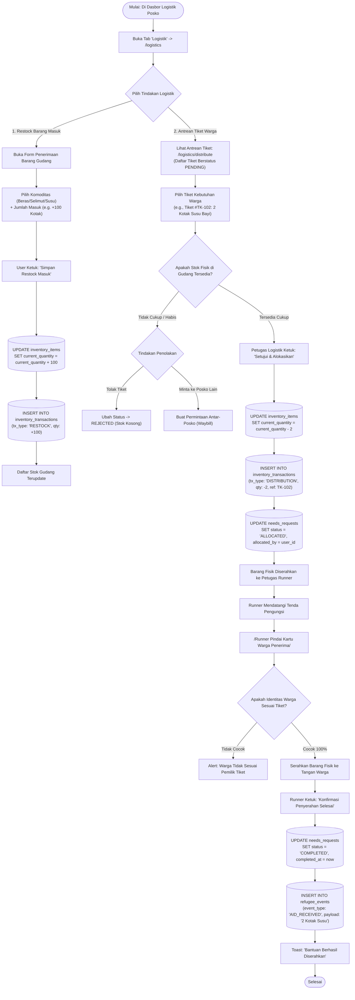

# User Flow: Logistik Gudang & Distribusi Single-Writer Ledger

> **Status**: Approved  
> **Target Persona**: Petugas Logistik (Warehouse Lead), Petugas Distribusi (Runner), Koordinator Posko  
> **Core Objective (JTBD)**: Mengelola stok fisik barang dengan prinsip *Single-Writer* anti-*race condition* (*phantom stock*), menyetujui tiket kebutuhan warga, dan mengonfirmasi serah terima bantuan di lapangan.  
> **Konteks & Lingkungan**: Gudang posko darurat, tenda pengungsi, pencatatan buku kas transaksi *append-only*.

---

## 1. Lingkup Alur & Pra-Kondisi

### Cakupan (In Scope)
- Penerimaan barang masuk / restock gudang (`inventory_items` & `inventory_transactions`).
- Pemrosesan antrean tiket kebutuhan warga (`needs_requests`: `PENDING` $\to$ `ALLOCATED`).
- Pemotongan resmi kuantitas fisik gudang oleh Petugas Logistik (*Single-Writer Authority*).
- Penyerahan fisik bantuan ke warga oleh Petugas Distribusi (*Runner*) (`ALLOCATED` $\to$ `COMPLETED`).
- Pembuatan Permintaan Bantuan Antar-Posko & QR Surat Jalan (*Waybill*) resmi.

### Di Luar Cakupan (Out of Scope)
- Pemotongan sepihak stok posko lain secara offline (Dilarang keras oleh arsitektur *Single-Writer*).

### Prekondisi
- Pengguna memiliki role aktif **Petugas Logistik** (untuk mutasi stok gudang) atau **Petugas Distribusi** (untuk penyerahan bantuan warga).

### Postkondisi
- Kuantitas fisik di `inventory_items` terpotong akurat.
- Buku kas transaksi `inventory_transactions` bertambah baris audit log baru.
- Tiket kebutuhan berstatus `COMPLETED` dan rekam peristiwa `AID_RECEIVED` tercatat di timeline pengungsi.

---

## 2. Peta Perjalanan Makro (High-Level Journey)

---

## 3. Diagram Alur Mikro Terinci (Detailed Flowchart)

---

## 4. Tabel Interaksi Langkah Demi Langkah

| Langkah # | Rute / Layar | Tindakan Aktor | Respons Sistem / SQLite Lokal | Validasi & Catatan |
|---|---|---|---|---|
| **4.0** | `/logistics` | Membuka tab *Stok Gudang* | Menampilkan tabel komoditas, stok fisik, dan peringatan *burn rate* | Data tersortir berdasarkan tingkat kekritisan |
| **4.1** | `/logistics` | Memasukkan restock 150 kg Beras | Menambah stok dan membuat baris buku kas `inventory_transactions (RESTOCK)` | Timestamp lokal tercatat |
| **4.2** | `/logistics/distribute` | Membuka antrean tiket kebutuhan | Menampilkan daftar tiket `PENDING` yang diajukan oleh Enumerator dan Dokter | Urutan berdasarkan waktu & prioritas rentan |
| **4.3** | `/logistics/distribute` | Logistik menyetujui tiket 2 Selimut | Kuantitas stok gudang terpotong $-2$, status tiket berubah menjadi `ALLOCATED` | Hanya dapat diakses oleh Petugas Logistik |
| **4.4** | `/logistics/distribute` | Runner memindai warga di tenda | Membuka tiket aktif milik warga yang bersangkutan | Mencegah salah sasaran |
| **4.5** | `/logistics/distribute` | Runner mengonfirmasi serah terima | Status tiket berubah `COMPLETED` dan event `AID_RECEIVED` tercatat di timeline warga | *Zero-dispute audit* |
| **4.6** | `/logistics/waybills` | Logistik membuat Surat Jalan ke Posko B | Men-generate QR Surat Jalan tertandatangani Ed25519 untuk dipindai sopir truk bantuan | Cegah kebocoran bantuan di jalan |

---

## 5. Matriks Kasus Khusus & Penanganan Galat (*Edge Cases*)

| Pemicu / Kondisi | Mode Kegagalan | Perilaku UX & Jalur Pemulihan |
|---|---|---|
| **Dua Posko Meminta Stok Beras dari Posko yang Sama** | Risiko klaim ganda (*Phantom Stock*) dalam kondisi offline | Sistem menerapkan *Single-Writer*: permintaan dari posko luar berstatus `REQUEST (PENDING)`. Pemotongan stok **hanya sah** saat gudang asal menyetujuinya secara fisik. |
| **Barang Rusak / Kadaluwarsa di Gudang** | Stok fisik berkurang bukan karena dibagikan ke warga | Petugas Logistik memilih tipe mutasi `DAMAGE (Kerusakan/Basah)` $\rightarrow$ stok berkurang dan tercatat di buku kas transaksi dengan catatan alasan. |
| **Warga Sedang Tidak Berada di Tenda Saat Runner Datang** | Bantuan tidak bisa diserahkan langsung | Runner mengetuk *"Tunda Penyerahan"* $\rightarrow$ tiket tetap berstatus `ALLOCATED` dan tidak hangus hingga warga kembali. |
| **Upaya Pemotongan Stok oleh Relawan Pendata** | Relawan non-logistik mencoba mengedit angka stok gudang | Tombol mutasi terkunci dengan badge: *"Akses Ditolak: Hanya Petugas Gudang yang Berhak Mengubah Stok"*. |

---

## 6. Inventaris Layar & Rute Terkait

| Nama Layar | Rute / ID Komponen | Komponen Utama | Aksi Kunci |
|---|---|---|---|
| **Stok Gudang & Mutasi** | `/(posko)/[poskoId]/logistics/page.tsx` | Kartu Komoditas, Indikator Sisa Hari, Tabel Buku Kas Transaksi | Tambah Restock, Koreksi Kerusakan |
| **Antrean & Distribusi Bantuan** | `/(posko)/[poskoId]/logistics/distribute/page.tsx` | List Tiket (Pending/Allocated/Completed), Scanner Kamera | Setujui Tiket, Scan Serah Terima |
| **Bantuan Antar-Posko & Waybills** | `/(posko)/[poskoId]/logistics/waybills/page.tsx` | Daftar Pengiriman, Generator QR Surat Jalan, Tracker Status | Buat Surat Jalan, Pindai Surat Masuk |
