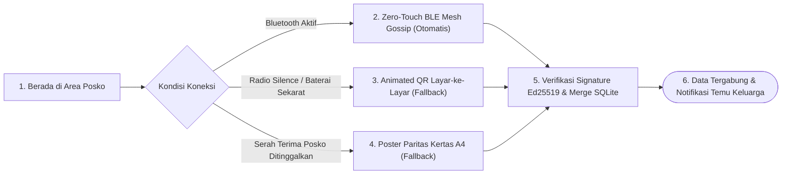

# User Flow: Pusat Sinkronisasi Data (Zero-Touch BLE Mesh & Fallback Poster Paritas)

> **Status**: Approved  
> **Target Persona**: Seluruh Relawan (Universal Data Mule), Koordinator Posko, Relawan Penerus Misi  
> **Core Objective (JTBD)**: Menyinkronkan ribuan data pengungsi dan transaksi logistik antar-perangkat secara otomatis tanpa sentuh via BLE Mesh di latar belakang, serta menyediakan jalur cadangan visual (Animated QR 6 FPS & Poster Paritas XOR) untuk isolasi air-gapped dan serah terima posko fisik.  
> **Konteks & Lingkungan**: Jaringan ad-hoc BLE Mesh (BitChat), tenda darurat, jalan setapak bencana, dinding posko, SQLite lokal.

---

## 1. Lingkup Alur & Pra-Kondisi

### Cakupan (In Scope)
- **Jalur Utama: Zero-Touch BLE Mesh Gossip (BitChat Protocol)**:
  - Deteksi otomatis perangkat relawan sekitar via Bluetooth LE.
  - Pertukaran Vector Clock dan *silent background sync* delta event Ultra-Dense v4 (~5–6 bytes/jiwa).
- **Jalur Cadangan 1: Moda Layar (Animated Multipart QR)**:
  - Layar Pengirim: Dynamic chunking (~1.200 Bytes/frame), animasi loop 6 FPS berputar di rute `/sync/animated-qr`.
  - Layar Penerima: Video camera capture asinkron (*out-of-order capture*), progress bar slot terisi, berhenti instan begitu lengkap (*haptic buzz*).
- **Jalur Cadangan 2: Moda Cetak (Poster Paritas XOR)**:
  - Pengekspor: Generator Grid 4 QR (3 Data + 1 Paritas XOR) / Grid 8 QR, tanda tangan Ed25519 Koordinator, siap cetak ke printer termal saku / PDF A4 di rute `/sync/poster`.
  - Pengimpor: Pemindaian $N-1$ kotak yang tersisa, rekonstruksi otomatis kotak yang hilang/rusak via formula XOR ($B = A \oplus C \oplus D$).
- **Auto Cloud Replication**:
  - Deteksi koneksi internet otomatis dan auto-push event lokal ke server cloud (Managed / BYOC).

### Di Luar Cakupan (Out of Scope)
- Sinkronisasi peer-to-peer kabel fisik.

### Prekondisi
- Perangkat pengirim memiliki data event lokal yang siap ditransfer.

### Postkondisi
- Database SQLite lokal penerima digabungkan secara konsisten (*reconciled*) tanpa duplikasi.
- Pemicu rekonsiliasi graf temu keluarga (*Family Reunion*) aktif secara otomatis.

---

## 2. Peta Perjalanan Makro (High-Level Journey)



---

## 3. Diagram Alur Mikro Terinci (Detailed Flowchart)

```mermaid
flowchart TD
  Start(["Mulai: Di Area Posko / Buka Tab /sync"]) --> SelectSyncMode{"Pilih Moda Sinkronisasi"}

  %% ==========================================
  %% MODA 0: ZERO-TOUCH BLE MESH GOSSIP (PRIMARY HIGHWAY)
  %% ==========================================
  SelectSyncMode -->|"Moda 1 (Utama): Zero-Touch BLE Mesh"| BLEProximity["Relawan Masuk Jangkauan BLE Radio (~50m)"]
  BLEProximity --> ExchangeVectorClock["Kirim SYNC_VECTOR_PROBE (~8B):<br/>Node A klaim {Posko: seq 45}"]
  ExchangeVectorClock --> ComputeDelta["Node B Cek SQLite:<br/>Clock lokal seq 40 -> Minta seq 41..45 (Hanya 5 Event Baru!)"]
  ComputeDelta --> DispatchDeltaBatch["Node A Kirim SYNC_DELTA_BATCH (~30B dalam 1 Packet)"]
  DispatchDeltaBatch --> IngestDeltaDB[("Merge Delta ke SQLite Lokal + Update Clock = 45")]
  IngestDeltaDB --> TriggerReunionCheck[" Auto-Trigger Match Temu Keluarga + Update UI!"]

  %% ==========================================
  %% MODA 1: ANIMATED MULTIPART QR (LAYAR-KE-LAYAR FALLBACK)
  %% ==========================================
  SelectSyncMode -->|"Moda 2 (Fallback Layar): Animated QR"| AnimatedChoice{"Kirim atau Terima?"}
  
  %% PENGIRIM (TRANSMITTER)
  AnimatedChoice -->|Kirim Data / Transmit| PrepPayloadScreen["Query Delta Event Baru dari SQLite<br/>-> Bit-Packing Ultra-Dense v4<br/>-> Kompresi Zstd / Deflate"]
  PrepPayloadScreen --> ChunkPayload["Bagi Payload ke N Chunks (@1.200 Bytes)<br/>N = Ceil(TotalBytes / 1.200)"]
  ChunkPayload --> PlayAnimation["Rute: /sync/animated-qr (Mode Kirim)<br/>Putar Animasi Loop 6 FPS di Layar HP"]
  
  %% PENERIMA (RECEIVER)
  AnimatedChoice -->|Terima Data / Receive| OpenCamReceiver["Rute: /sync/animated-qr (Mode Terima)<br/>Buka Kamera Scanner"]
  OpenCamReceiver --> PointCamera["Arahkan Kamera ke Layar HP Pengirim"]
  
  PointCamera --> CaptureFirstFrame["Tangkap Frame Pertama Mana Saja<br/>(Baca TotalParts: N -> Alokasi N Slot Buffer)"]
  
  CaptureFirstFrame --> LoopScanFrames["Loop Asinkron: Tangkap Frame yang Lewat"]
  LoopScanFrames --> DeduplicateFrame{"Frame Sudah Pernah Disimpan?"}
  DeduplicateFrame -->|Sudah| IgnoreFrame["Abaikan Frame Duplikat"]
  DeduplicateFrame -->|Belum| SaveSlotBuffer["Simpan ke Slot Buffer #Index"]
  
  IgnoreFrame --> CheckAllSlotsFilled{"Apakah Seluruh N Slot Terisi?"}
  SaveSlotBuffer --> CheckAllSlotsFilled
  
  CheckAllSlotsFilled -->|Belum| UpdateProgressBar["Update Progress Bar: (e.g. 7/10 Frame)"]
  UpdateProgressBar --> LoopScanFrames
  
  CheckAllSlotsFilled -->|Ya: Lengkap 100%!| StopScanInstan[" STOP SCAN INSTAN!<br/>Getar Haptic (BZZT) + Beep"]
  StopScanInstan --> DecompressPayload["Gabung Chunks -> Dekompresi Zstd<br/>-> Unpack Biner Ultra-Dense v4"]
  
  DecompressPayload --> MergeToLocalDB[("Merge Delta Records ke SQLite Lokal<br/>(Append-Only Events & Deduplikasi UUID)")]
  
  %% ==========================================
  %% MODA 2: POSTER PARITAS XOR (CETAK KERTAS)
  %% ==========================================
  SelectSyncMode -->|"Moda Cetak: Poster Paritas"| PosterChoice{"Cetak atau Scan Poster?"}
  
  %% CETAK POSTER
  PosterChoice -->|Cetak Poster Posko| PrepPosterData["Query Seluruh Data Posko Ini<br/>-> Tokenisasi & Ultra-Dense Bit-Packing"]
  PrepPosterData --> GenParityXOR["Bagi Menjadi 3 Chunks Data (A, B, C)<br/>+ Hitung 1 Chunk Paritas: D = A ⊕ B ⊕ C"]
  GenParityXOR --> SignCoordinator["Bubuhkan Tanda Tangan Ed25519 Koordinator"]
  SignCoordinator --> RenderPosterGrid["Rute: /sync/poster (Preview Grid 4 QR)<br/>[ QR A ] [ QR B ]<br/>[ QR C ] [ QR Paritas D ]"]
  RenderPosterGrid --> PrintPosterAction["User Ketuk: 'Cetak ke Printer Bluetooth' / Unduh PDF"]
  
  %% SCAN POSTER (RELIEVER TEAM)
  PosterChoice -->|Pindai Poster Fisik| OpenPosterCam["Buka Scanner Poster Paritas"]
  OpenPosterCam --> ScanGridBoxes["Pindai Kotak-Kotak QR di Poster Fisik"]
  
  ScanGridBoxes --> CountScannedBoxes{"Jumlah Kotak Terbaca?"}
  CountScannedBoxes -->|Kurang dari 3| PromptKeepScanning["Tampilkan Indikator: 'Pindai Minimal 3 dari 4 QR'"]
  PromptKeepScanning --> ScanGridBoxes
  
  CountScannedBoxes -->|Lengkap 4 Kotak| DirectAssemble["Gabungkan Data Utuh (A + B + C)"]
  CountScannedBoxes -->|3 Kotak (1 QR Sobek/Rusak)| XORReconstruction[" REKONSTRUKSI PARITAS XOR:<br/>Contoh: Kotak B Hilang<br/>B = A ⊕ C ⊕ D (100% Sempurna Pulih!)"]
  
  DirectAssemble --> VerifyPosterSig["Verifikasi Signature Ed25519 Koordinator"]
  XORReconstruction --> VerifyPosterSig
  
  VerifyPosterSig --> MergeToLocalDB
  
  %% REKONSILIASI AKHIR & TEMU KELUARGA
  MergeToLocalDB --> AutoReconciliation["Jalankan Rekonsiliasi Graf Temu Keluarga"]
  AutoReconciliation --> KinMatchFound{"Ada Nama Kerabat yang Cocok?"}
  KinMatchFound -->|Ya| ShowReunionAlert[" Munculkan Notifikasi Pop-up Temu Keluarga!"]
  KinMatchFound -->|Tidak| ShowSyncDoneToast["Toast: 'Sinkronisasi Selesai (Data Tergabung)'"]
  
  ShowReunionAlert --> EndSyncState(["Selesai"])
  ShowSyncDoneToast --> EndSyncState
```

---

## 4. Tabel Interaksi Langkah Demi Langkah

| Langkah # | Rute / Layar | Tindakan Aktor | Respons Sistem / SQLite Lokal | Validasi & Catatan |
|---|---|---|---|---|
| **5.0** | `/sync` | Membuka tab *Pusat Sinkronisasi* | Menampilkan dua moda: *Animated QR (Layar)* dan *Poster Paritas (Kertas)* | Indikator outbox belum tersinkron tampak |
| **5.1a** | `/sync/animated-qr` | Pengirim memilih *"Kirim Data"* | Menghitung frame dinamis dan memutar animasi loop 6 FPS modul tebal | Layar HP terkunci agar tidak meredup |
| **5.1b** | `/sync/animated-qr` | Penerima mengarahkan kamera | Kamera menangkap frame secara acak (*out-of-order*); slot terisi satu per satu | Progress bar 0% $\to$ 100% |
| **5.1c** | `/sync/animated-qr` | Seluruh slot terisi penuh | Kamera langsung berhenti seketika (*BZZT!*), mendekompresi payload dan merge ke SQLite | Waktu transfer 1.000 jiwa hanya 2–3 detik |
| **5.2a** | `/sync/poster` | Koordinator memilih *"Cetak Poster"* | Men-generate Grid 4 QR (3 Data + 1 Paritas XOR) bertandatangan Ed25519 | Cetak ke printer kasir termal saku |
| **5.2b** | `/sync/poster` | Tim relawan baru memindai poster yang sobek sudutnya | Membaca 3 kotak yang utuh, menghitung formula XOR $B = A \oplus C \oplus D$, dan memulihkan 100% data posko | *Zero-data-loss guarantee* |
| **5.3** | Background Task | Terhubung WiFi Starlink posko induk | Otomatis mem-push antrean event lokal ke Sandya Cloud / BYOC Server | Berjalan di latar belakang (*silent sync*) |

---

## 5. Matriks Kasus Khusus & Penanganan Galat (*Edge Cases*)

| Pemicu / Kondisi | Mode Kegagalan | Perilaku UX & Jalur Pemulihan |
|---|---|---|
| **Kamera HP Bergoyang / Melewatkan Frame Animasi** | Frame #3 terlewat saat animasi berputar | Scanner tetap berjalan asinkron; saat frame #3 muncul kembali pada putaran loop berikutnya, slot langsung tertangkap tanpa perlu restart dari awal. |
| **Poster Kertas Dirusak Air Hujan / 2 Kotak Rusak Sekaligus** | Kerusakan fisik melebihi batas toleransi paritas XOR (hanya 2 dari 4 QR yang terbaca) | Tampilkan peringatan: *"Data tidak cukup untuk rekonstruksi (butuh 3 kotak). Coba gunakan scan layar HP relawan lama jika perangkat masih aktif"*. |
| **Data yang Diimpor Memiliki NIK yang Sama Namun Beda Nama** | Potensi salah ketik data identitas di lapangan | Sistem menerapkan resolusi konflik berbasis *Event Sourcing*: kedua catatan tetap tersimpan berdampingan sebagai entri terpisah untuk diaudit koordinator. |
| **Koneksi Internet Putus di Tengah Sinkronisasi Cloud** | HTTP Request ke Cloud Server timeout | Event log tetap tersimpan di antrean *Outbox SQLite* lokal dan akan dicoba ulang (*exponential backoff*) saat jaringan kembali stabil. |

---

## 6. Inventaris Layar & Rute Terkait

| Nama Layar | Rute / ID Komponen | Komponen Utama | Aksi Kunci |
|---|---|---|---|
| **Hub Sinkronisasi** | `/(posko)/[poskoId]/sync/page.tsx` | Kartu Pilihan Moda, Indikator Outbox Queue, Status Cloud | Pilih Animated QR / Poster |
| **Animated QR (Layar)** | `/(posko)/[poskoId]/sync/animated-qr/page.tsx` | Canvas Animasi 6 FPS, Viewfinder Kamera, Slot Progress Bar | Mulai Transmit, Buka Receiver |
| **Poster Paritas (Kertas)** | `/(posko)/[poskoId]/sync/poster/page.tsx` | Generator Grid 4/8 QR, Tombol Cetak Thermal / Unduh PDF | Generate Poster, Scan Poster |
| **Modal Notifikasi Reuni** | `#modal-family-reunion-match` | Kartu Komparasi Kerabat, Lokasi Posko Asal, Tombol Sambungkan | Hubungi Posko, Buka Peta |
