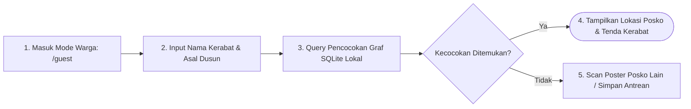

# User Flow: Pusat Temu Keluarga Terpisah (*Offline Family Reunion*)

> **Status**: Approved  
> **Target Persona**: Warga Pengungsi / Tamu (Guest Searcher), Relawan Pendata, Koordinator Posko  
> **Core Objective (JTBD)**: Melacak keberadaan anggota keluarga yang terpisah di posko bencana lain secara instan tanpa internet, baik melalui pencarian mandiri mode warga maupun pencocokan graf otomatis saat sinkronisasi posko.  
> **Konteks & Lingkungan**: Mode Tamu Publik (tanpa login), Sub-Tab Temu Keluarga di Posko, rekonsiliasi graf SQLite lokal.

---

## 1. Lingkup Alur & Pra-Kondisi

### Cakupan (In Scope)
- **Jalur Mode Warga (Guest Portal)**: Akses publik langsung dari halaman depan (`/(auth)/guest`) tanpa registrasi atau kartu tugas.
- **Sub-Tab Temu Keluarga Posko**: Dasbor pencarian dan audit reuni kerabat di `/(posko)/[poskoId]/refugees/reunion`.
- **Pencarian Lintas Posko & Lintas Organisasi**: Mencari di seluruh data posko yang pernah disinkronkan ke SQLite lokal HP (PMI, BPBD, Relawan Mandiri).
- **Targeted Query Match (Standar ICRC RFL)**: Warga memasukkan Nama Kerabat + Asal Dusun untuk menjaga privasi korban (bukan dump data publik).
- **Algoritma Pencocokan Graf (*Graph Matching & Confidence Scoring*)**:
  - *High-Confidence ($>95\%$)*: Nama identik + Asal Dusun sama $\to$ Peringatan Reuni Otomatis.
  - *Bi-directional Kin Match ($99\%$)*: Orang A mencari B dan Orang B mencari A $\to$ Reuni Otomatis.
  - *Medium-Confidence ($70-94\%$)*: Kesamaan nama parsial / nama kerabat terbalik.
- **Penerbitan Surat Keterangan Temu Keluarga (*Family Reunion Pass*)**: Informasi lokasi fisik tenda/posko untuk memfasilitasi penjemputan fisik.

### Di Luar Cakupan (Out of Scope)
- Pemindahan fisik pengungsi (dilakukan oleh tim evakuasi lapangan).

### Prekondisi
- Database SQLite lokal memiliki data pengungsi dari posko sendiri maupun posko lain hasil sinkronisasi Data Mule / Poster Paritas.

### Postkondisi
- Relasi keluarga terhubung di SQLite lokal.
- Banner alert dan notifikasi muncul di dasbor posko terkait.

---

## 2. Peta Perjalanan Makro (High-Level Journey)



---

## 3. Diagram Alur Mikro Terinci (Detailed Flowchart)

```mermaid
flowchart TD
  Start(["Mulai: Di Gerbang Utama /"]) --> ChooseGuestMode["Pilih Kartu 3: 'Pusat Pencarian Keluarga'<br/>Rute: /guest (Mode Tamu Tanpa Login)"]
  
  ChooseGuestMode --> SearchOption{"Pilih Cara Pencarian"}
  
  %% JALUR A: PENCARIAN NAMA DI DATABASE LOKAL
  SearchOption -->|"1. Ketik Nama Kerabat"| InputSearchForm["Form Pencarian Sederhana:<br/>• Nama Lengkap Kerabat (e.g., 'Siti Rahmawati')<br/>• Asal Dusun/Desa (e.g., 'Dusun Cijedil')"]
  InputSearchForm --> ExecuteSearch["User Ketuk: 'Cari Kerabat Saya'"]
  
  ExecuteSearch --> QueryLocalGraph[("Query SQLite Lokal:<br/>SELECT * FROM refugees<br/>WHERE full_name MATCH ? OR missing_kin_name MATCH ?")]
  
  QueryLocalGraph --> MatchEval{"Evaluasi Skor Kecocokan (Confidence)"}
  
  MatchEval -->|Skor > 95% (Exact Match)| ShowHighMatchModal[" KELUARGA DITEMUKAN!<br/>Tampilkan Kartu Hasil Reuni:<br/>• Nama: Siti Rahmawati (32 th)<br/>• Terdaftar di: Posko B (SDN 1 Pacet)<br/>• Penempatan: Ruang Kelas 2B<br/>• Waktu Terdata: Hari ini 10:15 WIB"]
  
  MatchEval -->|Skor 70-94% (Possible Match)| ShowFuzzyMatches["Tampilkan Daftar Kemungkinan Kerabat:<br/>(Beberapa nama mirip di posko sekitar)"]
  
  MatchEval -->|0% (Tidak Ditemukan)| ShowNotFound["Tampilkan Status: 'Belum Terdata di Posko Ini'"]
  
  ShowHighMatchModal --> PrintReunionPass["User Ketuk: 'Tampilkan / Cetak Surat Keterangan Reuni'"]
  PrintReunionPass --> EndSuccessState(["Selesai: Lokasi Keluarga Diketahui"])
  
  %% JALUR B: PINDAI POSTER POSKO LAIN (AIR-GAPPED LOOKUP)
  ShowNotFound --> ScanOtherPosPosterTap["User Membawa Foto / Di Depan Poster Posko Lain"]
  ScanOtherPosPosterTap --> OpenPosterScanner["Buka Scanner Poster di /guest"]
  OpenPosterScanner --> ScanPosterBoxes["Pindai Kotak-Kotak QR Poster Posko Lain"]
  
  ScanPosterBoxes --> RestoreAndQuery["Dekode Data Poster -> Query Nama Kerabat Seketika"]
  RestoreAndQuery --> MatchEval

  ShowFuzzyMatches --> ViewFuzzyDetail["Warga Verifikasi Ciri-Ciri Fisik & Usia"]
  ViewFuzzyDetail --> ConfirmMatchByUser{"Apakah Ini Keluarga Anda?"}
  ConfirmMatchByUser -->|Ya| ShowHighMatchModal
  ConfirmMatchByUser -->|Bukan| ShowNotFound
```

---

## 4. Tabel Interaksi Langkah Demi Langkah

| Langkah # | Rute / Layar | Tindakan Aktor | Respons Sistem / SQLite Lokal | Validasi & Catatan |
|---|---|---|---|---|
| **6.0** | `/` | Mengetuk kartu *[3] Pusat Pencarian Keluarga* | Masuk ke portal `/guest` dengan antarmuka sederhana ramah warga | Bebas login & tanpa kartu tugas |
| **6.1** | `/guest` | Mengetik nama *"Siti Rahmawati"* dan asal *"Dusun Cijedil"* | Sistem mencari kecocokan pada tabel `refugees` di database lokal | Pencarian $<10\text{ms}$ (Indexed) |
| **6.2** | `/guest` | Sistem menemukan kecocokan $98\%$ | Menampilkan modal kartu hijau menyala berisi lokasi posko dan nomor tenda kerabat | Menampilkan waktu pencatatan terakhir |
| **6.3** | `/guest` | Warga mengetuk *"Surat Reuni"* | Menampilkan lembar digital *Family Reunion Pass* dengan QR verifikasi | Dapat difoto atau dicetak untuk izin posko |
| **6.4** | `/refugees/reunion` | Koordinator membuka sub-tab Temu Keluarga | Menampilkan daftar seluruh pasangan kerabat yang berhasil terhubung otomatis di klaster posko | Monitoring terpusat |

---

## 5. Matriks Kasus Khusus & Penanganan Galat (*Edge Cases*)

| Pemicu / Kondisi | Mode Kegagalan | Perilaku UX & Jalur Pemulihan |
|---|---|---|
| **Ejaan Nama Berbeda Sedikit (*"Rizky"* vs *"Rizki"*)* | Exact match gagal menemukan nama kerabat | Algoritma *Levenshtein Distance* ($\le 2$) memunculkan nama sebagai *Possible Match* dengan badge: *"Kemungkinan Kerabat (Kemiripan 88%)"*. |
| **Kerabat Belum Terdata di Posko Mana Pun** | Nama kerabat belum masuk ke database lokal | Sistem menawarkan tombol *"Daftarkan Pencarian Kerabat"*; data pencarian disimpan dan akan otomatis dicocokkan di masa depan saat ada posko baru yang disinkronkan. |
| **Dua Orang Bernama Sama Persis dari Dusun Berbeda** | Kebingungan identitas warga | Sistem menyajikan informasi pembeda (usia, foto/ciri-ciri, nama anggota keluarga lain yang menyertai) untuk diverifikasi warga. |
| **Warga Berada di Tempat Tanpa HP Pintar** | Warga mendatangi meja posko secara fisik | Relawan di meja informasi posko membuka menu `/refugees/reunion` dan melakukan pencarian atas nama warga tersebut. |

---

## 6. Inventaris Layar & Rute Terkait

| Nama Layar | Rute / ID Komponen | Komponen Utama | Aksi Kunci |
|---|---|---|---|
| **Pencarian Mode Warga** | `/(auth)/guest/page.tsx` | Form Input Sederhana, Scanner Kamera Poster, Kartu Hasil | Cari Nama, Pindai Poster Posko Lain |
| **Pusat Temu Keluarga (Posko)** | `/(posko)/[poskoId]/refugees/reunion/page.tsx` | Tabel Pasangan Terhubung, Filter Posko Asal, Status Reuni | Verifikasi Reuni, Hubungkan Relasi |
| **Kartu Surat Reuni (Pass)** | `#modal-family-reunion-pass` | Detail Lokasi Tenda, QR Verifikasi Petugas, Tombol Cetak | Unduh/Foto Surat Izin Penjemputan |
