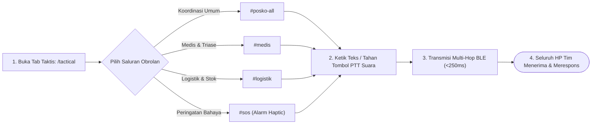

# User Flow: Komunikasi Taktis Lapangan & Mesh Intercom (PTT)

> **Status**: Approved  
> **Target Persona**: Relawan Lapangan, Dokter/Perawat Medis, Petugas Logistik, Koordinator Posko  
> **Core Objective (JTBD)**: Menyediakan saluran komunikasi taktis darurat bebas pulsa dan internet di lapangan bencana, mengirim instruksi cepat via Push-to-Talk (PTT) suara mikro, dan memantau status jaring node relawan sekitar (*Mesh Radar*).  
> **Konteks & Lingkungan**: Jaringan ad-hoc Bluetooth Low Energy (BitChat BLE Mesh), tenda pengungsi bising, ambulans berjalan, gelap/darurat malam hari.

---

## 1. Lingkup Alur & Pra-Kondisi

### Cakupan (In Scope)
- **Navigasi 4 Saluran Lapangan Resmi**:
  - `#posko-all`: **Siaran Resmi Satu Arah (*One-Way Authoritative Broadcast*)** dari Koordinator/Komandan ke seluruh HP relawan dan warga di portal `/guest` (bebas spam / zero-noise).
  - `#medis`: Saluran operasional triase darurat, permohonan obat kritis, kantong darah, dan tabung O2.
  - `#logistik`: Saluran operasional pengajuan pasokan sembako, selimut, susu bayi, dan verifikasi surat jalan.
  - ` #sos`: **Siaran Bahaya Darurat Satu Arah (*One-Way Emergency Siren*)** yang memicu getaran dan sirene alarm di seluruh HP dalam radius mesh.
- **Interaksi Push-to-Talk (PTT Voice Notes)**:
  - Menekan dan menahan tombol mikrofon (`Hold to Record`) untuk merekam audio suara hingga 5 detik.
  - Melepas tombol untuk langsung memancarkan audio terkompresi Opus 3.2 kbps ke saluran aktif.
  - Menggeser jari ke kiri (`Swipe to Cancel`) untuk membatalkan rekaman.
- **Penerimaan Audio Instan**:
  - Putar otomatis audio (*Auto-play*) untuk saluran prioritas tinggi atau *tap-to-play* dengan visualisasi waveform ringkas.
- **Peta Radar Topologi Mesh**:
  - Memantau jumlah node HP sekitar yang terhubung, kekuatan sinyal radio (RSSI), dan peran masing-masing anggota.

### Di Luar Cakupan (Out of Scope)
- Panggilan telepon streaming full-duplex kontinu (karena keterbatasan bandwidth radio BLE 2.4 GHz).

### Prekondisi
- Perangkat mengaktifkan Bluetooth dan izin mikrofon.
- Aplikasi berjalan di latar depan atau di latar belakang dengan *Mesh Foreground Service*.

### Postkondisi
- Pesan teks atau audio suara tersimpan di SQLite lokal dan berhasil di-relay ke seluruh node dalam radius 7-hop.

---

## 2. Peta Perjalanan Makro (High-Level Journey)



---

## 3. Diagram Alur Mikro Terinci (Detailed Flowchart)

```mermaid
flowchart TD
  Start(["Mulai: Di Tab Komunikasi Taktis /tactical"]) --> SelectChannel["Pilih Saluran: [#posko-all] [#medis] [#logistik] [#sos]"]
  
  SelectChannel --> ActionChoice{"Pilih Metode Komunikasi"}
  
  %% ==========================================
  %% JALUR 1: PESAN TEKS TAKTIS
  %% ==========================================
  ActionChoice -->|Pesan Teks / Simbol Cepat| InputText["Ketik pesan atau pilih Quick-Chip<br/>(e.g. 'Butuh Ambulans', 'Stok O2 Habis')"]
  InputText --> TapSend["Ketuk Tombol [  Kirim ]"]
  TapSend --> PackTextPacket["Bungkus ke PacketType::TacticalBroadcast<br/>+ Bubuhkan Ed25519 Signature"]
  PackTextPacket --> FloodBLEMesh["Pancarkan ke BLE Mesh Layer (TTL=7)"]
  
  %% ==========================================
  %% JALUR 2: PUSH-TO-TALK (PTT) SUARA MIKRO
  %% ==========================================
  ActionChoice -->|Push-to-Talk (PTT)| PressHoldPTT["Tekan & Tahan Tombol Mikrofon [  PTT ]"]
  PressHoldPTT --> StartRecording["Mulai Merekam Audio WebAudio (16kHz Mono)<br/>Visualisasi Gelombang Suara Aktif<br/>Maksimum Timer: 5.0 Detik"]
  
  StartRecording --> PTTAction{"Tindakan Pengguna"}
  
  PTTAction -->|Lepas Jari Normal| ReleasePTT["Lepas Tombol Mikrofon"]
  PTTAction -->|Geser Jari ke Kiri| SwipeCancel["Geser ke Kiri (Swipe to Cancel)"]
  PTTAction -->|Durasi Capai 5s| AutoStopTimer["Auto-Stop Timer 5 Detik Tercapai"]
  
  SwipeCancel --> CancelDiscard["Batalkan & Buang Buffer Audio<br/>(Getar Ringan Bzz)"]
  CancelDiscard --> SelectChannel
  
  ReleasePTT --> ProcessAudio["Kompresi Opus Voice Mode @3.2 kbps<br/>(Ukuran ~1.6 - 2.0 KB)"]
  AutoStopTimer --> ProcessAudio
  
  ProcessAudio --> ChunkVoicePacket["Potong Audio Menjadi 4-5 Frame (@400B)<br/>Header PTT: [VoiceID, ChunkIdx, TotalChunks]"]
  ChunkVoicePacket --> FloodBLEMesh
  
  %% ==========================================
  %% RELAY & PENERIMAAN
  %% ==========================================
  FloodBLEMesh --> RelayedMesh["Jaringan Relay Multi-Hop BLE (<250ms)"]
  RelayedMesh --> TargetReceive["HP Tim Posko Menerima Paket"]
  
  TargetReceive --> CheckChannelType{"Tipe Saluran & Prioritas?"}
  
  CheckChannelType -->|Saluran #sos (Prioritas Ekstrem)| TriggerSOSAlarm[" BUNYIKAN ALARM SIRINE + GETAR KUAT!<br/>Munculkan Pop-up Darurat Layar Penuh"]
  CheckChannelType -->|Saluran #medis / #logistik / #all| NormalNotif["Getar Halus (BZZT) + Audio Waveform Card di Chat"]
  
  TriggerSOSAlarm --> SaveMessageDB[("Simpan Pesan ke SQLite Lokal")]
  NormalNotif --> SaveMessageDB
  
  SaveMessageDB --> EndState(["Selesai"])
```

---

## 4. Tabel Interaksi Langkah Demi Langkah

| Langkah # | Layar / Komponen | Tindakan Pengguna | Respons Sistem / SQLite Lokal | Validasi & Catatan |
|---|---|---|---|---|
| **7.0** | `/tactical` | Membuka tab *Komunikasi Taktis* | Menampilkan 4 tab saluran, log obrolan aktif, dan tombol PTT di bagian bawah | Menampilkan badge jumlah node terhubung (` 8 Node`) |
| **7.1a** | `/tactical` | Memilih saluran `#medis` | Filter log obrolan hanya menampilkan diskusi medis, triase, dan resep obat | Saluran aktif diberi tanda warna merah medis |
| **7.1b** | `#ptt-button` | Menekan dan menahan tombol PTT | Layar menampilkan animasi gelombang suara merah (*recording pulse*) dan timer mundur $5.0\text{s}$ | Mikrofon merekam audio 16kHz mono |
| **7.1c** | `#ptt-button` | Melepas tombol PTT | Mengompresi buffer audio dengan Opus 3.2 kbps ($\approx 1.6\text{ KB}$), memotong 4 frame BLE, dan memancarkan ke mesh | HP pengirim bergetar konfirmasi (*sent vibration*) |
| **7.1d** | `#ptt-button` | Menggeser jari ke kiri saat menahan | Membatalkan rekaman dan menghapus buffer audio | Tidak ada paket yang dipancarkan (*safe cancel*) |
| **7.2** | Perangkat Penerima | Menerima frame PTT suara | Menyatukan potongan frame, memverifikasi CRC16, dan memunculkan bubble suara dengan waveform | Dapat langsung diputar ulang (*Tap to Play*) |
| **7.3** | `/tactical/radar` | Membuka tab *Radar Mesh* | Menampilkan daftar seluruh HP relawan dalam jangkauan 1–7 hop, RSSI sinyal, dan peran | Membantu koordinator memantau sebaran personel |
| **7.4** | `#btn-sos` | Menekan tombol *Siaran Darurat SOS* | Membuka modal konfirmasi dengan opsi: Gempa Susulan, Banjir Bandang, Kebakaran Tenda | Memancarkan paket prioritas tinggi yang memotong notifikasi lain |

---

## 5. Matriks Kasus Khusus & Penanganan Galat (*Edge Cases*)

| **Pemicu / Kondisi** | **Mode Kegagalan** | **Perilaku UX & Jalur Pemulihan** |
|---|---|---|
| **Pemicuan Tidak Sengaja di Saku (*Pocket Tap*)** | HP tertekan di saku celana saat evakuasi | Tombol SOS dirancang anti-*single-tap*; wajib melalui aksi **Geser Layar (*Slide to Confirm*)** atau **Tahan 3 Detik** + jeda pembatalan (*Grace Period 5 Detik*). |
| **Alarm Palsu / Iseng (*False Alarm / Pranks*)** | Personel salah mengira getaran atau berniat iseng | 1. Identitas pemancar (`Nama` + `Peran` + `Posko`) terpampang jelas di layar semua HP.<br/>2. Koordinator Posko / Komandan memiliki tombol override: `[  Batalkan SOS: Alarm Palsu ]` yang langsung mematikan sirene di seluruh HP relawan. |
| **Paket SOS Palsu dari Pihak Luar Tanpa Akun** | Pengguna mode tamu mencoba memicu alarm | Sistem menolak dan membuang (*drop silently*) paket SOS yang tidak memiliki tanda tangan digital Ed25519 dari kartu tugas posko terverifikasi. |
| **Frame Suara Terputus di Tengah Jalan** | 1 dari 4 frame Opus hilang karena interferensi radio | Dekoder Opus memanfaatkan fitur *Forward Error Correction (FEC)* bawaan untuk menyisipkan interpolasi suara lembut tanpa membatalkan seluruh pesan suara. |
| **Bluetooth Mati Saat Mencoba Kirim Pesan** | Antarmuka Bluetooth dinonaktifkan sistem | Tampilkan banner oranye: *"Bluetooth nonaktif. [ Aktifkan Bluetooth ] atau gunakan [ Pindai QR ]"*. Pesan disimpan di antrean outbox. |
| **Dua Orang Mengirim Suara Bersamaan** | Potensi tabrakan radio lokal | Jeda acak *Random Jitter (10–220ms)* memisahkan waktu siar kedua perangkat; kedua pesan tetap masuk ke antrean secara berurutan. |

---

## 6. Inventaris Layar & Rute Terkait

| Nama Layar | Rute / ID Komponen | Komponen Utama | Aksi Kunci |
|---|---|---|---|
| **Tactical Intercom Hub** | `/(posko)/[poskoId]/tactical/page.tsx` | Channel Selector Tabs, Chat Stream List, Quick Chips, PTT Button | Ganti Channel, Kirim Teks, Rekam Suara PTT |
| **Radar Topologi Mesh** | `/(posko)/[poskoId]/tactical/radar/page.tsx` | Node Signal Heatmap, List Tetangga BLE, Indikator Jarak Hop | Pantau Konektivitas Personel |
| **Modal Siaran Darurat SOS** | `#modal-sos-emergency` | Tombol Pilihan Bahaya BNPB, Konfirmasi Geser (*Slide to Confirm*) | Pancarkan Sirene Bencana Lapangan |
