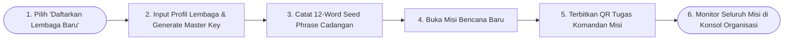

# User Flow: Pemimpin Organisasi (Organization Leader / Superadmin)

> **Status**: Approved  
> **Target Persona**: Pimpinan Lembaga (Ketua PMI, Kepala Pelaksana BPBD, Direktur Yayasan Kitabisa, Inisiator Komunitas)  
> **Core Objective (JTBD)**: Mendaftarkan lembaga baru, memegang & mengamankan Master Authority Key (Ed25519), mengonfigurasi Cloud BYOC/Managed, membuka Misi Bencana baru, dan menerbitkan Kartu Tugas Komandan Misi.  
> **Konteks & Lingkungan**: Desktop Command Center / Mobile Tablet HQ, SQLite lokal + Keyring Enkripsi, Cloud Backup.

---

## 1. Lingkup Alur & Pra-Kondisi

### Cakupan (In Scope)
- **Pendaftaran Lembaga Pertama Kali**: Jalur [2] pada halaman pembuka (`/org-setup`).
- **Generasi & Pengamanan Master Authority Key**: Pembuatan pasangan kunci Ed25519 (`did:sanidya:org_...`) dan pencatatan 12-Word Seed Phrase / Ekspor Backup Kunci (`.sanidya-key`).
- **Konsol Manajemen Organisasi (`/(organization)`)**:
  - Profil Lembaga & Status Kunci Otoritas.
  - Pengaturan Host Cloud (Sanidya Cloud Managed vs Server Mandiri BYOC).
  - Pembukaan Misi Tanggap Darurat Bencana Baru (`/organization/missions/create`).
  - Penutupan / Pengarsipan Misi yang telah selesai (`CLOSED_ARCHIVED`).
  - Penerbitan Kartu Tugas untuk **Komandan Misi** (`MISSION_COMMANDER`).
  - Audit makro seluruh misi dan seluruh posko di bawah lembaga.

### Di Luar Cakupan (Out of Scope)
- Operasional harian tenda posko (didelegasikan ke Komandan Misi dan Koordinator Posko).

### Prekondisi
- Pengguna membuka aplikasi Sanidya untuk pertama kali dan memilih jalur pendirian lembaga baru.

### Postkondisi
- Entitas organisasi tersimpan permanen di basis data lokal `organizations`.
- Master Key Ed25519 tersimpan aman di SQLite & dicadangkan oleh pemimpin.
- Misi Bencana pertama terbit dan siap dikelola oleh Komandan Misi.

---

## 2. Peta Perjalanan Makro (High-Level Journey)

---

## 3. Diagram Alur Mikro Terinci (Detailed Flowchart)

```mermaid
flowchart TD
    Start(["Mulai: Buka Aplikasi Sanidya /"]) --> LandingGateway["Layar Gerbang Utama<br/>Pilih: '[2] Daftarkan Lembaga / Organisasi Baru'"]
    
    LandingGateway --> OrgWizard["Rute: /org-setup<br/>Form Profil Organisasi"]
    
    OrgWizard --> InputOrgDetails["Input Identitas Lembaga:<br/>• Nama Lembaga (e.g., 'PMI Kabupaten Cianjur')<br/>• Kategori (Pemerintah BPBD / NGO Yayasan / Komunitas Warga)<br/>• Kode Wilayah Induk (e.g., '3201')<br/>• Kontak Markas Pusat"]
    
    InputOrgDetails --> TapGenerateKey["User Ketuk: 'Buat Kunci Otoritas Lembaga'"]
    
    TapGenerateKey --> CryptGen["Generate Keypair Ed25519 Lokal<br/>Pub: did:sanidya:org_7a9f81...<br/>Priv: Encrypted in SQLite Keyring"]
    
    CryptGen --> SeedPhraseModal["Tampilkan Modal Cadangan Kunci (Wajib):<br/>🔑 12-Word Recovery Seed Phrase<br/>(e.g., 'mountain rescue anchor signal safe...')"]
    
    SeedPhraseModal --> ConfirmSeed["Pimpinan Menulis / Menyalin Seed Phrase<br/>-> Ketuk 'Saya Sudah Mencadangkan Kunci'"]
    
    ConfirmSeed --> SaveOrgDB[("INSERT INTO organizations (SQLite Lokal)")]
    
    SaveOrgDB --> SelectCloudOption{"Pilih Konfigurasi Penyedia Cloud"}
    SelectCloudOption -->|Sanidya Cloud Hub| SetManagedCloud["Set Host: Managed Sanidya Cloud (Default)"]
    SelectCloudOption -->|Server Mandiri BYOC| InputBYOCURL["Input URL Server Instansi:<br/>https://sanidya.bpbd.jabar.go.id"]
    
    SetManagedCloud --> OpenOrgConsole["Masuk KONSOL ORGANISASI<br/>Rute: /(organization)"]
    InputBYOCURL --> OpenOrgConsole
    
    %% DI DALAM KONSOL ORGANISASI
    OpenOrgConsole --> OrgConsoleActions{"Pimpinan Memilih Tindakan"}
    
    %% TINDAKAN A: BUAT MISI BENCANA BARU
    OrgConsoleActions -->|"Buat Misi Bencana"| CreateMissionForm["Rute: /organization/missions/create<br/>Form Misi Operasi Bencana Baru"]
    CreateMissionForm --> InputMissionData["Input Parameter Misi:<br/>• Nama Operasi: 'Tanggap Darurat Gempa Cugenang 2026'<br/>• Jenis Bencana: GEMPA BUMI / BANJIR / ERUPSI<br/>• Target Masa Tanggap: 14 Hari<br/>• Wilayah Cakupan: Kecamatan Cugenang & Pacet"]
    
    InputMissionData --> SignMissionAction["User Ketuk: 'Buka Misi Resmi'"]
    SignMissionAction --> SignWithMasterKey["Tandatangani Payload Misi dengan Master Key Ed25519"]
    SignWithMasterKey --> InsertMissionDB[("INSERT INTO disaster_missions (Status: ACTIVE_EMERGENCY)")]
    
    InsertMissionDB --> DelegateCommanderModal["Tampilkan Modal Penugasan Komandan Misi:<br/>Layar Menampilkan QR Kartu Tugas Komandan Misi"]
    
    DelegateCommanderModal --> CommanderScanAction["Komandan Misi Memindai QR dari HP Miliknya"]
    CommanderScanAction --> MissionActiveState["Misi Resmi Aktif & Berjalan di Bawah Komando"]
    
    %% TINDAKAN B: AUDIT & MONITORING MAKRO
    OrgConsoleActions -->|"Audit Global"| ViewGlobalAudit["Lihat Daftar Seluruh Misi Aktif & Arsip:<br/>• Total Jiwa Terdalam Lembaga: 12.450 Jiwa<br/>• Total Posko Aktif: 18 Posko di 2 Misi<br/>• Total Stok Logistik Sentral"]
    
    MissionActiveState --> EndState(["Selesai / Sesi Berjalan"])
    ViewGlobalAudit --> EndState
```

---

## 4. Tabel Interaksi Langkah Demi Langkah

| Langkah # | Rute / Layar | Tindakan Aktor | Respons Sistem / SQLite Lokal | Validasi & Catatan |
|---|---|---|---|---|
| **1.0** | `/` | Memilih kartu *[2] Daftarkan Lembaga Baru* | Membuka form pendaftaran identitas organisasi di `/org-setup` | Ramah perangkat sentuh |
| **1.1** | `/org-setup` | Mengisi nama lembaga & kategori, klik *Buat Kunci* | Men-generate pasangan kunci Ed25519 lokal dan menampilkan modal *12-Word Recovery Phrase* | Kunci dibuat lokal di HP/PC tanpa internet |
| **1.2** | `/org-setup` | Mengonfirmasi pencatatan seed phrase | Menyimpan record ke tabel `organizations` dan membuka pilihan server Cloud (Managed / BYOC) | Cegah kehilangan kunci jika HP rusak |
| **1.3** | `/(organization)` | Masuk ke konsol utama lembaga | Menampilkan profil lembaga, indikator Master Key aktif, dan daftar portofolio misi | Tampilan Command Center HQ |
| **1.4** | `/organization/missions/create` | Mengisi nama misi *"Gempa Cugenang 2026"* | Sistem membubuhkan tanda tangan kriptografis Master Key pada payload misi | Legalitas operasi sah |
| **1.5** | `/(organization)` | Menampilkan QR Kartu Tugas Komandan Misi | Men-generate QR token dengan payload `{ orgId, missionId, role: "MISSION_COMMANDER" }` | Siap di-scan Komandan di lokasi |
| **1.6** | `/(organization)/settings` | Menguji koneksi Cloud BYOC | Mengirimkan handshake terenkripsi ke endpoint server instansi jika ada internet | Opsional (Tetap jalan offline) |

---

## 5. Matriks Kasus Khusus & Penanganan Galat (*Edge Cases*)

| Pemicu / Kondisi | Mode Kegagalan | Perilaku UX & Jalur Pemulihan |
|---|---|---|
| **HP Pimpinan Hilang / Rusak** | Kehilangan akses ke Master Authority Key | Pimpinan membuka HP baru $\rightarrow$ buka `/org-setup` $\rightarrow$ pilih *"Impor Kunci dari 12-Word Seed Phrase / File Backup"* $\rightarrow$ seluruh wewenang organisasi pulih 100%. |
| **Misi Bencana Selesai (Fase Darurat Berakhir)** | Misi sudah tidak aktif namun masih terbuka | Pimpinan membuka detail misi $\rightarrow$ ubah status ke `CLOSED_ARCHIVED` $\rightarrow$ seluruh posko di bawah misi ini otomatis terkunci menjadi mode *Read-Only (Arsip)*. |
| **Server Mandiri Instansi Sedang Down / Mati Listrik** | Gagal terhubung ke URL BYOC | Sistem otomatis beralih ke *Pure Offline Local Mode*, seluruh data tetap aman di SQLite lokal dan akan sinkron otomatis saat server kembali hidup. |
| **Penggantian / Rotasi Komandan Misi** | Komandan lama ditarik kembali ke markas | Pimpinan membuka menu Anggota $\rightarrow$ klik *"Cabut Mandat Komandan"* $\rightarrow$ buat QR Tugas baru untuk Komandan Pengganti. |

---

## 6. Inventaris Layar & Rute Terkait

| Nama Layar | Rute / ID Komponen | Komponen Utama | Aksi Kunci |
|---|---|---|---|
| **Pendaftaran Lembaga** | `/(auth)/org-setup/page.tsx` | Form Identitas Lembaga, Seed Phrase Generator Modal | Buat Master Key, Backup Kunci |
| **Konsol Utama Organisasi** | `/(organization)/page.tsx` | Header Lembaga, KPI Global (Total Jiwa & Posko), List Misi | Buat Misi Baru, Buka Misi Aktif |
| **Form Pembuatan Misi** | `/(organization)/missions/create/page.tsx` | Form Parameter Misi, Selector Jenis Bencana, Target Waktu | Terbitkan Misi, Sign Master Key |
| **Roster Anggota & Delegasi** | `/(organization)/members/page.tsx` | Tabel Pimpinan & Komandan, QR Generator Komandan | Terbitkan QR Komandan Misi |
| **Pengaturan & Cloud BYOC** | `/(organization)/settings/page.tsx` | Input Endpoint Server, Rotasi Kunci, Ekspor Backup | Ganti Host Cloud, Ekspor Backup |
