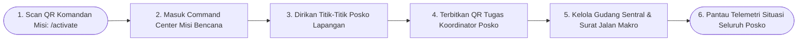
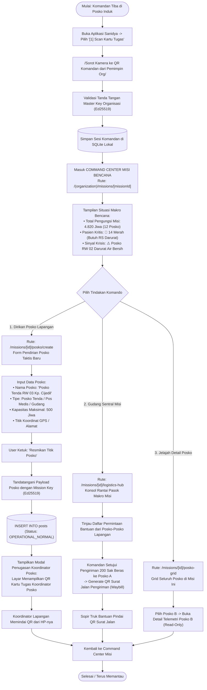

# User Flow: Komandan Misi Bencana (Mission Commander / Incident Lead)

> **Status**: Approved  
> **Target Persona**: Komandan Tanggap Darurat Bencana (Ketua Satgas Posko Induk, Incident Commander BNPB/PMI, Koordinator Wilayah Operasi)  
> **Core Objective (JTBD)**: Memimpin 1 Misi Operasi Bencana spesifik, memantau situasi makro seluruh wilayah terdampak, mendirikan titik-titik posko lapangan, mengangkat Koordinator Posko, dan mengendalikan rantai pasok logistik dari Gudang Sentral Misi.  
> **Konteks & Lingkungan**: Command Center Misi / Posko Induk Kabupaten, Desktop & Tablet Command View, sinkronisasi agregat multi-posko.

---

## 1. Lingkup Alur & Pra-Kondisi

### Cakupan (In Scope)
- **Aktivasi Peran**: Memindai QR Tugas Komandan Misi dari Pemimpin Organisasi via `/activate`.
- **Pusat Situasi & Komando Misi (`/(organization)/missions/[missionId]`)**:
  - Telemetri Agregat Bencana: Total Jiwa di seluruh posko, Peringatan Pasien Kritis (🔴 Triase Merah), dan Barometer Kebutuhan Darurat (Susu, Beras, Selimut).
  - Peta & Grid Direktori Seluruh Posko di bawah misi ini (`/posko-grid`).
  - Pendirian Posko Taktis Baru (`/missions/[missionId]/posko/create`).
  - Penerbitan Kartu Tugas untuk **Koordinator Posko** (`POSKO_LEAD`).
  - Pengelolaan **Gudang Sentral Logistik Misi** (`/logistics-hub`) & Penerbitan Surat Jalan Makro Pengiriman Bantuan ke Posko Lapangan.
  - Eksplorasi & audit data detail posko mana pun dalam misi ini.

### Di Luar Cakupan (Out of Scope)
- Pengaturan identitas permanen organisasi dan konfigurasi Cloud Host (wewenang Pemimpin Organisasi).
- Fast Intake warga 30s di tenda pengungsi (dilakukan oleh Relawan Posko Lapangan).

### Prekondisi
- Pemimpin Organisasi telah menerbitkan Misi Bencana dan membuat QR Kartu Tugas Komandan Misi.

### Postkondisi
- Sesi Komandan Misi aktif di SQLite lokal HP/Laptop komandan.
- Posko-posko lapangan resmi berdiri dan memiliki Koordinator Posko terverifikasi.
- Rantai pasok logistik sentral terhubung ke posko-posko lapangan.

---

## 2. Peta Perjalanan Makro (High-Level Journey)

---

## 3. Diagram Alur Mikro Terinci (Detailed Flowchart)

---

## 4. Tabel Interaksi Langkah Demi Langkah

| Langkah # | Rute / Layar | Tindakan Aktor | Respons Sistem / SQLite Lokal | Validasi & Catatan |
|---|---|---|---|---|
| **2.0** | `/activate` | Memindai QR tugas Komandan Misi | Memverifikasi tanda tangan Master Key dan mengaktifkan peran `MISSION_COMMANDER` | Instan 1 detik |
| **2.1** | `/(organization)/missions/[id]` | Membuka Command Center Misi | Menampilkan ringkasan seluruh wilayah bencana: agregat 12 posko, peta sebaran, dan alert krisis | *Situational Awareness Hub* |
| **2.2** | `/missions/[id]/posko/create` | Mengisi form pendirian Posko RW 03 | Menyimpan posko ke database `posts` bertandatangan Mission Key | Terhubung ke Misi ini |
| **2.3** | Modal Delegasi | Menampilkan QR Tugas Koordinator Posko | Men-generate QR token `{ missionId, poskoId, role: "POSKO_LEAD" }` | Untuk di-scan Koordinator di tenda |
| **2.4** | `/missions/[id]/logistics-hub` | Membuka konsol rantai pasok gudang | Menampilkan stok total di Gudang Sentral dan antrean permintaan dari posko-posko lapangan | Mencegah penumpukan barang di pusat |
| **2.5** | `/missions/[id]/logistics-hub` | Menerbitkan Surat Jalan ke truk bantuan | Men-generate QR Surat Jalan (*Waybill*) tertandatangani digital untuk dipindai sopir truk | Menjamin bantuan sampai tujuan |
| **2.6** | `/missions/[id]/posko-grid` | Membuka salah satu kartu posko | Menampilkan detail 4-tab posko tersebut dalam mode *Read-Only Audit* | Monitoring transparan |

---

## 5. Matriks Kasus Khusus & Penanganan Galat (*Edge Cases*)

| Pemicu / Kondisi | Mode Kegagalan | Perilaku UX & Jalur Pemulihan |
|---|---|---|
| **Posko Lapangan Terancam Bencana Susulan (Longsor/Banjir)** | Posko fisik harus segera dievakuasi | Komandan mengubah status posko di grid menjadi `🚨 HAZARD_EVACUATION` $\rightarrow$ seluruh posko sekitar menerima peringatan darurat untuk membantu relokasi pengungsi. |
| **Gudang Pusat Kehabisan Stok Logistik Kritis** | Kebutuhan beras seluruh posko melebihi kapasitas gudang sentral | Sistem menandai indikator krisis merah pada Barometer Misi $\rightarrow$ Komandan menerbitkan *Laporan Ringkasan Kebutuhan BNPB/Donatur* untuk suplai eksternal. |
| **Koordinator Posko Berhalangan / Sakit** | Posko lapangan kehilangan pimpinan | Komandan membuka menu posko tersebut $\rightarrow$ klik *"Ganti Koordinator"* $\rightarrow$ terbitkan QR Koordinator baru untuk relawan pengganti di posko tersebut. |

---

## 6. Inventaris Layar & Rute Terkait

| Nama Layar | Rute / ID Komponen | Komponen Utama | Aksi Kunci |
|---|---|---|---|
| **Command Center Misi** | `/(organization)/missions/[missionId]/page.tsx` | Telemetri Makro, Barometer Kebutuhan, Peta Posko | Monitor Wilayah, Setup Posko Baru |
| **Pendirian Posko Baru** | `/(organization)/missions/[id]/posko/create/page.tsx` | Form Identitas Posko, Kapasitas, Koordinat | Terbitkan Posko, Sign Mission Key |
| **Direktori Grid Posko** | `/(organization)/missions/[id]/posko-grid/page.tsx` | Kartu Posko (Status BNPB, Kapasitas, Stok) | Buka Detail Posko, Audit Posko |
| **Gudang Sentral Misi** | `/(organization)/missions/[id]/logistics-hub/page.tsx` | Stok Gudang Pusat, Generator QR Surat Jalan (Waybill) | Alokasi ke Posko, Terbitkan Waybill |
| **Modal Kartu Koordinator** | `#modal-posko-lead-qr` | Canvas QR Koordinator Posko | Pindai Tugas Koordinator |
