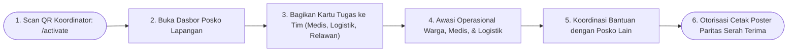
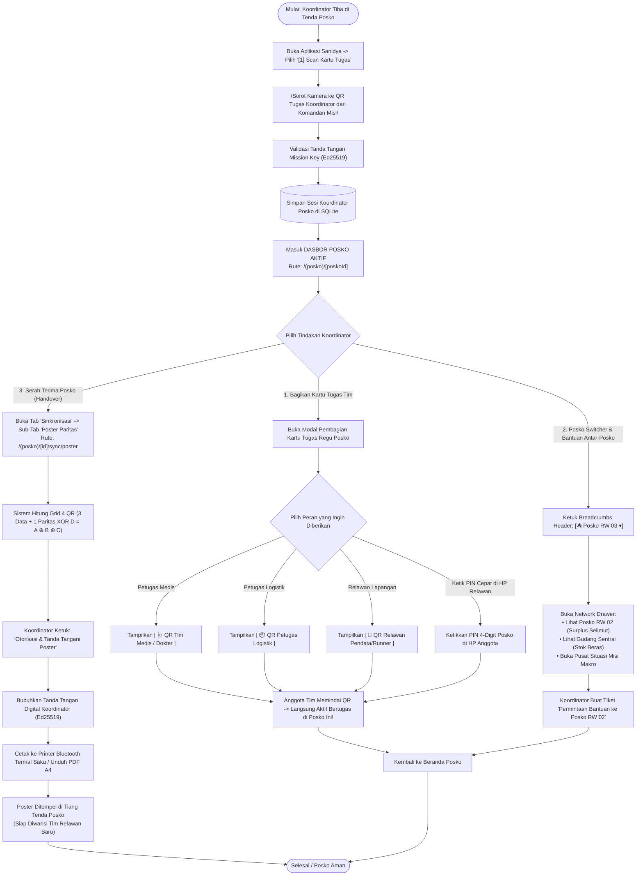

# User Flow: Koordinator Posko Lapangan (Posko Lead)

> **Status**: Approved  
> **Target Persona**: Koordinator Posko Tenda / Penanggung Jawab Posko Lapangan (Kepala Tenda Darurat, Komandan Regu Lapangan)  
> **Core Objective (JTBD)**: Mengendalikan operasional satu posko tenda fisik secara penuh, membagikan kartu tugas ke dokter/logistik/relawan, mengaudit seluruh data posko, berkoordinasi dengan posko tetangga, dan mengotorisasi cetak Poster Serah Terima Paritas XOR saat posko diserahterimakan.  
> **Konteks & Lingkungan**: Tenda Posko Lapangan, Mobile & Tablet Touch-Friendly, Offline-First SQLite.

---

## 1. Lingkup Alur & Pra-Kondisi

### Cakupan (In Scope)
- **Aktivasi Peran**: Memindai QR Koordinator Posko dari Komandan Misi via `/activate`.
- **Dasbor Utama Posko Lapangan (`/(posko)/[poskoId]`)**:
  - Telemetri Posko: Total Warga di posko ini, Kelompok Rentan, Status Triase Medis, Sisa Stok Pangan, dan Widget Node BLE Mesh Aktif.
  - Pembagian Kartu Tugas Regu Posko (`[🩺 Medis]`, `[📦 Logistik]`, `[📝 Relawan]`) via Modal QR atau PIN Otorisasi 4-Digit.
  - Navigasi Penuh 5-Tab Posko (Beranda, Warga & Medis, Logistik, Komunikasi Taktis, Sinkronisasi Multi-Transport).
  - Pemanfaatan **Komunikasi Taktis (`/tactical`)**: Siaran koordinasi regu di `#posko-all`, pantau sebaran personel di radar topologi mesh (`/tactical/radar`), dan siaran sirene `🚨 #sos`.
  - Akses ke **Posko Switcher & Pusat Situasi Misi** (melihat stok posko lain & mengajukan permintaan bantuan antar-posko).
  - **Otorisasi Cetak Poster Serah Terima Paritas XOR** bertandatangan digital Ed25519 saat tugas regu selesai.

### Di Luar Cakupan (Out of Scope)
- Mutasi fisik stok gudang secara sepihak (wewenang operasional Petugas Logistik posko).
- Penutupan Misi Bencana secara global (wewenang Komandan Misi / Pemimpin Lembaga).

### Prekondisi
- Titik posko telah didirikan di bawah Misi Bencana dan memiliki kredensial Koordinator Posko.

### Postkondisi
- Anggota tim posko (Dokter, Logistik, Relawan) memiliki kartu tugas aktif.
- Data operasional posko tercatat rapi dan siap diserahterimakan via poster fisik.

---

## 2. Peta Perjalanan Makro (High-Level Journey)

---

## 3. Diagram Alur Mikro Terinci (Detailed Flowchart)

---

## 4. Tabel Interaksi Langkah Demi Langkah

| Langkah # | Rute / Layar | Tindakan Aktor | Respons Sistem / SQLite Lokal | Validasi & Catatan |
|---|---|---|---|---|
| **3.0** | `/activate` | Memindai QR Koordinator Posko | Mengaktifkan sesi `POSKO_LEAD` dan membuka posko terkait | Instan 1 detik |
| **3.1** | `/(posko)/[id]` | Membuka Beranda posko | Menampilkan 4 kartu telemetri: Total Jiwa, Kelompok Rentan, Pasien Kritis, Sisa Logistik | *High-contrast outdoor UI* |
| **3.2** | Modal Tim | Memilih *"QR Tim Medis"* | Men-generate QR token bertandatangan Koordinator dengan hak akses dokter | Siap di-scan dokter posko |
| **3.3** | Modal Tim | Mengetik PIN 4-digit di HP relawan | Mengangkat role relawan secara instan tanpa perlu scan kamera | Opsi tercepat saat gelap |
| **3.4** | Header Bar | Mengetuk dropdown posko `[▾]` | Membuka daftar posko lain di misi ini dan telemetri stok mereka | Akses situasional transparan |
| **3.5** | `/sync/poster` | Mengklik *"Cetak Poster Serah Terima"* | Men-generate Grid 4 QR Paritas XOR dan membubuhkan tanda tangan Ed25519 Koordinator | Kebal sobekan 1 kotak utuh |

---

## 5. Matriks Kasus Khusus & Penanganan Galat (*Edge Cases*)

| Pemicu / Kondisi | Mode Kegagalan | Perilaku UX & Jalur Pemulihan |
|---|---|---|
| **Regu Medis Tiba Tanpa Koordinator Misi** | Dokter datang mendadak di posko tenda | Koordinator Posko cukup membuka modal tim $\rightarrow$ tampilkan *"QR Medis"* $\rightarrow$ dokter langsung aktif seketika tanpa perlu persetujuan markas pusat. |
| **Poster Serah Terima Rusak Terkena Lumpur di Tenda** | 1 kotak QR terkena lumpur pekat | Relawan baru yang memindai poster tetap berhasil merekonstruksi 100% data berkat redundansi formula XOR ($B = A \oplus C \oplus D$). |
| **Koordinator Harus Dievakuasi Cepat (Darurat Medis)** | Posko ditinggalkan sebelum sempat cetak poster | Koordinator membuka layar HP $\rightarrow$ buka *Animated QR (Kirim)* $\rightarrow$ relawan pengganti menyorot kamera selama 3 detik $\rightarrow$ seluruh wewenang & data posko berpindah instan. |

---

## 6. Inventaris Layar & Rute Terkait

| Nama Layar | Rute / ID Komponen | Komponen Utama | Aksi Kunci |
|---|---|---|---|
| **Beranda Posko** | `/(posko)/[poskoId]/page.tsx` | Hero KPI Cards, Alert Stok Kritis, Tombol Bagikan Tim | Monitor Posko, Buka Modal Tim |
| **Modal Kartu Tugas Regu** | `#modal-share-team-roles` | Selector Peran (Medis/Logistik/Relawan), Canvas QR | Tampilkan QR Peran, Setel PIN |
| **Drawer Jaringan Posko** | `#drawer-posko-switcher` | List Posko Lain di Misi, Status Stok Radar | Jelajah Posko Lain, Minta Bantuan |
| **Generator Poster Paritas** | `/(posko)/[poskoId]/sync/poster/page.tsx` | Preview Grid 4 QR, Tombol Cetak Thermal Bluetooth | Sign Ed25519, Cetak Poster Fisik |
