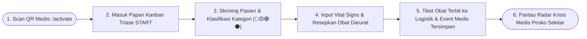

# User Flow: Petugas Medis / Dokter (Medical Officer)

> **Status**: Approved  
> **Target Persona**: Dokter Lapangan, Perawat Posko Medis, Bidan Tenda Darurat, Tim Medis Relawan  
> **Core Objective (JTBD)**: Menjalankan skrining klinis cepat, mengklasifikasikan keparahan pasien via Triase START (🔴🟡🟢⚫), merekam tanda vital, menerbitkan resep obat darurat ke logistik farmasi, serta memantau radar krisis medis di seluruh posko dalam misi bencana.  
> **Konteks & Lingkungan**: Tenda Pos Medis Darurat / RS Lapangan, SQLite lokal, Papan Kanban Triase.

---

## 1. Lingkup Alur & Pra-Kondisi

### Cakupan (In Scope)
- **Aktivasi Peran**: Memindai QR Kartu Tugas Medis dari Koordinator Posko via `/activate`.
- **Papan Kanban Triase START Medis (`/(posko)/[poskoId]/refugees/triage`)**:
  - Kolom Triase 4-Kategori: 🔴 Merah (*Immediate*), 🟡 Kuning (*Delayed*), 🟢 Hijau (*Minor*), ⚫ Hitam (*Deceased*).
- **Pemeriksaan Klinis & Rekam Vital Signs**: Input suhu, tekanan darah, nadi, $\text{SpO}_2$, keluhan, dan riwayat alergi.
- **Penerbitan Resep Obat Darurat (`uint8` Token Medis)**: Terbit otomatis sebagai tiket `needs_requests (PENDING)` untuk lemari obat gudang.
- **Komunikasi Medis Darurat Lapangan (`/tactical` Saluran `#medis`)**:
  - Kirim instruksi medis cepat via teks atau suara mikro PTT 5 detik (Opus 3.2 kbps) ke sesama dokter/perawat dan relawan evakuasi.
- **Append-Only Medical Timeline**: Setiap tindakan tercatat sebagai baris event `HEALTH_CHECK` di riwayat pasien tanpa menimpa (*no overwrite*).
- **Pusat Situasi Medis Misi (*Mission Medical Radar*)**: Membuka Posko Switcher / Layar Misi untuk memantau posko sekitar yang sedang mengalami lonjakan pasien kritis atau wabah diare.

### Di Luar Cakupan (Out of Scope)
- Pemotongan fisik stok obat dari lemari gudang (wewenang Petugas Logistik).
- Fast Intake pendataan umum warga di tenda (dilakukan oleh Relawan Lapangan).

### Prekondisi
- Petugas Medis telah memindai QR Kartu Tugas Medis dari Koordinator Posko.
- Pasien telah terdaftar di database posko (atau didata cepat saat tiba di pos medis).

### Postkondisi
- Status triase pasien diperbarui di Kanban.
- Riwayat pemeriksaan tersimpan permanen di `refugee_events`.
- Tiket kebutuhan obat terkirim ke antrean Petugas Logistik Posko.

---

## 2. Peta Perjalanan Makro (High-Level Journey)

---

## 3. Diagram Alur Mikro Terinci (Detailed Flowchart)

```mermaid
flowchart TD
    Start(["Mulai: Dokter Tiba di Pos Medis"]) --> OpenApp["Buka Aplikasi Sanidya -> Pilih '[1] Scan Kartu Tugas'"]
    
    OpenApp --> ScanMedicalPass["/Sorot Kamera ke QR Medis dari Koordinator Posko/"]
    ScanMedicalPass --> VerifyMedicalSig["Validasi Tanda Tangan Koordinator Posko (Ed25519)"]
    
    VerifyMedicalSig --> SaveMedicalSession[("Simpan Sesi Medis di SQLite Lokal")]
    SaveMedicalSession --> OpenTriageBoard["Masuk TAB TRIASE MEDIS AKTIF<br/>Rute: /(posko)/[poskoId]/refugees/triage"]
    
    %% KANBAN TRIASE START
    OpenTriageBoard --> ViewKanban["Tampilan Papan Kanban START:<br/>• 🔴 Merah (Gawat Darurat): 2 Pasien<br/>• 🟡 Kuning (Mendesak): 8 Pasien<br/>• 🟢 Hijau (Luka Ringan): 34 Pasien<br/>• ⚫ Hitam: 0"]
    
    ViewKanban --> DoctorActions{"Pilih Tindakan Medis"}
    
    %% TINDAKAN A: PEMERIKSAAN PASIEN
    DoctorActions -->|"1. Periksa Pasien Baru"| SelectPatientAction{"Cari Pasien"}
    SelectPatientAction -->|Scan Kartu Warga| ScanPatientBadge["/Sorot Kamera ke Kartu Pengungsi/"]
    SelectPatientAction -->|Pilih dari Antrean| PickPatientCard["Klik Kartu Pasien di Kolom Kanban"]
    
    ScanPatientBadge & PickPatientCard --> OpenExamModal["Buka Modal Lembar Pemeriksaan Klinis Darurat"]
    
    OpenExamModal --> InputVitalData["1. Input Tanda Vital:<br/>• Suhu: 39.1°C, Tensi: 120/80 mmHg, SpO2: 97%<br/>• Keluhan Utama: Diare Akut + Dehidrasi Sedang"]
    
    InputVitalData --> ClassifySTART{"Klasifikasi Kategori START"}
    ClassifySTART -->|🔴 Merah| SetRed["Set Kategori: 🔴 MERAH (Prioritas Penanganan)"]
    ClassifySTART -->|🟡 Kuning| SetYellow["Set Kategori: 🟡 KUNING (Stabil / Butuh Obat)"]
    ClassifySTART -->|🟢 Hijau| SetGreen["Set Kategori: 🟢 HIJAU (Rawat Jalan Tenda)"]
    
    SetRed & SetYellow & SetGreen --> PrescribeCheck{"Perlu Resep Obat Darurat?"}
    
    PrescribeCheck -->|Ya| SelectMedTokens["2. Pilih Obat dari Katalog uint8:<br/>• Oralit Larutan Diare (0x22) - 4 Sachet<br/>• Paracetamol 500mg (0x21) - 1 Strip<br/>• Zink Tablet 20mg - 1 Strip"]
    PrescribeCheck -->|Tidak| FinalizeExam
    
    SelectMedTokens --> FinalizeExam["Dokter Ketuk: 'Simpan Rekam Medis & Resep'"]
    
    FinalizeExam --> SaveMedicalEvent[("INSERT INTO refugee_events<br/>(TYPE: 'HEALTH_CHECK', Payload JSON, Timestamp)")]
    SaveMedicalEvent --> IssueNeedTicket[("INSERT INTO needs_requests<br/>(refugee_id, item_name, qty, status: 'PENDING')")]
    
    IssueNeedTicket --> NotifyLogistics["Notifikasi Masuk ke Antrean Petugas Logistik Gudang"]
    
    %% TINDAKAN B: RADAR MEDIS MISI
    DoctorActions -->|"2. Pantau Situasi Medis Misi"| OpenMissionRadar["Buka Posko Switcher -> Lihat Status Misi Makro"]
    OpenMissionRadar --> ViewOtherPoskoMedics["Pantau Situasi Posko Sekitar:<br/>• Posko B: ⚠️ 15 Pasien Diare (Wabah Terdeteksi)<br/>• Gudang Pusat: Stok Infus Tersedia 50 Kolf"]
    
    NotifyLogistics --> RefreshKanban["Papan Kanban & Riwayat Pasien Terupdate"]
    ViewOtherPoskoMedics --> RefreshKanban
    RefreshKanban --> EndState(["Selesai / Pasien Tertangani"])
```

---

## 4. Tabel Interaksi Langkah Demi Langkah

| Langkah # | Rute / Layar | Tindakan Aktor | Respons Sistem / SQLite Lokal | Validasi & Catatan |
|---|---|---|---|---|
| **4.0** | `/activate` | Memindai QR Kartu Tugas Medis | Mengaktifkan sesi `POSKO_MEDICAL` dan membuka papan Triase Medis | Instan 1 detik |
| **4.1** | `/refugees/triage` | Membuka sub-tab Triase Medis | Menampilkan Kanban 4 kolom kategori START dan ringkasan pasien kritis | Tampilan kontras tinggi |
| **4.2** | Form Medis | Mengisi vital signs & memilih chip 🔴 *Merah* | Kartu pasien berpindah otomatis ke kolom 🔴 *Merah* dan memicu alert di Beranda posko | Prioritas darurat |
| **4.3** | Form Medis | Memilih obat *Oralit* & *Paracetamol* dari katalog | Mengambil token biner 1-byte (`0x21`, `0x22`) dari katalog BNPB/PMI | Istilah medis standar |
| **4.4** | Form Medis | Mengetuk *"Simpan Rekam Medis"* | Menulis event baru ke `refugee_events` dan menerbitkan tiket `needs_requests (PENDING)` | Stempel nama & ID dokter |
| **4.5** | Header Bar | Membuka *Posko Switcher* | Menampilkan radar kesehatan posko-posko tetangga (indikator jumlah pasien merah/kuning) | *Situational Awareness* |

---

## 5. Matriks Kasus Khusus & Penanganan Galat (*Edge Cases*)

| Pemicu / Kondisi | Mode Kegagalan | Perilaku UX & Jalur Pemulihan |
|---|---|---|
| **Pasien Kritis Butuh Rujukan ke Rumah Sakit Kota** | Posko lapangan tidak memiliki alat bedah/operasi | Dokter memilih status 🔴 *Merah* $\rightarrow$ aktifkan toggle *"Butuh Rujukan"* $\rightarrow$ tiket rujukan otomatis terkirim ke Command Center Komandan Misi untuk ambulans. |
| **Obat Habis di Gudang Posko Ini** | Petugas logistik mengabarkan stok Paracetamol kosong | Dokter membuka *Posko Switcher* $\rightarrow$ melihat Posko RW 02 memiliki surplus Paracetamol $\rightarrow$ minta koordinator membuat Surat Jalan antar-posko. |
| **Pasien Datang Tanpa Identitas (Pingsan)** | Pasien belum pernah di-intake relawan | Dokter mengetuk *"Intake Darurat"* $\rightarrow$ sistem membuat record sementara (*"Mr. X - Tenda 02"*) $\rightarrow$ penanganan medis langsung berjalan tanpa tertahan administrasi. |

---

## 6. Inventaris Layar & Rute Terkait

| Nama Layar | Rute / ID Komponen | Komponen Utama | Aksi Kunci |
|---|---|---|---|
| **Papan Triase START** | `/(posko)/[poskoId]/refugees/triage/page.tsx` | Kanban 4-Kolom, Counter Pasien Merah/Kuning/Hijau | Buka Pasien, Pindah Kolom Triase |
| **Modal Pemeriksaan Klinis** | `#modal-medical-examination` | Form Tanda Vital, Selector START, Obat Picker uint8 | Simpan Rekam Medis, Resepkan Obat |
| **Detail & Rekam Medis Warga** | `/(posko)/[poskoId]/refugees/[id]/page.tsx` | Riwayat Event Medis Kronologis (Git-Graph Timeline) | Tinjau Riwayat Pemeriksaan Medis |
| **Radar Situasi Medis Misi** | `#drawer-posko-switcher` | List Posko di Misi, Indikator Pasien Kritis Posko Lain | Pantau Krisis Medis Wilayah |
