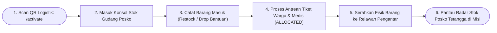
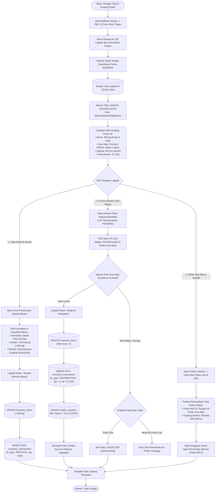

# User Flow: Petugas Logistik (Logistics / Warehouse Master)

> **Status**: Approved  
> **Target Persona**: Kepala Gudang Posko, Petugas Farmasi & Pangan Lapangan, Pengelola Logistik Tenda  
> **Core Objective (JTBD)**: Mengendalikan stok fisik logistik posko dengan prinsip *Single-Writer* anti-*race condition* (*phantom stock*), mencatat restock barang masuk, menyetujui tiket kebutuhan warga & resep obat medis, menyerahkan barang ke relawan pengantar, dan memantau radar stok posko sekitar.  
> **Konteks & Lingkungan**: Gudang Logistik Posko Tenda, SQLite lokal, Buku Kas Transaksi *Append-Only Ledger*.

---

## 1. Lingkup Alur & Pra-Kondisi

### Cakupan (In Scope)
- **Aktivasi Peran**: Memindai QR Kartu Tugas Logistik dari Koordinator Posko via `/activate`.
- **Manajemen Stok Gudang Posko (`/(posko)/[poskoId]/logistics`)**:
  - Daftar Komoditas Fisik: Pangan (Beras, MRE), Sandang (Selimut), Perlengkapan Bayi (Susu, Popok), Medis (Obat-obatan), Sanitasi.
  - Penerimaan Restock Barang Masuk (`inventory_transactions` tipe `RESTOCK`).
  - Pencatatan Koreksi Barang Rusak / Kadaluwarsa (`DAMAGE`).
- **Persetujuan Tiket Kebutuhan Warga & Resep Medis (`/logistics/distribute`)**:
  - Memeriksa ketersediaan fisik $\to$ Setujui & Potong Stok (*Single-Writer*) $\to$ Tiket beralih dari `PENDING` menjadi `ALLOCATED`.
  - Menyerahkan fisik bantuan ke Relawan Lapangan (*Runner*).
- **Koordinasi Logistik Taktis (`/tactical` Saluran `#logistik`)**:
  - Berkomunikasi via radio mesh dengan relawan pembagi bantuan di tenda dan sopir pengirim stok.
- **Radar Logistik Misi & Surat Jalan Antar-Posko (`/logistics/waybills`)**:
  - Membuka *Posko Switcher* / Konsol Misi untuk melihat ketersediaan stok posko-posko tetangga (melihat posko mana yang surplus/defisit).
  - Menerbitkan Permintaan Bantuan & QR Surat Jalan (*Waybill*) resmi.

### Di Luar Cakupan (Out of Scope)
- Pendataan identitas warga (wewenang Relawan Lapangan).
- Skrining klinis dan penulisan dosis obat (wewenang Petugas Medis).

### Prekondisi
- Petugas Logistik memegang kartu tugas aktif `POSKO_LOGISTICS` di posko terkait.

### Postkondisi
- Angka fisik di `inventory_items` terpotong akurat sesuai kenyataan di lemari gudang.
- Buku kas transaksi `inventory_transactions` bertambah baris audit log baru.
- Tiket kebutuhan berstatus `ALLOCATED` dan siap diantar oleh Relawan Lapangan.

---

## 2. Peta Perjalanan Makro (High-Level Journey)

---

## 3. Diagram Alur Mikro Terinci (Detailed Flowchart)

---

## 4. Tabel Interaksi Langkah Demi Langkah

| Langkah # | Rute / Layar | Tindakan Aktor | Respons Sistem / SQLite Lokal | Validasi & Catatan |
|---|---|---|---|---|
| **5.0** | `/activate` | Memindai QR Kartu Tugas Logistik | Mengaktifkan sesi `POSKO_LOGISTICS` dan membuka tab logistik posko | Hak mutasi stok aktif |
| **5.1** | `/logistics` | Membuka tab stok gudang | Menampilkan katalog komoditas, stok fisik, dan peringatan *burn rate* | *High-contrast UI* |
| **5.2** | Form Restock | Memasukkan restock 50 karung beras | Menambah angka stok dan mencatat transaksi `RESTOCK` di buku kas | Timestamp lokal tercatat |
| **5.3** | `/logistics/distribute` | Membuka antrean tiket `PENDING` | Menampilkan tiket kebutuhan warga dan resep obat yang diajukan dokter | Prioritas kelompok rentan |
| **5.4** | `/logistics/distribute` | Menyetujui tiket 2 kotak susu | Memotong stok gudang $-2$ dan mengubah status tiket menjadi `ALLOCATED` | *Single-Writer enforcement* |
| **5.5** | Gudang Posko | Menyerahkan barang ke Relawan | Relawan membawa barang ke tenda warga untuk diserahkan | Alur fisik terjaga |
| **5.6** | Header Bar | Membuka *Posko Switcher* | Menampilkan radar ketersediaan logistik di seluruh posko dalam misi yang sama | Transparansi rantai pasok |

---

## 5. Matriks Kasus Khusus & Penanganan Galat (*Edge Cases*)

| Pemicu / Kondisi | Mode Kegagalan | Perilaku UX & Jalur Pemulihan |
|---|---|---|
| **Dua Petugas Berbeda Mencoba Memotong Stok Bersamaan di 2 HP** | Risiko selisih perhitungan stok di posko yang sama | Sistem menetapkan prinsip *Single-Writer*: hanya 1 HP yang memegang wewenang aktif *Warehouse Master* per posko, HP kedua hanya bertindak sebagai asisten/viewer. |
| **Beras Rusak Terkena Air Hujan di Tenda Gudang** | Stok fisik berkurang bukan karena dibagikan ke warga | Petugas Logistik memilih tipe transaksi `DAMAGE (Kerusakan/Basah)` $\rightarrow$ stok berkurang dan tercatat di buku kas dengan alasan kerusakan. |
| **Surplus Barang Tertahan di Posko (Tidak Dibutuhkan Pengungsi)** | Posko A punya surplus 300 selimut tapi kekurangan beras | Petugas Logistik membuka *Posko Switcher* $\rightarrow$ menerbitkan penawaran transfer barang ke posko tetangga yang membutuhkan. |

---

## 6. Inventaris Layar & Rute Terkait

| Nama Layar | Rute / ID Komponen | Komponen Utama | Aksi Kunci |
|---|---|---|---|
| **Stok Gudang Posko** | `/(posko)/[poskoId]/logistics/page.tsx` | Kartu Komoditas, Prediksi Sisa Hari, Buku Kas Ledger | Tambah Restock, Koreksi Kerusakan |
| **Antrean & Alokasi Tiket** | `/(posko)/[poskoId]/logistics/distribute/page.tsx` | List Tiket Pending, Tombol Setujui & Alokasikan | Alokasikan Tiket, Tolak Tiket |
| **Bantuan Antar-Posko & Waybills** | `/(posko)/[poskoId]/logistics/waybills/page.tsx` | Daftar Pengiriman, Generator QR Surat Jalan (Waybill) | Buat Pengajuan, Pindai Surat Masuk |
| **Radar Logistik Misi** | `#drawer-posko-switcher` | List Stok Posko Lain di Misi, Indikator Surplus/Defisit | Pantau Rantai Pasok Misi |
