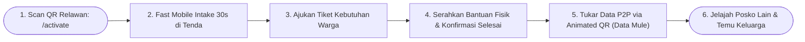
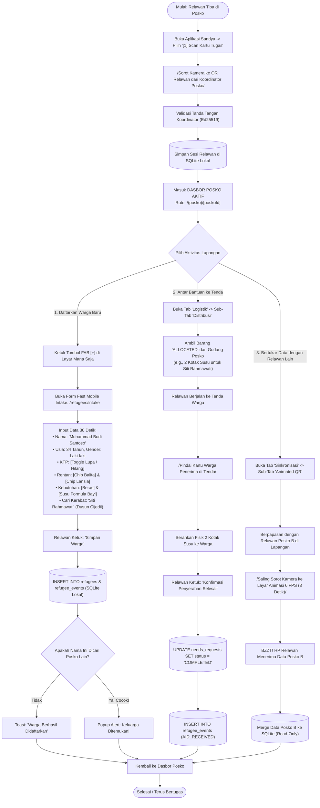

# User Flow: Relawan Lapangan (Field Volunteer / Frontliner)

> **Status**: Approved  
> **Target Persona**: Relawan Pendata Tenda, Relawan Distribusi Pangan/Sandang, Kurir Data Lapangan (*Universal Data Mule*)  
> **Core Objective (JTBD)**: Mendaftarkan pengungsi baru dalam <30 detik di tenda darurat tanpa hambatan KTP, mengajukan kebutuhan warga, menyerahkan fisik bantuan ke tangan pengungsi, serta membawa dan menukarkan data offline antar-posko via *Animated QR*.  
> **Konteks & Lingkungan**: Tenda Pengungsi Lapangan, Jalan Setapak Bencana, Mobile Handheld, P2P Air-Gapped Sync.

---

## 1. Lingkup Alur & Pra-Kondisi

### Cakupan (In Scope)
- **Aktivasi Peran**: Memindai QR Kartu Tugas Relawan dari Koordinator Posko via `/activate`.
- **Fast Mobile Intake 30 Detik (`/refugees/intake`)**:
  - Pemicu instan via Tombol FAB Melayang `[+]` di layar mana pun.
  - Penanganan NIK Dinamis (0 Byte jika KTP hilang/lupa, 5 Byte jika sewilayah).
  - Perekaman Kelompok Rentan (Balita, Lansia, Ibu Hamil, Disabilitas) & Kebutuhan Mendesak Awal.
  - Perekaman Data Temu Keluarga (`missing_kin_name` & `domicile_origin`).
- **Penyerahan Bantuan ke Warga di Tenda (`/logistics/distribute`)**:
  - Mengambil barang yang telah berstatus `ALLOCATED` dari gudang posko.
  - Memindai kartu warga di tenda $\to$ serahkan barang $\to$ konfirmasi tiket `COMPLETED`.
- **Zero-Touch Background Sync & Radio Taktis (`/tactical`)**:
  - Berjalan di antara tenda: HP otomatis menyinkronkan data pengungsi baru via **Zero-Touch BLE Mesh** (BitChat) tanpa perlu membuka layar.
  - Menggunakan tombol Push-to-Talk (PTT) suara 5 detik untuk melapor ke `#posko-all` atau memicu alarm bahaya di ` #sos`.
- **Cadangan Sinkronisasi Visual (*Fallback Optical Data Mule*) (`/sync/animated-qr`)**:
  - Jika berada di luar jangkauan radio BLE: Saling sorot layar HP (Animated QR 6 FPS) selama 2–3 detik atau memindai lembaran Poster Paritas XOR di dinding posko.
- **Jelajah Posko Misi (*Mission Directory & Family Search*)**:
  - Membuka *Posko Switcher* untuk mencari kerabat yang terpisah atau melihat kondisi posko sekitar.

### Di Luar Cakupan (Out of Scope)
- Pemotongan sepihak stok gudang (wewenang Petugas Logistik).
- Skrining medis dan resep obat (wewenang Petugas Medis).

### Prekondisi
- Relawan telah memindai QR Kartu Tugas Relawan dari Koordinator Posko.

### Postkondisi
- Pengungsi baru tersimpan di SQLite lokal posko dan masuk antrean Data Mule.
- Tiket bantuan warga berstatus `COMPLETED` dan event `AID_RECEIVED` tercatat di timeline.
- Data posko lain tersinkronisasi di HP relawan.

---

## 2. Peta Perjalanan Makro (High-Level Journey)

---

## 3. Diagram Alur Mikro Terinci (Detailed Flowchart)

---

## 4. Tabel Interaksi Langkah Demi Langkah

| Langkah # | Rute / Layar | Tindakan Aktor | Respons Sistem / SQLite Lokal | Validasi & Catatan |
|---|---|---|---|---|
| **6.0** | `/activate` | Memindai QR Kartu Tugas Relawan | Mengaktifkan sesi `FIELD_VOLUNTEER` dan membuka dasbor posko | Instan 1 detik |
| **6.1** | Layar Mana Saja | Mengetuk tombol melayang FAB `[+]` | Membuka form modal Fast Intake 30 detik | *Thumb-friendly 1-hand UI* |
| **6.2** | `/refugees/intake` | Mengisi nama warga & mengetuk chip kebutuhan | Menyimpan record ke `refugees` & menerbitkan tiket kebutuhan awal | Waktu rekam $<30$ detik |
| **6.3** | Tenda Warga | Memindai QR kartu warga penerima | Membuka tiket bantuan aktif milik warga tersebut | Cegah salah serah barang |
| **6.4** | Tenda Warga | Mengetuk *"Konfirmasi Penyerahan"* | Mengubah tiket menjadi `COMPLETED` dan mencatat event `AID_RECEIVED` | *Zero-dispute audit* |
| **6.5** | `/sync/animated-qr` | Menyorot kamera ke layar HP relawan lain | Menangkap frame animasi out-of-order; selesai dalam 2–3 detik dengan getaran haptik | *Universal Data Mule* |
| **6.6** | Header Bar | Membuka *Posko Switcher* | Menjelajahi data posko-posko lain yang baru disinkronkan dari Data Mule | *Read-Only visibility* |

---

## 5. Matriks Kasus Khusus & Penanganan Galat (*Edge Cases*)

| Pemicu / Kondisi | Mode Kegagalan | Perilaku UX & Jalur Pemulihan |
|---|---|---|
| **Kondisi Gelap Gulita di Tenda Malam Hari** | Kamera HP sulit mengunci fokus QR warga | Aplikasi menyediakan tombol *"Nyalakan Senter HP (Flashlight)"* langsung dari dalam viewfinder scanner. |
| **Warga Tidak Memiliki Kartu Fisik dan Lupa Nama KTP** | Relawan kesulitan menemukan data warga saat ingin menyerahkan bantuan | Relawan mencari warga berdasarkan filter *Lokasi Tenda* (e.g. "Tenda Darurat 03") atau pencarian nama panggilan. |
| **Animasi QR HP Pengirim Terlalu Cepat untuk Kamera Murah** | Kamera HP kelas bawah mengalami motion blur | Penerima dapat meminta pengirim mengetuk tombol *"Perlambat Animasi (3 FPS)"* di layar pengirim. |

---

## 6. Inventaris Layar & Rute Terkait

| Nama Layar | Rute / ID Komponen | Komponen Utama | Aksi Kunci |
|---|---|---|---|
| **Fast Mobile Intake** | `/(posko)/[poskoId]/refugees/intake/page.tsx` | Form 30 Detik, Toggle KTP, Selector Kerentanan | Simpan Warga Cepat |
| **Penyerahan Bantuan Tenda** | `/(posko)/[poskoId]/logistics/distribute/page.tsx` | Scanner Warga, List Tiket Allocated | Scan Penerima, Konfirmasi Selesai |
| **Pusat Animated QR** | `/(posko)/[poskoId]/sync/animated-qr/page.tsx` | Canvas Animasi 6 FPS, Viewfinder Kamera Asinkron | Transmit Layar, Receive Layar |
| **Pusat Temu Keluarga** | `/(posko)/[poskoId]/refugees/reunion/page.tsx` | Form Pencarian Kerabat, List Hasil Reuni | Cari Nama Kerabat di Seluruh Posko |
