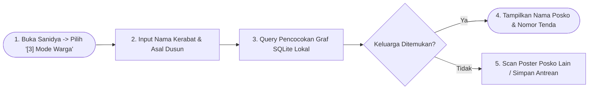

# User Flow: Warga Pengungsi & Tamu Publik (Public Guest / Family Searcher)

> **Status**: Approved  
> **Target Persona**: Warga Korban Bencana, Keluarga yang Mencari Kerabat Hilang, Masyarakat Umum  
> **Core Objective (JTBD)**: Melacak keberadaan sanak saudara yang terpisah di posko-posko penampungan secara instan tanpa perlu mendaftar akun/kartu tugas, serta memindai poster posko fisik untuk membaca informasi darurat secara offline.  
> **Konteks & Lingkungan**: Mode Publik Bebas Login (Landing Jalur [3]), Viewfinder Kamera Poster, SQLite Lokal.

---

## 1. Lingkup Alur & Pra-Kondisi

### Cakupan (In Scope)
- **Akses Langsung Tanpa Login**: Memilih kartu *[3] Pusat Pencarian Keluarga* dari halaman pembuka (`/(auth)/guest`).
- **Pencarian Nama Kerabat di Database Lokal**:
  - Input nama lengkap kerabat, estimasi usia, dan asal dusun/desa.
  - Pencarian multi-posko secara *real-time* di seluruh data posko yang tersimpan di SQLite HP tersebut.
- **Pemindaian Poster Posko Fisik (*Air-Gapped Offline Scan*)**:
  - Memindai lembaran poster serah terima posko fisik yang ditempel di dinding posko untuk langsung menelusuri daftar warga di posko tersebut.
- **Tampilan Hasil Reuni & Lokasi Spesifik**:
  - Menampilkan nama posko, lokasi ruangan/tenda, dan waktu pencatatan terakhir.
  - Penerbitan Lembar Digital **Surat Keterangan Temu Keluarga (*Family Reunion Pass*)**.

### Di Luar Cakupan (Out of Scope)
- Mengubah, menghapus, atau memutasi data warga/logistik (mode ini murni *Read-Only*).
- Mengakses konsol internal manajemen organisasi atau posko (`/(posko)/[id]`).
- Mengakses Saluran Komunikasi Taktis / Intercom Radio / PTT Suara (**Zero Chat Access**).
- Memancarkan siaran alarm bahaya `🚨 #sos`.

### Prekondisi
- Aplikasi Sanidya terbuka di HP warga / HP relawan di meja informasi publik.

### Postkondisi
- Lokasi posko dan nomor tenda kerabat ditemukan oleh warga.
- Hubungan keluarga terhubung di basis data lokal.

---

## 2. Peta Perjalanan Makro (High-Level Journey)



---

## 3. Diagram Alur Mikro Terinci (Detailed Flowchart)

```mermaid
flowchart TD
    Start(["Mulai: Warga Buka Aplikasi /"]) --> LandingScreen["Layar Gerbang Utama<br/>Pilih: '[3] Pusat Pencarian Keluarga (Mode Warga)'"]
    
    LandingScreen --> GuestPortal["Masuk Portal Warga: /(auth)/guest<br/>(Antarmuka Sederhana Bebas Login)"]
    
    GuestPortal --> SearchMethodChoice{"Pilih Cara Pelacakan"}
    
    %% JALUR A: KETIK NAMA KERABAT
    SearchMethodChoice -->|"1. Ketik Nama Kerabat"| InputKinNameForm["Form Pencarian Kerabat:<br/>• Nama Lengkap yang Dicari (e.g. 'Siti Rahmawati')<br/>• Asal Dusun/Desa (e.g. 'Dusun Cijedil')<br/>• Estimasi Usia (Opsional)"]
    InputKinNameForm --> TapSearch["Warga Ketuk: 'Cari Kerabat Saya'"]
    
    TapSearch --> QueryLocalDB[("Query SQLite Lokal di Seluruh Posko Terdata")]
    QueryLocalDB --> MatchScoreCheck{"Evaluasi Skor Kecocokan (Confidence)"}
    
    MatchScoreCheck -->|Skor > 95% (Exact Match)| ShowReunionCard["🎉 KELUARGA DITEMUKAN!<br/>Tampilkan Kartu Hasil Reuni:<br/>• Nama: Siti Rahmawati (32 Tahun)<br/>• Terdaftar di: ⛺ Posko B (SDN 1 Pacet)<br/>• Lokasi Tenda: Ruang Kelas 2B<br/>• Waktu Terdata: Hari Ini, 10:15 WIB<br/>• Kondisi: Sehat / Stabil"]
    
    MatchScoreCheck -->|Skor 70-94% (Fuzzy Match)| ShowPossibleMatches["Tampilkan Daftar Nama Mirip di Posko Terdekat"]
    
    MatchScoreCheck -->|0% (Tidak Ditemukan)| ShowNotFoundState["Tampilkan Pesan: 'Belum Terdata di Posko-Posko Ini'"]
    
    ShowReunionCard --> ViewReunionPassAction["Warga Ketuk: 'Simpan / Foto Surat Keterangan Reuni'"]
    ViewReunionPassAction --> DisplayDigitalPass["Tampilkan Lembar Digital Family Reunion Pass<br/>(Berisi QR Validasi Petugas untuk Izin Penjemputan)"]
    
    %% JALUR B: SCAN POSTER POSKO FISIK
    SearchMethodChoice -->|"2. Pindai Poster Posko Lain"| OpenPosterScanner["Buka Kamera Pemindai Poster di HP Warga"]
    OpenPosterScanner --> ScanPhysicalPoster["/Sorot Kamera ke Kotak QR Poster di Dinding Tenda/"]
    ScanPhysicalPoster --> DecodePosterData["Dekode Data Posko -> Simpan ke SQLite HP Warga"]
    DecodePosterData --> AutoQueryAfterScan["Sistem Otomatis Cari Ulang Nama Kerabat di Data Poster Baru"]
    AutoQueryAfterScan --> MatchScoreCheck
    
    ShowNotFoundState --> SaveSearchQueue["Simpan Permintaan Pencarian di HP Warga<br/>(Akan Dicocokkan Otomatis Saat Ada Data Posko Baru)"]
    
    DisplayDigitalPass --> EndState(["Selesai / Lokasi Keluarga Diketahui"])
    SaveSearchQueue --> EndState
```

---

## 4. Tabel Interaksi Langkah Demi Langkah

| Langkah # | Rute / Layar | Tindakan Aktor | Respons Sistem / SQLite Lokal | Validasi & Catatan |
|---|---|---|---|---|
| **7.0** | `/` | Mengetuk kartu *[3] Pusat Pencarian Keluarga* | Masuk ke portal warga `/guest` dengan bahasa Indonesia ramah publik | Tanpa kartu tugas / registrasi |
| **7.1** | `/guest` | Mengetik nama *"Siti Rahmawati"* & asal *"Dusun Cijedil"* | Sistem mencari pada seluruh record di tabel `refugees` lintas posko | Pencarian instan $<10\text{ms}$ |
| **7.2** | `/guest` | Sistem menemukan data yang cocok $98\%$ | Menampilkan modal kartu hijau menyala lengkap dengan nama posko dan nomor tenda/kelas | Disertai jam pendataan |
| **7.3** | `/guest` | Warga mengetuk *"Simpan Surat Reuni"* | Menampilkan lembar digital *Family Reunion Pass* dengan QR verifikasi | Dapat difoto untuk izin posko |
| **7.4** | `/guest` | Memindai lembaran poster posko lain | Mendekode data posko tersebut dan otomatis mencari nama kerabat di dalamnya | *Air-gapped lookup* |

---

## 5. Matriks Kasus Khusus & Penanganan Galat (*Edge Cases*)

| Pemicu / Kondisi | Mode Kegagalan | Perilaku UX & Jalur Pemulihan |
|---|---|---|
| **Keluarga Belum Terdata di Posko Mana Pun** | Nama kerabat tidak ada di seluruh database lokal | Sistem menawarkan tombol *"Daftarkan Pencarian Saya"*; data nama dicatat di HP warga dan otomatis memunculkan pop-up saat data posko baru disinkronkan. |
| **Dua Orang Bernama Sama Persis di Posko yang Sama** | Kebingungan identitas warga | Sistem menyajikan data pelengkap (usia, nama anggota keluarga yang mendampingi, dan asal dusun) agar warga dapat memverifikasi dengan tepat. |
| **Warga Tidak Memiliki Smartphone** | Warga mendatangi pos informasi posko secara fisik | Relawan lapangan di meja informasi membuka menu Temu Keluarga di HP relawan dan melakukan pencarian atas nama warga tersebut. |

---

## 6. Inventaris Layar & Rute Terkait

| Nama Layar | Rute / ID Komponen | Komponen Utama | Aksi Kunci |
|---|---|---|---|
| **Portal Mode Warga** | `/(auth)/guest/page.tsx` | Form Input Nama & Dusun, Viewfinder Scanner Poster | Cari Nama, Pindai Poster Posko |
| **Modal Hasil Reuni** | `#modal-family-match-result` | Kartu Lokasi Posko, Status Kesehatan, Tombol Surat Reuni | Buka Surat Reuni, Cek Peta Tenda |
| **Surat Keterangan Reuni** | `#modal-family-reunion-pass` | Lembar Digital Pas Penjemputan, QR Validasi Petugas | Unduh / Simpan Pas Reuni |
