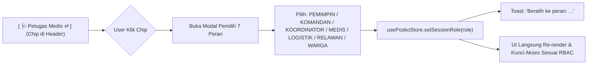

# Rencana Implementasi: Pengetatan Hak Akses (RBAC) Komprehensif & Role Testing Chip

> **Status**: Menunggu Persetujuan User  
> **Ruang Lingkup**: Penegakan 16 Kapabilitas Hak Akses (RBAC) secara ketat di seluruh modul aplikasi (Tingkat Organisasi, Tingkat Misi, Tingkat Posko Lapangan, dan Mode Tamu Publik), serta penyediaan **Interactive Role Testing Chip** di Header Topbar, Sidebar, dan Switcher Modal.

---

## 1. Audit Lengkap: 16 Kapabilitas & Penegakan RBAC

Berdasarkan audit mendalam terhadap seluruh 41 rute halaman dan komponen, berikut adalah 16 kapabilitas operasional Sandya dan matriks kewenangan resminya:

### Tabel Matriks Hak Akses Lengkap (16 Kapabilitas)

| No | Kapabilitas / Fitur | `PEMIMPIN_ORGANISASI` | `KOMANDAN_MISI` | `KOORDINATOR_POSKO` | `PETUGAS_MEDIS` | `PETUGAS_LOGISTIK` | `RELAWAN_LAPANGAN` | `WARGA_TAMU` |
| :- | :--- | :---: | :---: | :---: | :---: | :---: | :---: | :---: |
| 1 | **Mutasi Stok Fisik Gudang Posko** *(Restock, Rusak, Edit, Hapus)* | ❌ *(Single-Writer)* | ❌ *(Single-Writer)* | ❌ *(Single-Writer)* | ❌ | ✅ *(Single-Writer)* | ❌ | ❌ |
| 2 | **Persetujuan & Potong Stok Tiket Bantuan (`ALLOCATE`)** | ❌ | ❌ | ❌ | ❌ | ✅ *(Utama)* | ❌ | ❌ |
| 3 | **Penyerahan Fisik Bantuan ke Tenda (`DELIVERED`)** | ❌ | ❌ | ✅ | ❌ | ✅ | ✅ *(Kurir Utama)* | ❌ |
| 4 | **Pemeriksaan Klinis & Triase START (4-Warna)** | ❌ | ❌ | ❌ | ✅ *(Utama)* | ❌ | ❌ *(Read-Only)* | ❌ |
| 5 | **Vonis Triase Hitam (Wafat) & Resolusi Jenazah** | ❌ | ❌ | ❌ | ✅ *(Utama)* | ❌ | ❌ | ❌ |
| 6 | **Pendaftaran Warga (Fast Intake 30s & Bulk AI OCR)** | ❌ *(Audit Makro)* | ❌ *(Audit Makro)* | ✅ | ✅ | ✅ | ✅ *(Frontliner)* | ❌ |
| 7 | **Edit Data Pokok & Checkout Warga** | ❌ | ❌ | ✅ | ✅ | ✅ | ✅ | ❌ |
| 8 | **Rekam Peristiwa Medis (`HEALTH_CHECK`, `TRIAGE_UPDATE`)** | ❌ | ❌ | ❌ | ✅ *(Utama)* | ❌ | ❌ | ❌ |
| 9 | **Pengajuan Tiket Kebutuhan Warga (`PENDING`)** | ❌ | ❌ | ✅ | ✅ | ✅ | ✅ *(Utama)* | ❌ |
| 10 | **Surat Jalan Logistik Posko (Minta Suplai / Terima Truk)** | ❌ | ❌ | ❌ | ❌ | ✅ *(Utama)* | ❌ | ❌ |
| 11 | **Surat Jalan Truk Gudang Sentral Misi (`/missions/.../logistics`)** | ✅ | ✅ *(Utama)* | ❌ | ❌ | ✅ *(Staf Hub)* | ❌ | ❌ |
| 12 | **Buka Posko Lapangan Baru (`/missions/.../poskos/create`)** | ✅ | ✅ *(Utama)* | ❌ | ❌ | ❌ | ❌ | ❌ |
| 13 | **Pengaturan Misi Bencana (`/missions/.../settings`)** | ✅ | ✅ *(Utama)* | ❌ | ❌ | ❌ | ❌ | ❌ |
| 14 | **Pengaturan Posko & Delegasi Kartu Staf (`/posko/.../settings`)** | ✅ | ✅ | ✅ *(Utama)* | ❌ | ❌ | ❌ | ❌ |
| 15 | **Konsol Lembaga & Master Key Ed25519 (`/org`)** | ✅ *(Master Key)* | ❌ | ❌ | ❌ | ❌ | ❌ | ❌ |
| 16 | **Intercom Taktis (PTT Voice, Chat HT, Kirim & Batal SOS)** | Kirim + Batal SOS | Kirim + Batal SOS | Kirim + Batal SOS | Kirim SOS (Staf) | Kirim SOS (Staf) | Kirim SOS (Staf) | ❌ *(Muted)* |

---

## 2. Interactive Role Testing Chip (UI & UX)

Untuk mempermudah pengujian seluruh peran secara langsung, kami akan menambahkan **Role Testing Chip** yang selalu terlihat di header atas (`UnifiedAppHeader`):



### Desain & Fitur Chip:
- **Tampilan Kompak & Menarik**: Badge di kanan atas header bertuliskan icon peran + nama peran + panah switch `⇄` (misal: `🏛️ Pemimpin`, `🩺 Medis`, `📦 Logistik`, `🤝 Relawan`, `👥 Tamu`).
- **Modal / Sheet Pilihan Lengkap**: Menampilkan ke-7 peran dengan label Indonesia resmi, tingkat hierarki (Tingkat 1/2/3/Publik), dan deskripsi singkat wewenang.
- **Efek Instan**: Memilih peran langsung meng-update session Zustand `setSessionRole(newRole)`, menampilkan notifikasi toast, dan seketika mengaktifkan/menonaktifkan tombol serta menampilkan banner wewenang di layar yang sedang aktif.

---

## 3. Rincian File yang Dimodifikasi & Dibuat

### A. Core Permission & Domain Layer
1. **[`src/core/permissions/posko-permissions.ts`](file:///home/auttomus/Documents/Code/PROJECT/sanidya_v2/src/core/permissions/posko-permissions.ts)**:
   - Definisikan kelompok peran canonical untuk ke-16 kapabilitas:
     - `canMutateStock(role)`: Hanya `PETUGAS_LOGISTIK`, `'LOGISTIK'`.
     - `canApproveDistribution(role)`: Hanya `PETUGAS_LOGISTIK`, `'LOGISTIK'`.
     - `canDeliverAid(role)`: `RELAWAN_LAPANGAN`, `PETUGAS_LOGISTIK`, `KOORDINATOR_POSKO`.
     - `canConductTriage(role)`: Hanya `PETUGAS_MEDIS`, `'MEDIS'`, `'DOKTER'`.
     - `canDeclareDeceased(role)`: Hanya `PETUGAS_MEDIS`, `'MEDIS'`, `'DOKTER'`.
     - `canIntakeRefugees(role)`: Staf posko (`RELAWAN_LAPANGAN`, `KOORDINATOR_POSKO`, `PETUGAS_MEDIS`, `PETUGAS_LOGISTIK`).
     - `canManageRefugeeProfile(role)`: Staf posko.
     - `canManageWaybills(role)`: `PETUGAS_LOGISTIK`.
     - `canManageMissionWaybills(role)`: `KOMANDAN_MISI`, `PETUGAS_LOGISTIK`, `PEMIMPIN_ORGANISASI`.
     - `canCreatePosko(role)`: `KOMANDAN_MISI`, `PEMIMPIN_ORGANISASI`.
     - `canManageMissionSettings(role)`: `KOMANDAN_MISI`, `PEMIMPIN_ORGANISASI`.
     - `canManagePoskoSettings(role)`: `KOORDINATOR_POSKO`, `KOMANDAN_MISI`, `PEMIMPIN_ORGANISASI`.
     - `canAccessOrgConsole(role)`: `PEMIMPIN_ORGANISASI`.
     - `canSendTacticalMessage(role)`: Seluruh staf (`!WARGA_TAMU`).
     - `canCancelSOS(role)`: `KOORDINATOR_POSKO`, `KOMANDAN_MISI`, `PEMIMPIN_ORGANISASI`.

2. **[`src/core/domain/logistics/inventory.aggregate.ts`](file:///home/auttomus/Documents/Code/PROJECT/sanidya_v2/src/core/domain/logistics/inventory.aggregate.ts)**:
   - Pengetatan method `mutateStock`: tolak semua peran selain `PETUGAS_LOGISTIK` / `'LOGISTIK'`.

3. **[`src/core/use-cases/refugees/record-triage-exam.usecase.ts`](file:///home/auttomus/Documents/Code/PROJECT/sanidya_v2/src/core/use-cases/refugees/record-triage-exam.usecase.ts)**:
   - Pengetatan wewenang klinis: tolak semua peran selain `PETUGAS_MEDIS` / `'MEDIS'`.

4. **[`src/core/use-cases/refugees/record-refugee-event.usecase.ts`](file:///home/auttomus/Documents/Code/PROJECT/sanidya_v2/src/core/use-cases/refugees/record-refugee-event.usecase.ts)**:
   - Pengetatan event medis: `HEALTH_CHECK` dan `TRIAGE_UPDATE` wajib dibuat oleh `MEDIS`.

---

### B. UI Navigation & Role Testing Chip
5. **[NEW] `src/features/navigation/components/role-testing-chip.tsx`**:
   - Komponen Chip interaktif di Topbar untuk beralih instan antar 7 peran.
6. **[`src/features/navigation/components/unified-app-header.tsx`](file:///home/auttomus/Documents/Code/PROJECT/sanidya_v2/src/features/navigation/components/unified-app-header.tsx)**:
   - Pasang `<RoleTestingChip />` di top header (desktop & mobile).
7. **[`src/features/navigation/components/unified-app-sidebar.tsx`](file:///home/auttomus/Documents/Code/PROJECT/sanidya_v2/src/features/navigation/components/unified-app-sidebar.tsx)**:
   - Buat card profil di footer sidebar dapat diklik untuk membuka role switcher yang sama.
8. **[`src/features/navigation/components/hierarchy-switcher-modal.tsx`](file:///home/auttomus/Documents/Code/PROJECT/sanidya_v2/src/features/navigation/components/hierarchy-switcher-modal.tsx)**:
   - Tambahkan pemilih peran testing di dalam modal switcher hierarki.

---

### C. Halaman Operasional & Modal (Penegakan Guard)
9. **[`src/app/posko/[poskoId]/logistics/page.tsx`](file:///home/auttomus/Documents/Code/PROJECT/sanidya_v2/src/app/posko/[poskoId]/logistics/page.tsx)**:
   - Non-logistik: banner read-only + tombol restock, rusak, edit, hapus disabled.
10. **[`src/app/posko/[poskoId]/logistics/distribute/page.tsx`](file:///home/auttomus/Documents/Code/PROJECT/sanidya_v2/src/app/posko/[poskoId]/logistics/distribute/page.tsx)**:
    - Tombol "Setujui & Potong Stok" khusus `PETUGAS_LOGISTIK`. Tombol "Konfirmasi Diantar" untuk Relawan & Logistik.
11. **[`src/app/posko/[poskoId]/logistics/waybills/page.tsx`](file:///home/auttomus/Documents/Code/PROJECT/sanidya_v2/src/app/posko/[poskoId]/logistics/waybills/page.tsx)**:
    - Penerbitan surat jalan posko khusus `PETUGAS_LOGISTIK`.
12. **[`src/app/posko/[poskoId]/refugees/(tabs)/triage/page.tsx`](file:///home/auttomus/Documents/Code/PROJECT/sanidya_v2/src/app/posko/[poskoId]/refugees/(tabs)/triage/page.tsx)**:
    - Non-medis: banner read-only + tombol periksa vital dan quick triage dropdown disabled.
13. **[`src/app/posko/[poskoId]/refugees/(tabs)/page.tsx`](file:///home/auttomus/Documents/Code/PROJECT/sanidya_v2/src/app/posko/[poskoId]/refugees/(tabs)/page.tsx) & [`layout.tsx`](file:///home/auttomus/Documents/Code/PROJECT/sanidya_v2/src/app/posko/[poskoId]/refugees/(tabs)/layout.tsx)**:
    - Guard tombol `+ Daftar Warga (30s)` dengan `canIntakeRefugees`. Mode tamu publik diarahkan ke pencarian keluarga.
14. **[`src/features/refugees/components/refugee-detail-view.tsx`](file:///home/auttomus/Documents/Code/PROJECT/sanidya_v2/src/features/refugees/components/refugee-detail-view.tsx) & [`add-refugee-event-modal.tsx`](file:///home/auttomus/Documents/Code/PROJECT/sanidya_v2/src/features/refugees/components/add-refugee-event-modal.tsx)**:
    - Guard edit profil, checkout warga, dan rekam event non-medis.
15. **[`src/app/posko/[poskoId]/settings/page.tsx`](file:///home/auttomus/Documents/Code/PROJECT/sanidya_v2/src/app/posko/[poskoId]/settings/page.tsx)**:
    - Guard simpan profil posko & penerbitan kartu tugas staf posko khusus `KOORDINATOR_POSKO`, `KOMANDAN_MISI`, `PEMIMPIN_ORGANISASI`.
16. **[`src/app/missions/[missionId]/poskos/create/page.tsx`](file:///home/auttomus/Documents/Code/PROJECT/sanidya_v2/src/app/missions/[missionId]/poskos/create/page.tsx)**:
    - Guard pembuatan posko baru khusus `KOMANDAN_MISI` & `PEMIMPIN_ORGANISASI`.
17. **[`src/app/missions/[missionId]/settings/page.tsx`](file:///home/auttomus/Documents/Code/PROJECT/sanidya_v2/src/app/missions/[missionId]/settings/page.tsx)**:
    - Guard perubahan parameter & arsip misi khusus `KOMANDAN_MISI` & `PEMIMPIN_ORGANISASI`.
18. **[`src/app/missions/[missionId]/logistics/page.tsx`](file:///home/auttomus/Documents/Code/PROJECT/sanidya_v2/src/app/missions/[missionId]/logistics/page.tsx)**:
    - Guard penerbitan surat jalan truk gudang sentral wilayah.
19. **[`src/app/posko/[poskoId]/tactical/page.tsx`](file:///home/auttomus/Documents/Code/PROJECT/sanidya_v2/src/app/posko/[poskoId]/tactical/page.tsx)**:
    - Nonaktifkan input pesan & PTT untuk `WARGA_TAMU` (Muted), dan tombol Batalkan Alarm SOS khusus koordinator/pimpinan.

---

## 4. Rencana Verifikasi

### Automated Tests
1. **[`tests/unit/strict-rbac-permissions.test.ts`](file:///home/auttomus/Documents/Code/PROJECT/sanidya_v2/tests/unit/strict-rbac-permissions.test.ts)** [NEW]:
   - Uji menyeluruh ke-16 kapabilitas terhadap ke-7 peran (112 skenario pengujian permutasi).
2. **[`tests/unit/logistics-single-writer.test.ts`](file:///home/auttomus/Documents/Code/PROJECT/sanidya_v2/tests/unit/logistics-single-writer.test.ts)**:
   - Verifikasi penolakan mutasi stok untuk koordinator/pimpinan jika bukan petugas logistik.
3. **Master Test Suite & Build Verification**:
   ```bash
   npm test
   npm run build
   ```

### Manual Verification
1. Buka aplikasi di posko (`/posko/POS-01`).
2. Klik **Role Testing Chip** di header atas, lalu coba secara berurutan:
   - **`PEMIMPIN_ORGANISASI`**: Cek bahwa konsol `/org` terbuka, namun mutasi di `/posko/POS-01/logistics` dan `/posko/POS-01/refugees/triage` terkunci read-only.
   - **`PETUGAS_MEDIS`**: Cek bahwa triase medis `/triage` terbuka penuh (pemeriksaan vital + resep), sedangkan gudang logistik `/logistics` terkunci.
   - **`PETUGAS_LOGISTIK`**: Cek bahwa gudang `/logistics` terbuka penuh (restock + rusak + alokasi bantuan), sedangkan triase `/triage` terkunci.
   - **`RELAWAN_LAPANGAN`**: Cek bahwa pendaftaran warga `/refugees` dan pengantaran bantuan terbuka, sedangkan mutasi stok & triase klinis terkunci.
   - **`WARGA_TAMU`**: Cek bahwa seluruh form input posko terkunci, radio taktis muted, dan tab Temu Keluarga terbuka publik.
